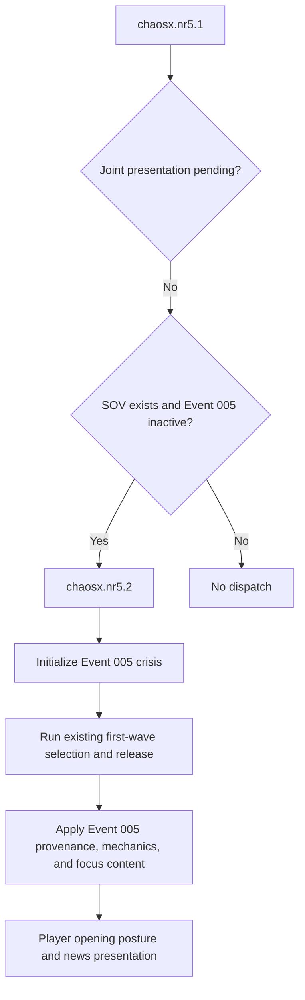
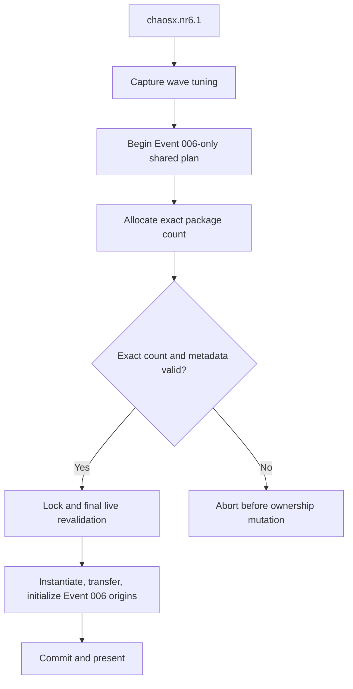
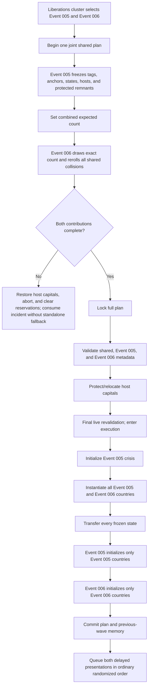

# Event 005 / Event 006 Joint Collision Implementation Handoff

> Transaction correction, 2026-07-15: the historical limitations in this handoff that describe post-release ownership as non-compensable are superseded by `006_transaction_architecture_resolution_2026_07_15.md`. The current coordinator has a frozen owner/controller/core/capital recovery ledger, exact compensating rollback before finalization, and a separate terminal finalization-failure phase. This file remains as the original implementation record.

## Status

The synchronous Event 005 / Event 006 Liberations-cluster transaction is implemented. Event 005 freezes its opening republic tags, anchors, exact states, hosts, and protected host remnants first. Event 006 then allocates its exact wave count against those reservations, rerolling collisions. Both contributions lock, revalidate, instantiate, transfer, initialize their own mechanics, and commit in one effect chain before the cluster queues either presentation.

This tranche is not a complete Event 006 integration claim. The repeatable Event 006 entry and committed-joint presentation consumer are wired. The remaining release blocker is the package initialization adapter: no package is allowed to publish `independence_wave_package_content_ready` until its politics, command roster, force materialization, focus/decision content, AI, assets, localisation, and post-setup proof are complete. The allocator therefore remains deliberately empty while country packages are unfinished.

## Required references used

- Repo skills: `chaos-redux-events` and `chaos-redux-subagents`.
- Offline wiki: Data structures, Triggers, Effects, Modifiers, Localisation, Scopes, On actions, Event modding, Decision modding, Idea modding, and AI modding.
- Installed documentation: `script_concept_documentation.md`, `common/script_constants/documentation.md`, `effects_documentation.md`, `triggers_documentation.md`, and collection documentation.
- Vanilla release precedents: BBA Italy, MTG Soviet release paths, NSB Soviet content, and GOE Raj content.
- Event 006 source-of-truth specs, package bindings, collision audit, and scripted-architecture handoffs.

## Files changed

### Added

- `common/script_constants/005_006_liberations_collision_constants.txt`
  - Stable joint result/member enums.
  - Event 005 family IDs.
  - Event 005 package IDs `501` through `514`, disjoint from Event 006 IDs `1` through `206`.
  - Bounded loop and Kazakhstan-gate planner constants.
- `common/scripted_triggers/005_006_liberations_collision_triggers.txt`
  - Joint cluster selection, preparation, Event 005 metadata alignment, and plan-local reroll predicates.
- `common/scripted_effects/005_006_liberations_collision_effects.txt`
  - Event 005 provisional allocation, exact-state reservation, frozen execution, and the joint transaction barrier.
- `common/scripted_effects/006_independence_wave_execution_effects.txt`
  - Event 006 metadata validation, fixed-tag instantiation, exact-state transfer, initialization, standalone transaction wrapper, and pre-/post-mutation failure handling.
- `interface/006_independence_wave_event_pictures.gfx`
  - Stable sprites for the committed wave report and the later Event 006 news/super-event scenes.
- `docs/plans/006_independence_wave_plans/subagent_handoffs/006_joint_event5_event6_collision_implementation_handoff.md`
  - This implementation handoff.

### Modified

- `common/scripted_effects/chaosx_liberation_release_effects.txt`
  - Added a shared host-loss-capacity measurement effect used before each Event 005 anchor or optional-state reservation.
  - Added an aligned original-capital ledger and pre-execution capital rollback so an atomic cancellation does not leave a host relocated.
- `common/scripted_triggers/chaosx_liberation_release_triggers.txt`
  - Requires the original-capital ledger to stay aligned with every shared host row.
- `common/scripted_effects/chaosx_event_cluster_effects.txt`
  - Runs the joint transaction while preparing a Liberations cluster that selected both members.
  - Queues presentations only after a successful commit.
  - Consumes an atomic pre-mutation cancellation without falling back to either standalone event.
- `events/005_soviet_collapse.txt`
  - `chaosx.nr5.1` recognizes a committed joint presentation even though Event 005 is already active.
  - `chaosx.nr5.2` consumes the joint presentation flag without initializing or releasing a second time.
- `events/006_independence_wave.txt`
  - `chaosx.nr6.1` prioritizes a committed joint presentation and otherwise runs the standalone frozen-plan transaction.
  - `chaosx.nr6.2` presents only the post-commit public ledger.
- `common/scripted_effects/006_independence_wave_package_planner_effects.txt`
  - Freezes public wave, country, region, host, armed-state, network, and date facts before planner cleanup.
- `common/scripted_localisation/006_independence_wave_scripted_localisation.txt`
  - Selects public armed-state, host-distribution, and earlier-network report prose from the committed ledger.
- `localisation/english/006_independence_wave_l_english.yml`
  - Final opening-wave report text and dynamic summary clauses.
- `docs/events/006_independence_wave.md`
  - Documents standalone/joint dispatch and the post-commit presentation ledger.
- `docs/assets/006_independence_wave/generated_event_scenes_gfx_handoff.md`
  - Records the final report/news/super-event sprite registration and current wiring status.
- `docs/systems/liberation_release_coordinator.md`
  - Documents the original-capital snapshot and cancellation rollback contract.

### Concurrent dependency verified

The parent agent updated `common/scripted_triggers/006_independence_wave_package_triggers.txt` during this audit. `is_independence_wave_candidate_anchor_available` now rejects both an owner and a controller satisfying `is_soviet_collapse_active_origin_country`. This closes the Event 006-standalone/different-tag carve-out identified during the collision review. That edit was not authored by this subagent.

## New scripted identifiers

### Effects

- `soviet_collapse_joint_clear_pending_country_metadata`
- `soviet_collapse_joint_clear_plan_contribution`
- `soviet_collapse_joint_begin_plan_contribution`
- `soviet_collapse_joint_add_current_first_wave_candidate`
- `soviet_collapse_joint_build_current_family_pool`
- `soviet_collapse_joint_get_current_candidate_package_id`
- `soviet_collapse_joint_add_current_candidate_host`
- `soviet_collapse_joint_build_candidate_host_pool`
- `soviet_collapse_joint_record_optional_state_trim`
- `soviet_collapse_joint_reserve_current_candidate`
- `soviet_collapse_joint_fill_current_family_slot`
- `soviet_collapse_joint_measure_central_asian_plan`
- `soviet_collapse_joint_prepare_kazakhstan_pressure_preview`
- `soviet_collapse_joint_measure_kazakhstan_gate`
- `soviet_collapse_joint_allocate_opening_republics`
- `soviet_collapse_joint_validate_execution_metadata`
- `soviet_collapse_joint_release_one_frozen_country`
- `soviet_collapse_joint_instantiate_frozen_countries`
- `soviet_collapse_joint_transfer_frozen_states`
- `soviet_collapse_joint_initialize_frozen_countries`
- `liberations_joint_cancel_before_ownership_mutation`
- `liberations_joint_record_failure_after_ownership_mutation`
- `liberations_joint_prepare_and_execute_incident`
- `liberation_release_measure_candidate_host_loss_capacity`
- `liberation_release_restore_host_capitals_before_execution`

### Triggers

- `liberations_joint_cluster_selected_both_members`
- `can_liberations_joint_prepare_incident`
- `soviet_collapse_joint_plan_metadata_arrays_are_aligned`
- `soviet_collapse_joint_current_candidate_not_rejected`

### Constant categories

- `liberations_joint_result`
- `liberations_joint_member`
- `liberations_joint_event5_family`
- `liberations_joint_event5_package`
- `liberations_joint_planner`

## Implemented invariants

| Invariant | Implementation |
| --- | --- |
| Distinct creator origins | Event 005 rows use `liberation_plan_owner.soviet_collapse`; Event 006 rows retain `liberation_plan_owner.independence_wave`. Each creator runs only its own initialization effect. |
| Reserve before release | The complete Event 005 contribution is published first; Event 006 allocates afterward; no release or state transfer occurs before lock and final live revalidation. |
| Living/reserved/colliding tags reroll | Event 005 family pools rebuild after every failed draw and remember rejections by plan ID. Event 006's existing package predicates see Event 005's reserved tags and states. |
| Never replace a living tag/tree | Event 005 candidates must be absent and cannot carry Event 006 origin. Event 005 setup/focus loading remains limited to countries created by Event 005. Event 006 same-tag availability already excludes Event 005 origins. |
| Never carve another active origin | Event 005 state predicates reject active Event 006 owners/controllers. Event 006 anchor availability now rejects active Event 005 owners/controllers, including different-tag geographic overlap. |
| One state survives per host | Each host reserves a protected remnant, preferring its current owned/controlled capital. Every prospective state checks `planned losses < owned states - 1`. One-state hosts reject their anchor. The coordinator also snapshots each host's original capital and restores it on any pre-execution cancellation. |
| Unique anchors and states | Shared country/state rows and package IDs are uniqueness-validated at reservation, lock, and execution. Each accepted country has exactly one anchor row. |
| Optional territory trims first | Event 005 reserves its anchor, then attempts other same-host cores as compact territory. Host, state, or protection failures become aligned trim records and do not reject an otherwise valid candidate. |
| Event 006 exact count | The joint expected count becomes `Event 005 selected count + Event 006 target count`. Event 006 must still fill its exact target before lock. Pool exhaustion cancels the whole joint incident before ownership mutation. |
| No order-dependent collision | Member presentation order remains randomized, but ownership changes are finished synchronously before either delayed event is queued. |
| No permanent exclusion | Rejections are keyed to the current plan ID. Ended origin cleanup can make a tag eligible in a later generation. |
| Coordinator isolation | The dispatcher records whether it successfully began the current joint plan. A busy coordinator or an undelivered Event 005/Event 006 joint presentation cancels only this cluster attempt; it cannot abort another plan or clear the pending presentation. |
| Bounded work | Event 005 has at most fourteen candidate attempts per requested slot. Event 006 remains bounded to its package/plan arrays. There is no daily, weekly, or monthly whole-world action. |

## Event 005 category and Kazakhstan handling

The Event 005 contribution follows the standalone opening order:

1. Western republic.
2. Caucasus republic.
3. Central Asian republic.
4. General extra republic.
5. Chaos/war-dependent extra slots.
6. Kazakhstan gate.
7. If Kazakhstan is selected while no smaller southern republic is present, the chaos-scaled Central Asian retry slots.

The Kazakhstan preview reconstructs the opening values required by `can_soviet_collapse_open_kazakhstan_first_wave`: prior major-event count excluding Event 005 itself, refreshed world-threat pressure, chaos tier, stability, war support, war pressure, lost-capital pressure, and the first-month guarded breakaway pressure from a non-empty provisional opening wave. It also counts already active or provisionally frozen UZB/KYR/TAJ/TMS countries.

The preview is deliberately read-only with respect to Event 005 activation. `soviet_collapse_initialize_crisis_values` runs only after the coordinator's final live revalidation enters the execution phase.

## Standalone flow diagrams

### Event 005 standalone

Existing Event 005 tag, state, adoption, setup, and focus guards exclude active Event 006 origins. Event 005 standalone therefore does not consume an Event 006 country or replace its tree.

### Event 006 standalone

This is the wired planner/executor contract in `events/006_independence_wave.txt`. The entry is repeatable and hidden; the public report is a separate post-commit event. The allocator currently finds no candidates because package readiness remains fail-closed until complete country packages are installed.

### Event 006 entry and presentation hook

`chaosx.nr6.1` gives the committed-joint branch priority over standalone allocation:

1. If `independence_wave_joint_presentation_pending` is set, clear it, record delivery if desired, and run presentation/log/news work only. The joint dispatcher has already allocated, released, initialized countries, committed previous-wave memory, and committed the shared plan. This branch must not call tuning capture, plan begin, allocation, release, initialization, or memory commit again.
2. Otherwise, the standalone branch must capture wave tuning; set `liberation_call_mode = constant:liberation_plan_mode.automatic`, `liberation_call_plan_owner = constant:liberation_plan_owner.independence_wave`, and `liberation_call_expected_country_count = independence_wave_wave_target_count`; then call `liberation_release_begin_plan`, `liberation_release_enter_allocation_phase`, `independence_wave_allocate_automatic_packages`, and `independence_wave_execute_standalone_frozen_plan` in that order.
3. Standalone presentation must occur only after the shared plan reaches `committed`. A failure before execution must call `liberation_release_restore_host_capitals_before_execution`, clear the Event 006 contribution, and abort the shared plan; a failure after execution starts must be reported as non-rollbackable rather than presented as success.
4. The public `chaosx.nr6.2` report reads only the committed presentation ledger and uses `GFX_report_event_006_asset_001_wave_summary`.

The next execution hook belongs inside `independence_wave_initialize_frozen_countries`, after `independence_wave_initialize_country_origin` and before the initialized counter advances. It must dispatch package setup by numeric package ID, prove a valid authority and command roster, load and materialize the approved force package, assign the full framework or safe additive treatment, publish AI/mechanic/formable fields, and set a package-specific setup-complete flag. A missing proof must prevent the initialized count from matching the frozen country count.

## Joint Liberations flow

## Static simulations and evidence

The following deterministic coordinator simulations passed:

1. Event 005 reserves ARM/state 230; Event 006 package `iw_070` is rejected while disjoint `iw_071` remains eligible.
2. Event 005 reserves UKR state 73; different-tag Event 006 package `iw_038` is rejected while disjoint `iw_034` remains eligible.
3. A one-state host rejects its only possible anchor.
4. A two-state host accepts one anchor and preserves one state.
5. A three-state host accepts its anchor and first compact state, then trims the second optional state instead of destroying the host or rejecting the country.
6. A living tag is unavailable in the current plan and becomes eligible again after active origin ends; there is no permanent package blacklist.
7. Dispatcher ordering is Event 005 reservation, Event 006 reroll allocation, lock, metadata validation, capital protection, final live revalidation, Event 005 activation, instantiation, transfer, creator initialization, and commit.
8. Event 006 planner, allocator, and all fourteen package-reservation files contain no ownership mutation effects.
9. If capital preparation relocates one or more hosts and the incident cancels before execution, the aligned original-capital ledger restores each relocated host before contribution cleanup; an unsuccessful restore raises `liberation_release_capital_restore_failed`.

Structural integration checks also proved:

- The joint transaction runs before `event_cluster_queue_ordered_fired_members`.
- The joint path requires both selected Liberations members.
- A cancelled joint transaction sets `event_cluster_fired` so the automatic caller cannot fall back to one standalone event.
- A dispatcher that did not begin the shared plan cannot call the shared abort path; a busy coordinator and an earlier pending Event 006 presentation remain intact.
- Event 005 consumes its joint-presentation flag before considering standalone initialization.
- Event 006 standalone anchor availability rejects both owners and controllers carrying an active Event 005 origin.
- Shared host-array validation includes hosts, owned-state snapshots, protected states, and original capitals; unused-host cleanup removes all four aligned rows.
- Every prefixed scripted call from the new collision file resolves to one definition.
- Every `constant:category.key` reference from the collision effect/trigger files resolves in `common/script_constants`.
- All new scripted identifiers are unique in `common/`.

## Assets, localisation, and documentation

The joint path reuses Event 005's existing presentation. Event 006 now has a separate committed-wave report, dynamic localisation for its public ledger, and registered generated scene sprites. The opening report uses the generated `ASSET-001` scene; the other five registered scenes remain reserved for their owning host-crisis, recognition, league, and super-event incidents and are not presented as wired gameplay.

## Simplifications, omissions, and blockers

1. **Event 006 package initialization and readiness are incomplete.** The entry, allocator, and frozen executor are wired, but the executor does not yet dispatch a complete per-package setup before incrementing the initialized count. No package publishes `independence_wave_package_content_ready`, so standalone Event 006 attempts abort before mutation and joint Event 5/Event 6 attempts cancel atomically. This is intentional fail-closed behavior, not playable completion.
2. **No live HOI4 runtime execution was performed in this subtask.** The evidence is source-level validation and deterministic transaction simulation, not an engine session.
3. **Clausewitz cannot roll back ownership after the first successful release.** The plan performs three validation layers before mutation and keeps execution synchronous. An unexpected engine failure after the first release is marked by `liberations_joint_incident_failed_after_mutation`; it cannot be made genuinely transactional after that point.
Because item 1 is an active integration blocker, this handoff does not claim the combined Event 005/Event 006 goal is complete.

## Parent integration checklist

- Insert the numeric package setup/proof dispatcher into Event 006 initialization, then publish readiness only for fully audited packages.
- Re-run the static collision scenarios after those edits.
- Run the required Event 006 completion audit and the Event 005/Event 006 joint regression matrix before a completion claim.
- Keep this tranche in the eventual Event 006 plan commit; no commit was created by this subagent.

## Skills used

- `chaos-redux-events`
- `chaos-redux-subagents`

No skill was created or updated.

## Kazakhstan opening-pressure parity addendum (2026-07-14)

### Result

The Kazakhstan emergency-pressure edge case formerly listed as blocker 4 is resolved. The joint gate no longer estimates Event 005 pressure by adding a saturated opening-wave amount to uncapped raw values. It executes a temporary-variable analogue of the standalone opening transaction in frozen country order:

1. Compute the same raw authority, confidence, obedience, depot, foreign, league, and old-movement components used by Event 005 initialization.
2. Run the initial recalc while the opening lock exists but `soviet_collapse_opening_pressure_initialized` is still false.
3. Freeze those results as the last-month component row and enable the initialized state.
4. For each planned country, register its cascade identity and increment the breakaway count.
5. Apply the `+0.5` foreign source, its branch-sensitive monthly cap, and a full recalc.
6. Apply the base, major, or regional breakaway source package, its branch-sensitive source caps, and another full recalc.
7. Feed the final preview components and preview war predicate into the unchanged Kazakhstan gate thresholds.

Every recalc mirrors the live order: component clamp, center-erosion floor, calm-center transition, dynamic absolute caps, last-month component-growth caps, foreign-source caps, total calculation and dampening, total guard, immediate pacing, and the second total guard. Timeout-burst pacing is a proven no-op in this fresh opening transaction because the initializer resets the relevant counters before the first-wave setup loop.

The calculator itself performs no normal-variable, global-variable, flag, country, state, or ownership writes. The joint planner does persist frozen pressure-class metadata in its ordinary plan arrays, just as it persists countries, packages, states, and hosts.

### Files and identifiers changed in this parity pass

- `common/scripted_effects/005_soviet_collapse_effects.txt`
  - Added the pure class evaluator `soviet_collapse_calculate_breakaway_pressure_class_from_inputs` and the live fact loader `soviet_collapse_measure_breakaway_pressure_class`.
  - Added the temporary opening pipeline from `soviet_collapse_measure_opening_static_preview_inputs` through `soviet_collapse_simulate_opening_release_pressure`.
  - `soviet_collapse_initialize_crisis_values` now sources its raw components from the same calculator while retaining the standalone world-threat cache refresh.
  - `soviet_collapse_apply_breakaway_setup_package` uses the shared class evaluator. Ordinary Event 005 reads live country facts; joint execution can supply its aligned frozen class.
- `common/scripted_effects/005_006_liberations_collision_effects.txt`
  - Added aligned major/regional pressure-class arrays and `soviet_collapse_joint_build_opening_pressure_class_plan`; the classifier combines retained tag facts with civilian and military factories from the exact frozen state rows.
  - Replaced the old Kazakhstan arithmetic in `soviet_collapse_joint_prepare_kazakhstan_pressure_preview` with the shared simulator.
  - `soviet_collapse_joint_measure_kazakhstan_gate` now reads the simulated post-release war predicate rather than live pre-incident Event 005 variables.
  - Final allocation rebuilds the class rows after Kazakhstan and any southern retry slots; execution supplies those same rows to each country setup.
  - Contribution cleanup clears both new arrays.
- `common/scripted_triggers/005_006_liberations_collision_triggers.txt`
  - `soviet_collapse_joint_plan_metadata_arrays_are_aligned` requires both pressure-class arrays to match the selected-country count.
- `docs/plans/006_independence_wave_plans/subagent_handoffs/006_joint_event5_event6_collision_implementation_handoff.md`
  - Added this parity analysis and removed the resolved emergency-pressure blocker.

The new temporary pipeline identifiers are:

- `soviet_collapse_measure_opening_static_preview_inputs`
- `soviet_collapse_calculate_opening_raw_components`
- `soviet_collapse_opening_preview_register_current_country_for_cascade`
- `soviet_collapse_initialize_opening_preview_cascade_counts`
- `soviet_collapse_measure_opening_preview_predicates`
- `soviet_collapse_update_opening_preview_center_state`
- `soviet_collapse_apply_opening_preview_center_floor`
- `soviet_collapse_apply_opening_preview_center_erosion_caps`
- `soviet_collapse_apply_opening_preview_dynamic_caps`
- `soviet_collapse_apply_opening_preview_component_growth_caps`
- `soviet_collapse_apply_opening_preview_foreign_source_caps`
- `soviet_collapse_cap_opening_preview_total_and_store_dampening`
- `soviet_collapse_apply_opening_preview_total_guard_caps`
- `soviet_collapse_apply_opening_preview_immediate_total_pacing`
- `soviet_collapse_recalculate_opening_pressure_preview`
- `soviet_collapse_apply_opening_preview_foreign_delta`
- `soviet_collapse_apply_opening_preview_breakaway_delta`
- `soviet_collapse_simulate_opening_release_pressure`

### Deterministic pressure simulations

| Scenario | Initial guarded result | Result immediately before Kazakhstan | Gate consequence |
| --- | --- | --- | --- |
| Ordinary baseline, any non-empty provisional wave | `R=24`, `D=28`, `F=12`, `T=7.25` | `R=24.2`, `D=28.2`, `F=12.1`, `T=7.375` | The first country consumes the opening component-growth room; later countries cannot stack more ordinary opening pressure. Major/regional classification does not evade those caps. |
| Five earlier major events plus low stability, no emergency | Raw `R=34.5`; the calm last-month growth branch yields initial `R=24.45` | Exact final `R=24.65` | The removed estimator produced `R=35.25`, incorrectly satisfying the strict `R > 35` Kazakhstan pressure gate. The exact transaction keeps it closed. |
| Chaos tier 5, seven provisional countries | `R=56`, `D=60`, `F=28`, `M=14`, `T=30.75` | `R=61`, `D=66`, `F=31.5`, `M=14`, `T=34.375` | Emergency removes the opening lock caps. Breakaway sources still stop at their tier-5 transaction limits (`R +5`, `D +6`), while all seven foreign `+0.5` sources apply. Kazakhstan is independently open from tier 5. |

The ordinary trace demonstrates the regression that motivated this pass: the old preview treated the `0.75` source cap and `0.25` foreign cap as final component growth. Live Event 005 immediately recalculates again, reducing them to `0.2` and `0.1` against the frozen last-month row. The emergency trace demonstrates the opposite branch, where the calculator must not reuse those ordinary opening limits.

### Review evidence and remaining uncertainty

- The temporary calculator block contains no persistent-write effects.
- The simulator and execution use the same ordered country rows and the same frozen major/regional class rows.
- The pre-existing real-cascade predicate (including internal successors) is seeded directly; newly planned western, Baltic, Caucasus, and Central Asian countries are then registered in execution order before each branch decision.
- All helper calls introduced by this pass resolve to one scripted definition; all referenced script constants resolve; the new top-level identifiers are unique.
- The optional whole-workspace Event Chain inspection returned a partial result dominated by unrelated repository diagnostics, so it was not used as completion evidence.
- No live HOI4 runtime execution was performed. This remains covered by blocker 2 above, not by a pressure-calculator simplification.

No fallback, approximation, placeholder class, or emergency simplification remains in the Kazakhstan preview. The broader joint goal remains incomplete for the blockers still listed above, especially Event 006 package initialization and readiness.
