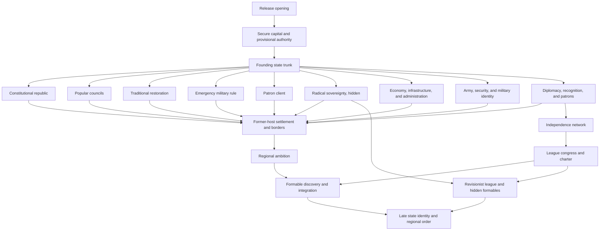

# Focus tree lane map

This diagram shows branch relationships. The implementation agent owns final coordinates and exact focus count.

## Layout intent

- The survival trunk stays central.
- Government routes fan outward and remain visually distinct.
- Economy, military, and diplomacy support several governments.
- Former-host content and regional ambition occupy one side.
- Network, league, and formables occupy the opposite side.
- Hidden high-chaos content appears only after reveal conditions.
- Regional and country modules attach near the lane they modify.
