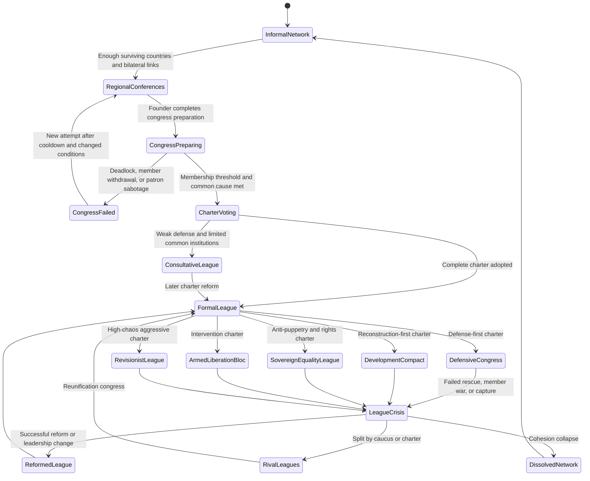

# League state machine

```mermaid
stateDiagram-v2
    [*] --> InformalNetwork
    InformalNetwork --> RegionalConferences: Enough surviving countries and bilateral links
    RegionalConferences --> CongressPreparing: Founder completes congress preparation
    CongressPreparing --> CongressFailed: Deadlock, member withdrawal, or patron sabotage
    CongressPreparing --> CharterVoting: Membership threshold and common cause met
    CharterVoting --> ConsultativeLeague: Weak defense and limited common institutions
    CharterVoting --> FormalLeague: Complete charter adopted
    FormalLeague --> DefensiveCongress: Defense-first charter
    FormalLeague --> DevelopmentCompact: Reconstruction-first charter
    FormalLeague --> SovereignEqualityLeague: Anti-puppetry and rights charter
    FormalLeague --> ArmedLiberationBloc: Intervention charter
    FormalLeague --> RevisionistLeague: High-chaos aggressive charter
    ConsultativeLeague --> FormalLeague: Later charter reform
    CongressFailed --> RegionalConferences: New attempt after cooldown and changed conditions
    DefensiveCongress --> LeagueCrisis: Failed rescue, member war, or capture
    DevelopmentCompact --> LeagueCrisis
    SovereignEqualityLeague --> LeagueCrisis
    ArmedLiberationBloc --> LeagueCrisis
    RevisionistLeague --> LeagueCrisis
    LeagueCrisis --> ReformedLeague: Successful reform or leadership change
    LeagueCrisis --> RivalLeagues: Split by caucus or charter
    LeagueCrisis --> DissolvedNetwork: Cohesion collapse
    ReformedLeague --> FormalLeague
    RivalLeagues --> FormalLeague: Reunification congress
    DissolvedNetwork --> InformalNetwork
```

## Values driving transitions

- League Cohesion
- Common Cause
- Patron Capture
- Shared Reserve
- Member Confidence
- member survival and host threat
- charter compliance
