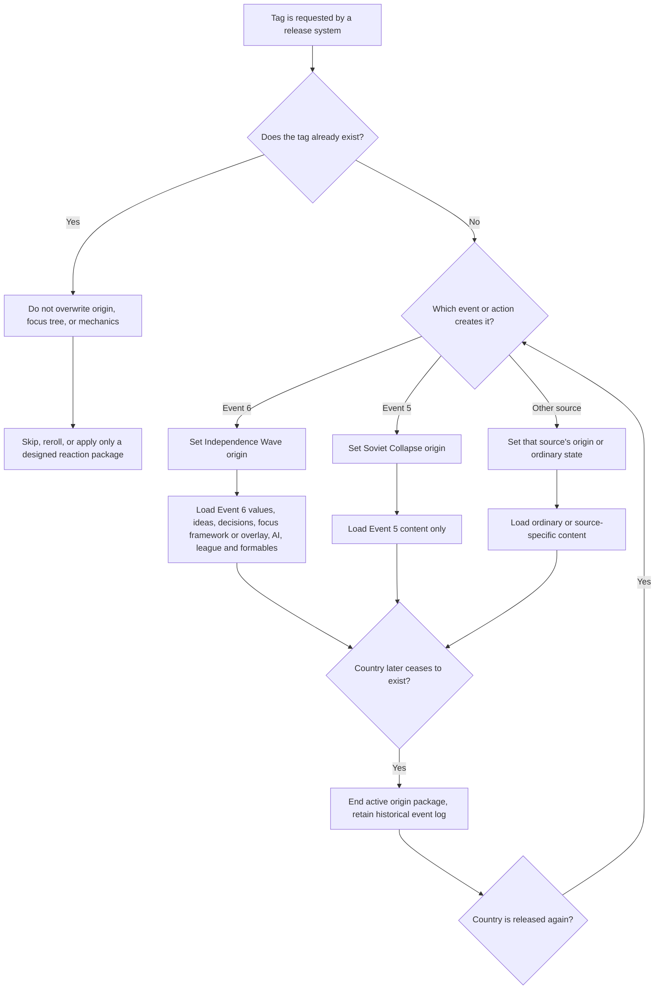

# Origin separation model

## Cluster collision rule

When Events 5 and 6 are in one Liberations cluster firing, both plans reserve tags and anchors before execution. One tag receives one origin. The losing plan selects another candidate.
