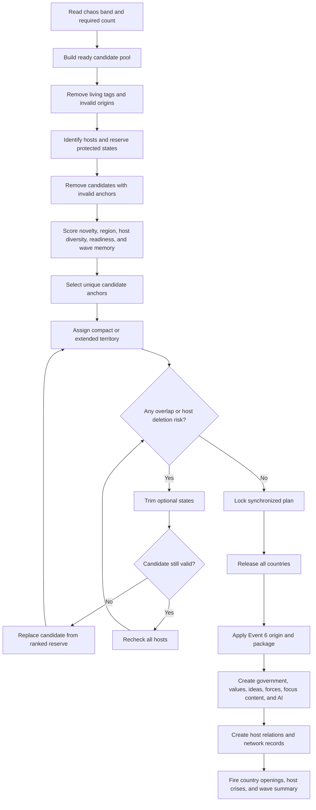

# Release planner flow

This diagram is a design guide. It is not final script.

## Priority order when a conflict appears

1. Preserve every host.
2. Preserve each selected candidate's unique anchor.
3. Trim ambition territory.
4. Trim extended territory.
5. Trim compact territory to the anchor.
6. Replace the candidate.
7. Accept a documented shortfall only when no replacement exists.
