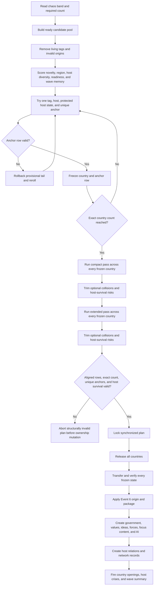

# Release planner flow

This diagram is a design guide. It is not final script.

## Priority order when a conflict appears

1. Preserve every host.
2. Preserve each selected candidate's unique anchor.
3. Keep ambition territory outside the automatic release footprint; preserve it as later claims, negotiations, missions, or formable requirements.
4. Trim extended territory.
5. Trim compact territory to the anchor.
6. During anchor selection only, replace an invalid candidate and continue until the exact count is reached or the incident aborts before mutation.

The ambition step is not a fourth release tier. Part 1's package contract is authoritative: automatic and scenario allocation reserves anchor, compact, and extended states only, while ambition territory remains playable post-release content.
