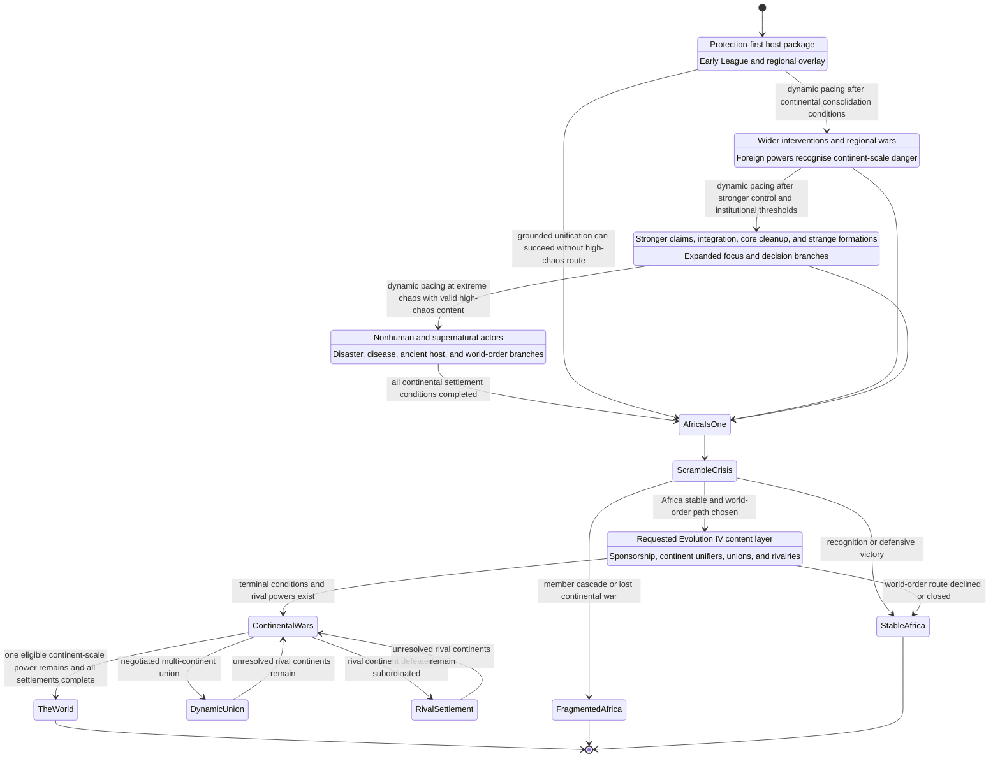

# Event 12 Africa evolution and world-order state machine

The event begins at Chaos tier 4. The design therefore uses three logged post-fire evolutions and treats the requested Evolution IV as a post-unification escalation layer rather than an impossible fourth post-tier track.

## Pacing notes

- Evolution incidents use dynamic MTTH and do not fire instantly unless a forced evolved opening explicitly calls for it.
- Disabled evolutions must not set recorded flags or block the grounded route.
- High-chaos content is optional and cannot become a hidden prerequisite for Africa is one.
- Post-unification Evolution IV content is still a major playable layer, but it should not be logged as an impossible extra chaos-tier evolution if the shared system supports only one evolution stage per tier.
- The World requires the shared world-end threshold, terminal guards, resolved continent identities, and a fully researched super-event package.
