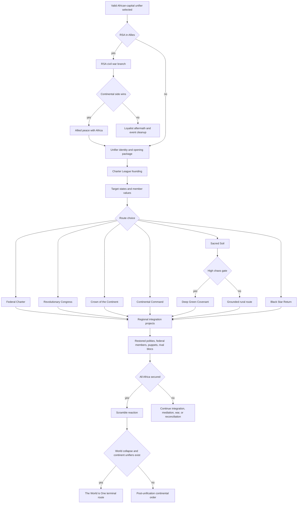

# 012 Africa final canonical system flow

```mermaid
flowchart TD
    A[Valid African-capital unifier selected] --> B{RSA in Allies}
    B -->|yes| C[RSA civil war branch]
    B -->|no| D[Unifier identity and opening package]
    C --> E{Continental side wins}
    E -->|yes| F[Allied peace with Africa]
    E -->|no| G[Loyalist aftermath and event cleanup]
    F --> D
    D --> H[Charter League founding]
    H --> I[Target states and member values]
    I --> J{Route choice}
    J --> K[Federal Charter]
    J --> L[Revolutionary Congress]
    J --> M[Crown of the Continent]
    J --> N[Continental Command]
    J --> O[Sacred Soil]
    J --> P[Black Star Return]
    O --> Q{High chaos gate}
    Q -->|yes| R[Deep Green Covenant]
    Q -->|no| S[Grounded rural route]
    K --> T[Regional integration projects]
    L --> T
    M --> T
    N --> T
    S --> T
    P --> T
    R --> T
    T --> U[Restored polities, federal members, puppets, rival blocs]
    U --> V{All Africa secured}
    V -->|yes| W[Scramble reaction]
    V -->|no| X[Continue integration, mediation, war, or reconciliation]
    W --> Y{World collapse and continent unifiers exist}
    Y -->|yes| Z[The World is One terminal route]
    Y -->|no| AA[Post-unification continental order]
```
