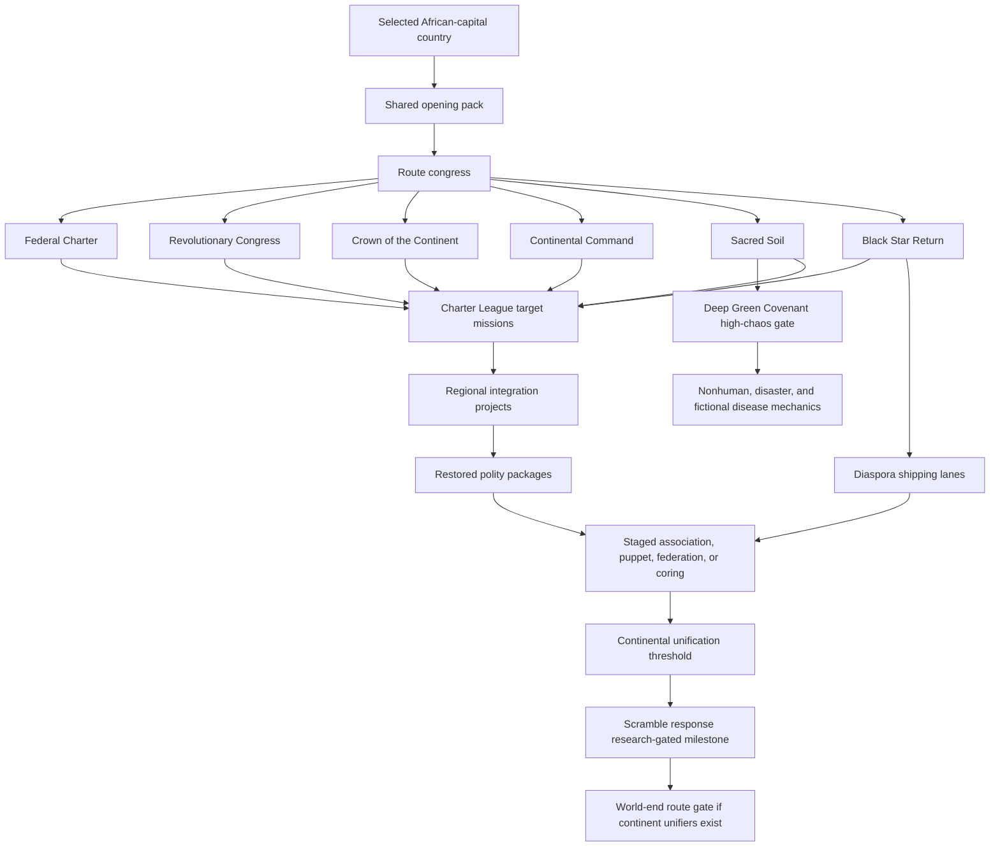

# 012 Africa third-pass focus and integration flow

```mermaid
flowchart TD
    A[Selected African-capital country] --> B[Shared opening pack]
    B --> C[Route congress]
    C --> F[Federal Charter]
    C --> R[Revolutionary Congress]
    C --> K[Crown of the Continent]
    C --> M[Continental Command]
    C --> S[Sacred Soil]
    C --> D[Black Star Return]
    S --> G[Deep Green Covenant high-chaos gate]
    F --> L[Charter League target missions]
    R --> L
    K --> L
    M --> L
    S --> L
    D --> L
    G --> H[Nonhuman, disaster, and fictional disease mechanics]
    L --> I[Regional integration projects]
    I --> P[Restored polity packages]
    P --> U[Staged association, puppet, federation, or coring]
    D --> X[Diaspora shipping lanes]
    X --> U
    U --> O[Continental unification threshold]
    O --> Q[Scramble response research-gated milestone]
    Q --> W[World-end route gate if continent unifiers exist]
```
