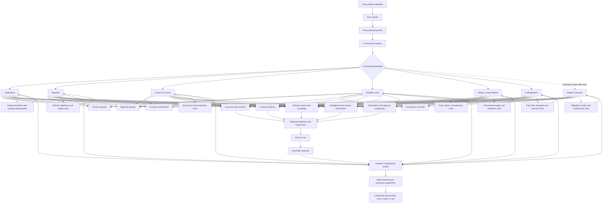

# Event 012 Africa focus-route interaction map

This diagram shows how the constitutional routes share support branches while changing their rules, crises, and end states. It is a design guide rather than final focus coordinates.

## Design reading

- The four cross-route values let the same support lane behave differently under each constitution.
- Every route has a crisis that tests its governing promise.
- A route crisis can be resolved, partially settled, or allowed to transform the constitution.
- Shared branches do not become identical. Their costs, authority, consent, and distribution rules come from the route.
- Postwar review is mandatory after major emergency rule. The player cannot preserve every wartime institution without consequence.
- The hidden Covenant can reuse support lanes only after it defines obligations, boundaries, and human safeguards.
