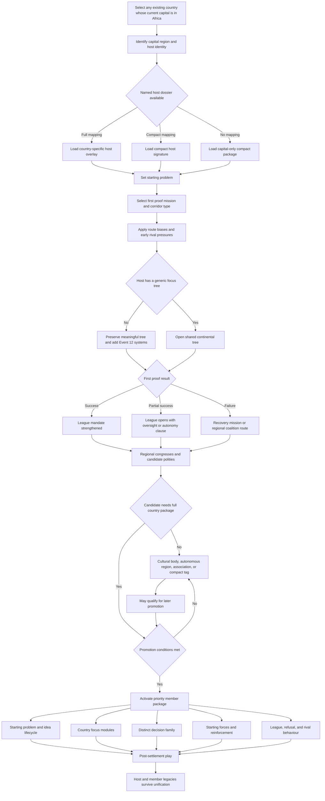

# Event 012 Africa host-overlay and country-package selection flow

This diagram shows how the event creates country specificity without assigning a separate full tree to every African start.

## Selection rules

The host pool is geographic and exhaustive: every existing country whose current capital is in Africa is eligible. Named dossiers, focus trees, contacts, political status, capital control, and country classification change content or weighting only. Event 12 has no valid host only when the map contains no country with an African capital.

A full host dossier is used when the country has a distinct opening problem that changes the first mission, constitutional risks, diplomatic behaviour, military geography, and post-unification legacy.

A compact signature is used when the country needs identity but does not justify a parallel large overlay. It changes one host problem, one first proof, one regional hook, one support-branch mutation, and AI preferences.

An African-capital country outside the named matrix receives the neutral capital-only compact package and a continent-wide contact pool. It never impersonates a named country dossier. A meaningful existing focus tree is preserved; only the generic focus tree is replaced by the continental tree.

A priority member package is promoted only when it has:

- a viable compact territory or stable autonomy
- local support or a functioning political institution
- an economic or strategic role
- a distinct relationship problem with the League
- a safe force and access plan
- content that does not duplicate a neighbouring package

A candidate remains a cultural body, autonomous region, associated council, or compact tag when a full country would create an inaccessible enclave, unsafe territorial transfer, or duplicate system.
