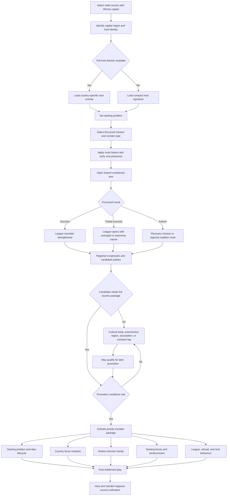

# Event 012 Africa host-overlay and country-package selection flow

This diagram shows how the event creates country specificity without assigning a separate full tree to every African start.

## Selection rules

A full host dossier is used when the country has a distinct opening problem that changes the first mission, constitutional risks, diplomatic behaviour, military geography, and post-unification legacy.

A compact signature is used when the country needs identity but does not justify a parallel large overlay. It changes one host problem, one first proof, one regional hook, one support-branch mutation, and AI preferences.

A priority member package is promoted only when it has:

- a viable compact territory or stable autonomy
- local support or a functioning political institution
- an economic or strategic role
- a distinct relationship problem with the League
- a safe force and access plan
- content that does not duplicate a neighbouring package

A candidate remains a cultural body, autonomous region, associated council, or compact tag when a full country would create an inaccessible enclave, unsafe territorial transfer, or duplicate system.
