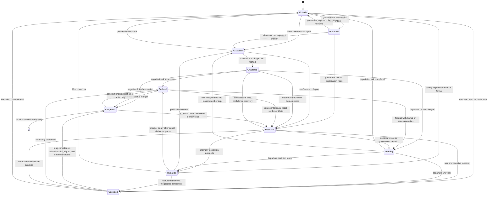

# Event 12 Africa member relationship state machine

This state machine defines the intended political lifecycle. It is not a direct script recipe.

## Transition rules

- Positive opinion alone never moves a country into integration.
- Every upward transition needs visible cooperation, confidence, clauses, route compatibility, and manageable Integration Burden.
- Occupation never grants immediate full integration by default.
- A member can move backward when guarantees fail, clauses are broken, representation is denied, or costs exceed benefits.
- Rival blocs can be legitimate African alternatives. Their peaceful merger requires equal-status settlement.
- Terminal cleanup must preserve history and achievement tracking before obsolete relationship variables are cleared.
