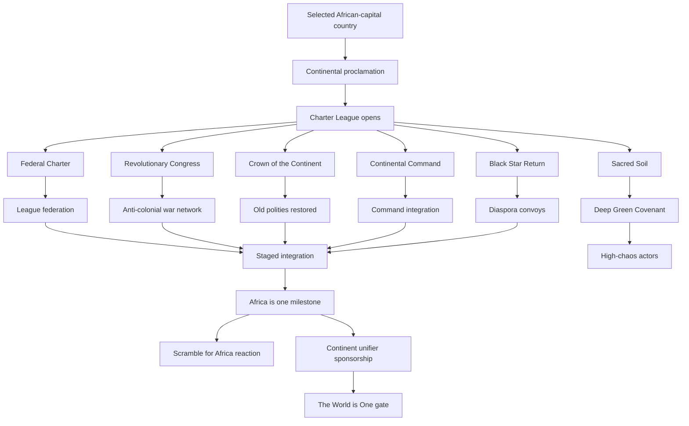

# 012 Africa route sketch

```mermaid
flowchart TD
    A[Selected African-capital country] --> B[Continental proclamation]
    B --> C[Charter League opens]
    C --> D[Federal Charter]
    C --> E[Revolutionary Congress]
    C --> F[Crown of the Continent]
    C --> G[Continental Command]
    C --> H[Black Star Return]
    C --> I[Sacred Soil]
    I --> J[Deep Green Covenant]
    D --> K[League federation]
    E --> L[Anti-colonial war network]
    F --> M[Old polities restored]
    G --> N[Command integration]
    H --> O[Diaspora convoys]
    K --> P[Staged integration]
    L --> P
    M --> P
    N --> P
    O --> P
    J --> Q[High-chaos actors]
    P --> R[Africa is one milestone]
    R --> S[Scramble for Africa reaction]
    R --> T[Continent unifier sponsorship]
    T --> U[The World is One gate]
```
