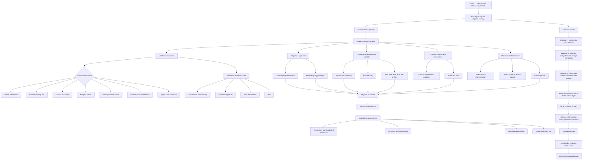

# Event 12 Africa system architecture

This diagram is a design guide, not final HOI4 GUI geometry or script structure.

## Reading notes

- Protection, member agency, development, military preparation, diaspora return, and restoration operate in parallel.
- Constitutional routes change integration policy and political identity without closing the support branches by default.
- Rival blocs and member departure are normal political outcomes, not script failures.
- High-chaos content enters after the grounded continental system is already established.
- Scramble response is a global reaction to successful unification.
- The World is a rare terminal identity after every continent-scale rival is resolved.
