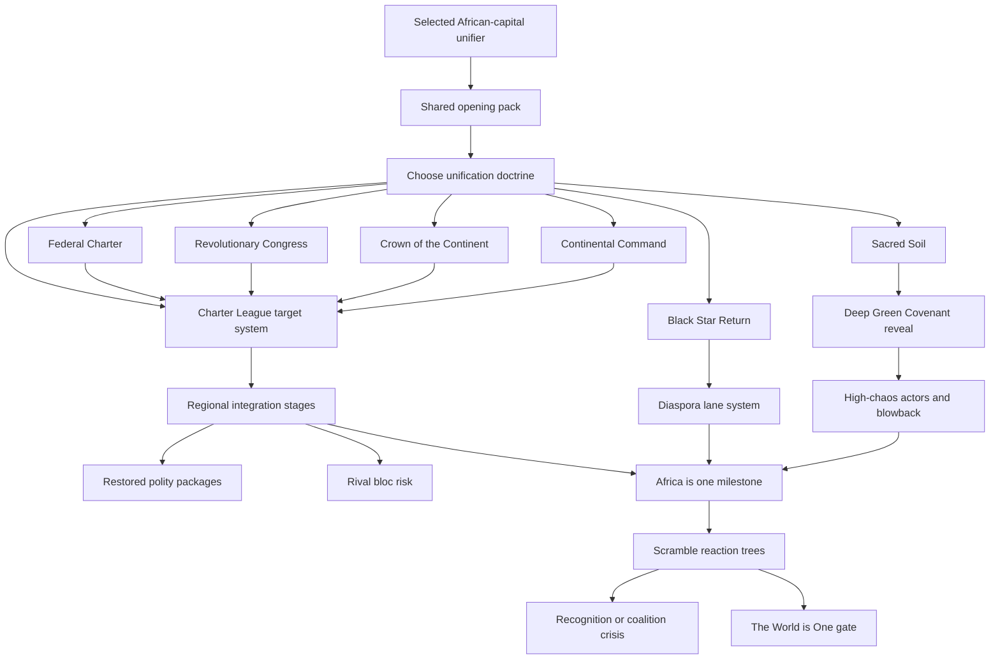

# 012 Africa second-pass system flow diagram

```mermaid
flowchart TD
    Start[Selected African-capital unifier] --> Opening[Shared opening pack]
    Opening --> Doctrine[Choose unification doctrine]
    Doctrine --> Federal[Federal Charter]
    Doctrine --> Revolution[Revolutionary Congress]
    Doctrine --> Crown[Crown of the Continent]
    Doctrine --> Command[Continental Command]
    Doctrine --> Sacred[Sacred Soil]
    Doctrine --> Star[Black Star Return]
    Sacred --> Green[Deep Green Covenant reveal]
    Doctrine --> League[Charter League target system]
    Federal --> League
    Revolution --> League
    Crown --> League
    Command --> League
    Star --> Diaspora[Diaspora lane system]
    League --> Regions[Regional integration stages]
    Regions --> Restored[Restored polity packages]
    Regions --> Rival[Rival bloc risk]
    Regions --> AfricaOne[Africa is one milestone]
    Diaspora --> AfricaOne
    Green --> HighChaos[High-chaos actors and blowback]
    HighChaos --> AfricaOne
    AfricaOne --> Scramble[Scramble reaction trees]
    Scramble --> Recognition[Recognition or coalition crisis]
    Scramble --> WorldGate[The World is One gate]
```
