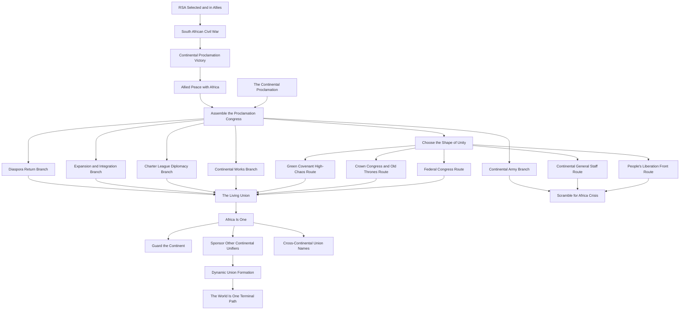
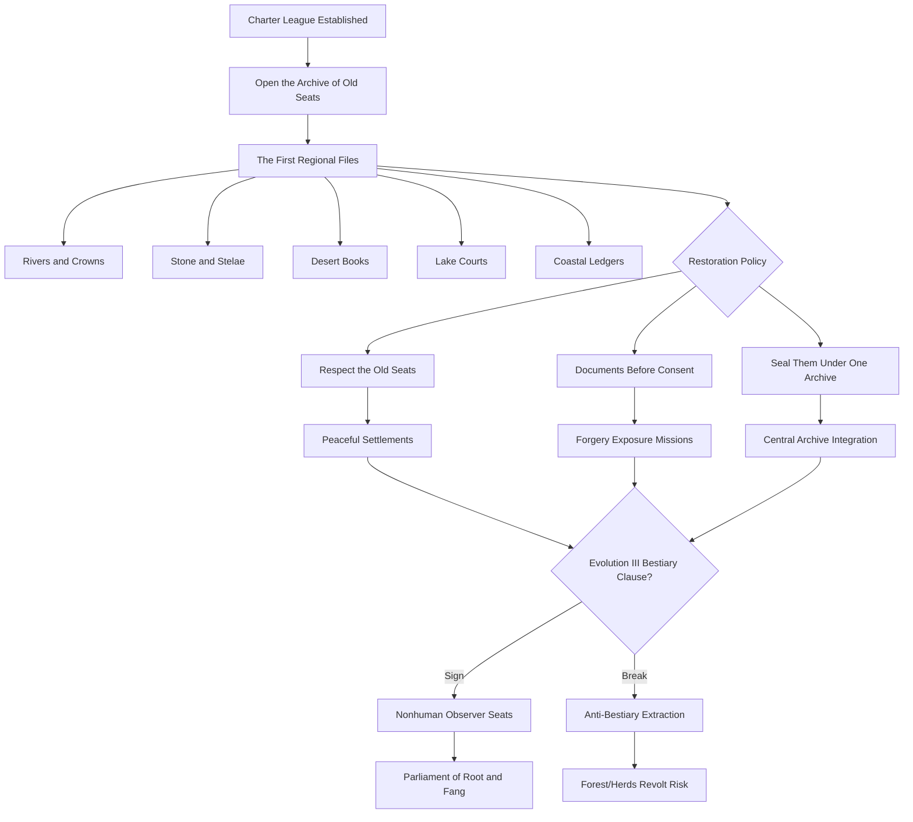
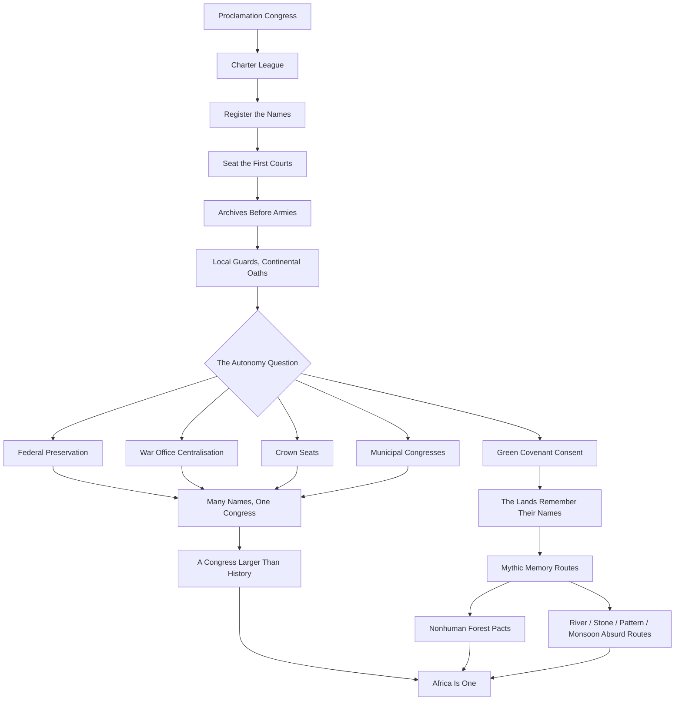

# Event 012 Africa — Focus Tree Architecture Sketch

The Mermaid file `012_africa_focus_tree_architecture.mmd` is a route sketch, not a final HOI4 coordinate map. The implementation agent should use it to preserve branch shape, route locks, convergence, hidden/high-chaos paths, and late-game sequence while creating a clean in-game focus layout.

## Archive of Old Seats overlay

## Niche country unlock graph

# Event 012 Africa — Niche Country Unlock Graph

