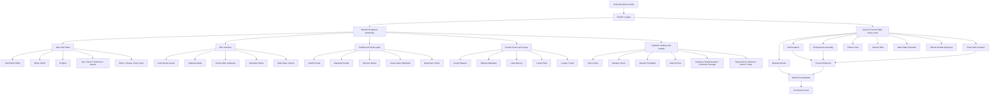

# Event 012 Africa — Expanded subject web

```mermaid
flowchart TD
    A[Selected African Unifier] --> B[Charter League]
    B --> C[Baseline Regional Authorities]
    C --> W[West and Sahel]
    C --> N[Nile and Horn]
    C --> E[Swahili and Great Lakes]
    C --> K[Central Forest and Congo]
    C --> S[Southern Plateau and Islands]

    W --> W1[Jolof-Wolof Office]
    W --> W2[Mossi Shield]
    W --> W3[Songhai]
    W --> W4[Oyo / Benin / Dahomey / Asante]
    W --> W5[Bornu / Hausa / Futa / Segu]

    N --> N1[Kush-Meroe Guard]
    N --> N2[Makuria-Alodia]
    N --> N3[Sennar Blue Sultanate]
    N --> N4[Aksumite Stelae]
    N --> N5[Adal-Harar / Ajuran]

    E --> E1[Swahili Coast]
    E --> E2[Buganda Charter]
    E --> E3[Bunyoro-Kitara]
    E --> E4[Great Lakes Highlands]
    E --> E5[Nyamwezi / Hehe]

    K --> K1[Kongo Mbanza]
    K --> K2[Ndongo-Matamba]
    K --> K3[Luba Memory]
    K --> K4[Lunda Titles]
    K --> K5[Loango / Kuba]

    S --> S1[Stone Cities]
    S --> S2[Mutapa / Rozvi]
    S --> S3[Barotse Floodplain]
    S --> S4[Merina Rova]
    S --> S5[Sakalava / Betsimisaraka / Comorian Passage]
    S --> S6[Nama-Herero-Damara / Desert Tracks]

    B --> G[Green Covenant High-Chaos Lane]
    G --> H1[Gorilla Nation]
    G --> H2[Chimpanzee Assembly]
    G --> H3[Great Herd Compact]
    G --> H4[Orisha Court]
    G --> H5[Ananse Web]
    G --> H6[Mami Wata Tidemark]
    G --> H7[Baobab Senate]
    G --> H8[Termite Citadel Engineers]
    H1 --> FP[Forest Parliament]
    H2 --> FP
    H3 --> FP
    H7 --> WR[World Root Mandate]
    FP --> WR
    WR --> WO[The World Is One]
```
