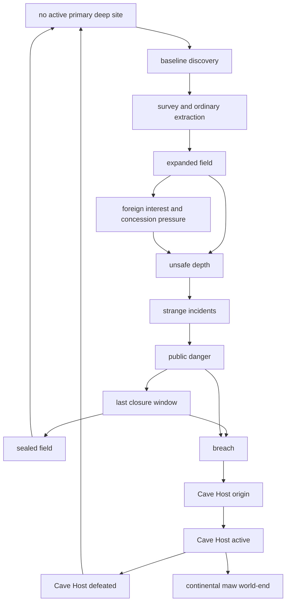

# Event 018 Resources Found Field State Machine Diagram

All state labels are working labels only. They are not final localisation.

The field state machine describes the ordinary field lifecycle. It is not the same as evolutions. Evolutions add stronger openings or new behavior, while field stages show what is happening at the discovered site.

## Stage diagram

## Stage table

| Stage | Entry cause | Player-visible condition | Decisions visible | Exit paths |
| --- | --- | --- | --- | --- |
| No active primary deep site | Start state or cleanup | No deep resource crisis is active. | none | discovery fires |
| Baseline discovery | Random valid state receives around 100 of one random resource. | Owner receives discovery popup and field category opens. | survey, first extraction, trade inquiry | survey and ordinary extraction |
| Survey and ordinary extraction | Owner acknowledges discovery. | Field has ordinary resource value and low danger. | exploit field, invest in safety, sell concession, restrict access | expanded field or closure |
| Expanded field | Owner invests or evolution starts stronger. | More resources or foreign interest appear. | expand extraction, local boom, foreign company, border security | concession pressure, unsafe depth, closure |
| Foreign interest and concession pressure | Resource is valuable to nearby or deficit countries. | Other countries show trade interest, pressure, or border attention. | concession, trade pact, smugglers, demilitarized commission if evolved | unsafe depth, border crisis, stable trade |
| Unsafe depth | Extraction pressure, greed, or evolution reaches danger threshold. | Workers suffer, tools corrode, and missing people appear. | safety commission, slow extraction, conceal incidents, emergency medical works | strange incidents, stabilized unsafe field, closure |
| Strange incidents | Evolution II or unsafe depth remains active. | Cave reports become repeated and harder to explain. | reinforce shafts, investigate tunnels, evacuate crews, hunt lower chambers | public danger, closure, temporary quiet |
| Public danger | Evolution III or failed containment makes attacks visible. | Monsters attack workers or towns and evacuation becomes public. | evacuation, public hunts, military cordon, close field, emergency collapse | last closure window, breach |
| Last closure window | Public danger is severe but breach has not happened. | Owner can sacrifice all event-added resources to close the site. | close field, emergency collapse, abandon resources | sealed field or breach |
| Sealed field | Closure succeeds before Cave Host emergence. | Event-added resources are removed and danger ends. | aftermath cleanup, compensation if designed | no active primary deep site |
| Breach | Closure fails or pressure remains too high. | Cave Host appears and takes origin state. | Host country setup, human anti-Host response | Cave Host active |
| Cave Host active | Nonhuman country exists. | Host wars neighbours and creates divisions from captured resources. | Host focus tree, Host capacity refresh, human evacuation and counter decisions | defeated or continental maw world-end |
| Cave Host defeated | Host loses country or origin sealing succeeds. | World threat source clears and aftermath may fire. | sealing, memorial, reconstruction, resource loss handling | no active primary deep site |
| Continental maw world-end | Host controls enough of a continent at chaos over 1000. | Terminal branch begins and other continents are threatened. | world-end handling | terminal state |

## Transition rules

| Transition | Trigger direction | Cleanup needed |
| --- | --- | --- |
| Discovery to survey | Owner popup acknowledged or automatic setup completes. | Save field state, owner, resource type, amount, origin state. |
| Survey to expanded field | Investment, repeat finding, or evolved opening. | Add resource memory by type and update field richness. |
| Expanded field to foreign pressure | Valuable resource, border region, or trade-deficit neighbours. | Save interested countries and concession flags. |
| Expanded field to unsafe depth | Extraction pressure rises above safety. | Start worker harm and incident pulse. |
| Unsafe depth to strange incidents | Pressure remains high and safety is low. | Start deeper incident events. |
| Strange incidents to public danger | Attacks become public or Evolution III enters active state. | Reveal emergency decisions and evacuation logic. |
| Public danger to last closure window | Site is dangerous but not breached. | Mark closure as last chance and show resource sacrifice. |
| Last closure window to sealed field | Closure succeeds. | Remove event-added resources and clear primary deep site. |
| Last closure window to breach | Closure fails, is refused, or pressure reaches breach threshold. | Calculate origin army and create Cave Host. |
| Cave Host active to defeated | Host loses last valid state or sealing route succeeds. | Clear world threat source, cleanup Host capacity logic. |
| Cave Host active to world-end | Host controls enough of a continent and chaos is over 1000. | Set world-end, show terminal super-event, gate incompatible systems. |

## Evolution overlay guide

| Evolution | Overlay on state machine | Changed entry or behavior |
| --- | --- | --- |
| Evolution I | Discovery, expanded field, foreign pressure | Larger deposits, demilitarized field demands, border tension. |
| Evolution II | Unsafe depth, strange incidents | Worker sickness, corrosion, population loss, cave attacks. |
| Evolution III | Public danger, last closure window | Monsters become public, cities lose population, closure sacrifice remains possible. |
| Evolution IV | Breach, Cave Host active | Cave Host appears as nonhuman country and begins resource-based war. |

Baseline stage progression should not be recorded as evolutions. Evolution logs should record the mutation tier, not every normal field stage.
