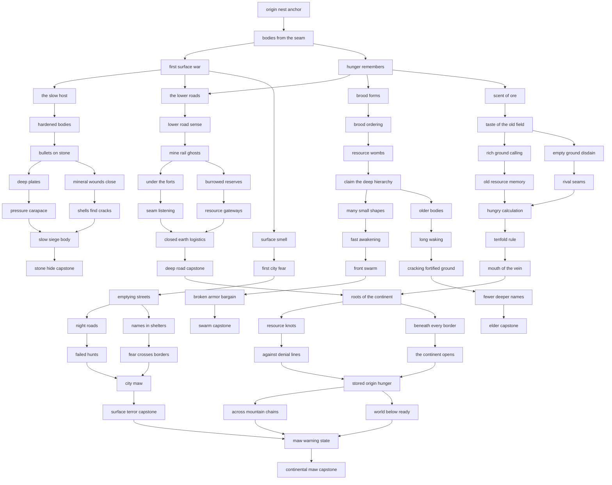

# Event 018 Resources Found Cave Host Focus Route Diagram

All labels are working labels only. They are not final localisation.

## Lane sketch

```text
row 00                       [Origin nest anchor]
row 01                       [Bodies from the seam]
row 02              [First surface war]     [Hunger remembers]
row 03       [The slow host]  [Lower roads]  [Brood forms]
row 04  Hunger opens    Stone opens    Tunnel opens    Brood method opens          Surface smell
row 05  ore scent       bullets         mine rail       resource wombs              first city fear
row 06  resource fork   armor fork      tunnel fork     method lock                 emptying streets
row 07  old memory      pressure        seam links      swarm or elder split         fear fork
row 08  calculation     cracks          logistics       route development           public hunts
row 09  tenfold rule    siege body      deep road       route payoff                city maw
row 10  hunger capstone stone capstone  tunnel capstone route payoff                terror capstone
row 11                       [Roots of the continent]
row 12                  [Resource knots] [Beneath every border]
row 13              [Against denial lines] [The continent opens]
row 14                       [Stored origin hunger]
row 15                  [Mountain chains] [World below ready]
row 16                       [Maw warning state]
row 17                       [Continental maw capstone]
```

## Mermaid route map



## Route lock notes

- Swarm and elder routes must be mutually exclusive.
- Hunger, stone hide, tunnel, surface terror, and continental maw are compatible paths.
- Continental maw needs a territory and chaos gate even when focus prerequisites are met.
- Surface terror should require public Host violence, not only an early focus click.
- Existing branch completion should change decision categories and AI behaviour where possible.

## Final layout warning

The diagram is a design map. It should not force final in-game coordinates if the actual focus file becomes ugly. The final tree should use readable lanes, comfortable spacing, and no duplicate coordinates. The route coverage table in Part 7 is the acceptance target.
