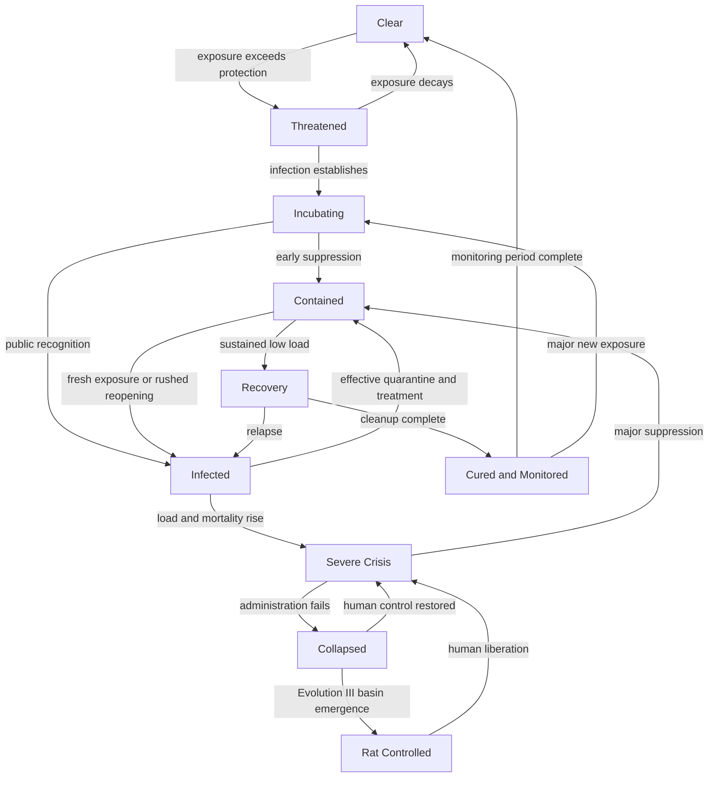

# Crisis Board State Flow

## Provenance overlay

Natural, accidental, weaponized, relapse, and rat-occupation provenance sit above this state flow. They change condemnation, starting load, attribution, or rat behavior without creating duplicate disease instances.
