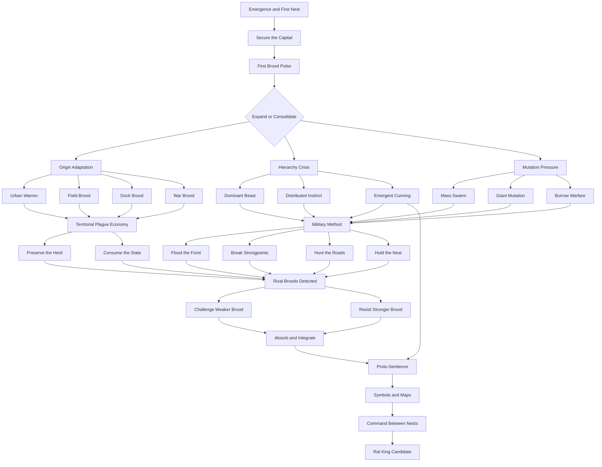

# Base Rat Nation Focus Tree Architecture

## Layout rules

- Origin modules sit as short distinct side branches.
- Hierarchy and mutation are visually separate mutual-choice families.
- Territorial policy converges with military method before rival absorption.
- Proto-sentience is visible only when its conditions are met.
- The tree should not create connector lines that cross the main route families.
