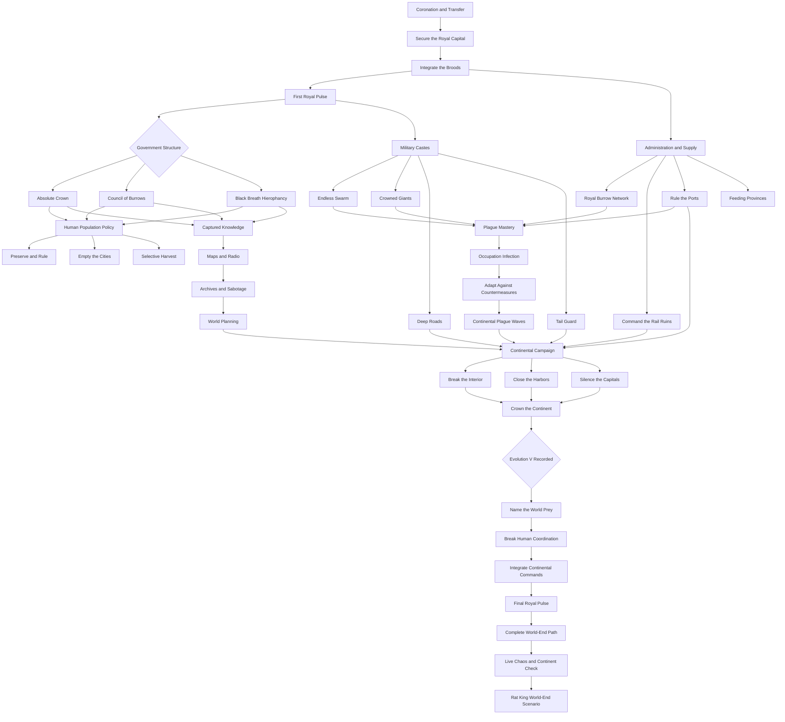

# Rat King Focus Tree Architecture

## Layout rules

- Government routes occupy a clear upper fork and remain visible throughout the tree.
- Administration, military, plague, and knowledge branches can coexist but have route-weighted rewards.
- Human population policy is a real mutually exclusive branch.
- Continental campaign converges from several support branches.
- World-end path remains hidden until Evolution V and cannot be reached by bypassing continent objectives.
