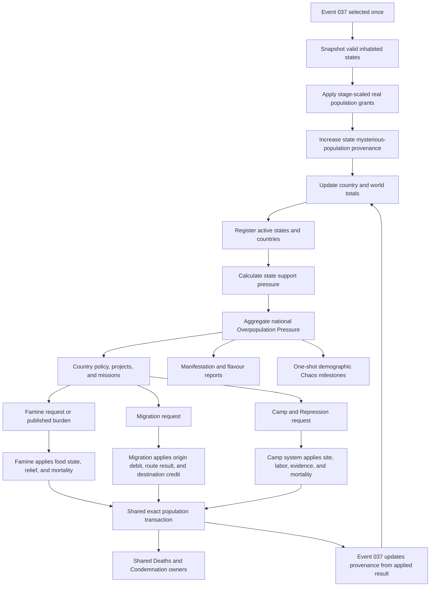

# Event 037 system flow

## Ownership map



## Data ownership table

| Fact or action | Owner | Event 037 responsibility |
| --- | --- | --- |
| Real population creation | Event 037 | create once and record applied amount |
| Mysterious provenance | Event 037 | maintain state, country, and world totals |
| Integration | Event 037 | track administrative absorption |
| Overpopulation Pressure | Event 037 | summarize support burden |
| Food Security, reserves, relief | Famine | publish burden and receive results |
| Movement, routes, reception | Migration | submit composition-proven request and reconcile results |
| Camps, forced labor, killing | Camp and Repression | identify targeted cohort and reconcile applied results |
| Civilian deaths | Deaths owner for the cause | reduce provenance after the applied transaction |
| Public atrocity consequence | Condemnation | provide evidence-linked context only |
| Special-country eligibility | shared civilian classifiers | call shared result, no private tag list |
| Event history and evolution history | shared Event Logs | provide one firing and clean evolution context |
| Direct event Chaos | Event 037 | apply one-shot demographic milestones only |

## Runtime cadence

### At manifestation

- one bounded world-state pass
- one grant per valid state
- one global transaction identity
- one event-history row
- relevant player reports after totals are final

### After manifestation

- active state and country registries only
- event-driven refresh after creation, movement, mortality, ownership, capacity, and policy changes
- bounded pressure updates
- incremental totals
- resolved entries removed

### Reconciliation

A full recount is an explicit repair, save migration, or debug action. It is not normal daily or monthly processing.

## Transaction invariants

```text
real state population after grant
= real state population before grant
+ applied Event 037 grant
```

```text
living mysterious population after grant
= living mysterious population before grant
+ applied Event 037 grant
```

```text
ordinary mysterious deaths
= applied ordinary civilian loss
multiplied by the pre-loss mysterious share
subject to rounding and population bounds
```

```text
targeted mysterious deaths or movement
= the applied targeted transaction result
bounded by living mysterious population
```

```text
world living mysterious population
= sum of current state provenance
```

The same person cannot be credited to two states, killed twice, moved without origin debit, or removed from provenance without a matching real population transaction.
