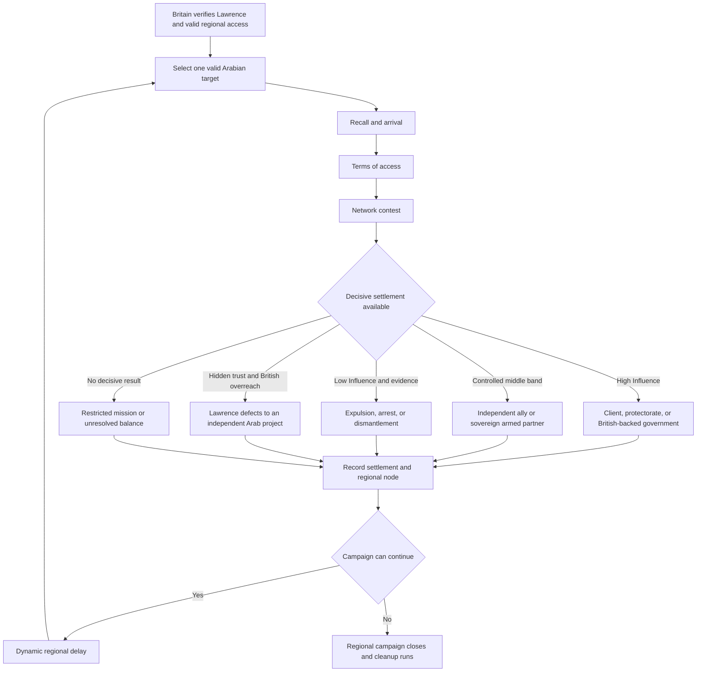
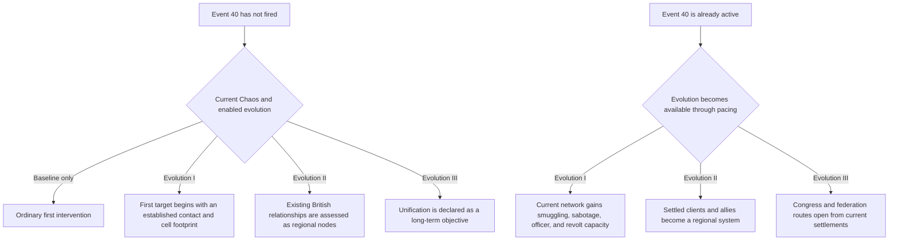
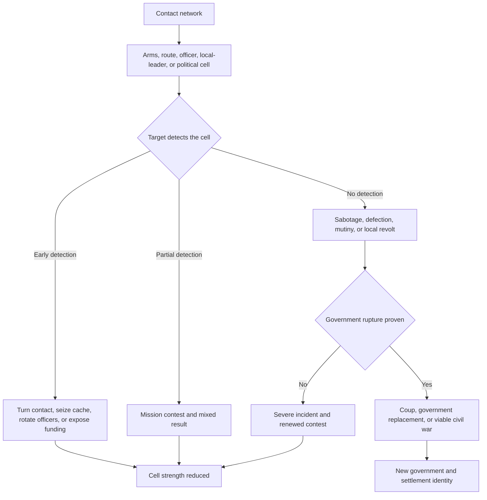
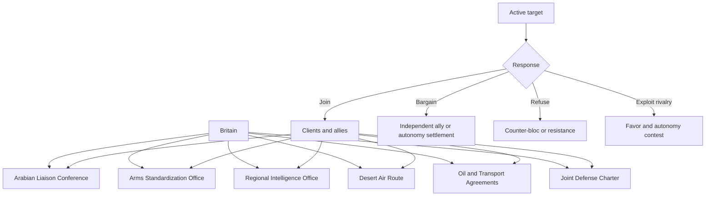
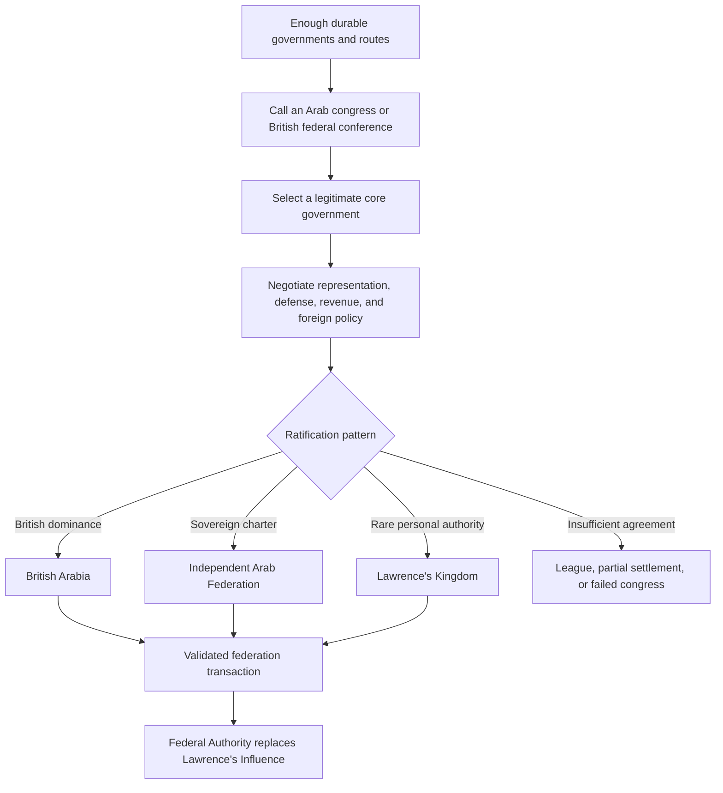
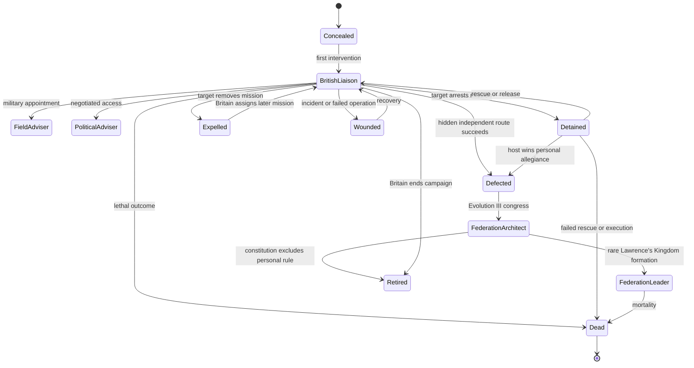

# Event 40 Route Maps

## Baseline campaign flow



## Influence response map


## Evolution entry paths



## Evolution I incident ladder



## Evolution II system map



## Evolution III formation map



## Lawrence character state map



## Federation focus architecture

```text
                         PROVISIONAL FEDERATION
                                  |
                 FOUNDING CHARTER AND TEMPORARY CAPITAL
                                  |
        +-------------------------+-------------------------+
        |                         |                         |
POLITICAL SETTLEMENT       FEDERAL STRUCTURE        COMMAND INTEGRATION
        |                         |                         |
+-------+-------+          +------+-------+          +------+-------+
|       |       |          |              |          |              |
British Sovereign Lawrence Central State Charter     General Staff  Member Council
Compact Congress Personal  Method        Method      Method         Method
        |       Settlement        |              |          |              |
        +-----------+-------------+--------------+----------+--------------+
                    |
       ECONOMY, OIL, RAIL, PORTS, AIR ROUTES, SUPPLY
                    |
         DIPLOMACY, RECOGNITION, AND ACCESSION
                    |
          REGIONAL SETTLEMENT AND LATE ORDER
```

## Outcome and cleanup matrix

| Outcome | Lawrence status | British regional reach | Target category | Later role |
| --- | --- | --- | --- | --- |
| British client | British liaison or regional adviser | increases | closes | regional node |
| Independent ally | British liaison with limits | moderate increase | closes | treaty partner |
| Sovereign armed partner | British liaison with narrow access | small increase | closes | possible congress member |
| Restricted mission | may remain or return | little change | closes | neutral memory |
| Expulsion | expelled | decreases | closes after cleanup | target preparedness |
| Arrest | detained | uncertain | captivity actions replace ordinary actions | exchange, rescue, trial, or defection |
| Dismantled network | expelled or returned | strong decrease | closes after mission | counter-bloc support |
| Defection | independent adviser | decreases sharply | independent actions replace British actions | federation architect |
| Federation formation | architect, adviser, leader, retired, or dead | converted into outcome-specific relation | Lawrence's Influence closes | Federal Authority begins |
