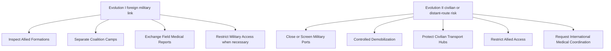

# Event 41 decision state map

## Baseline phase map

```mermaid
flowchart TD
    A[Localized pressure] --> B[Rotate the Sickest Formations]
    A --> C[Establish Quarantine Camps]
    A --> D[Expand Field Hospitals]
    A --> E[Sanitize Camps and Supply]
    A --> F[Set Operational Posture]

    G[Operational epidemic] --> H[Active rotation mission or new sector rotation]
    G --> I[Assign Medical Evacuation Priority]
    G --> J[Expand Field Hospitals]
    G --> K[Repair the Medical Corridor when blocked]
    G --> L[Set Operational Posture]

    M[Army crisis] --> N[Isolate the Military District]
    M --> O[Emergency Medical Mobilization]
    M --> P[Abandon the Contaminated Sector when valid]
    M --> Q[Repair or Secure the Medical Corridor]
    M --> R[Set Operational Posture]
```

## Evolution additions

## Visibility rule

The category should select the most relevant three to five primary actions from the current state. Evolution actions replace lower-priority baseline actions. They do not append an unlimited second list.
