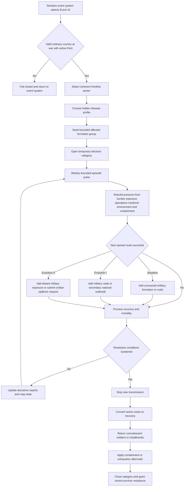
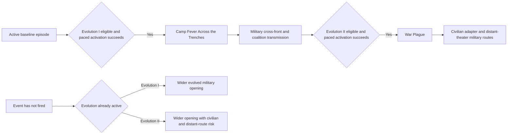

# Event 41 lifecycle diagram

```mermaid
flowchart TD
    A[Random event system selects Event 41] --> B{Valid ordinary country at war with active front}
    B -->|No| C[Fail closed and return to event system]
    B -->|Yes| D[Select coherent frontline sector]
    D --> E[Choose hidden disease profile]
    E --> F[Seed bounded affected formation group]
    F --> G[Open temporary decision category]
    G --> H[Weekly bounded episode pulse]

    H --> I[Rebuild pressure from burden exposure operations medicine environment and containment]
    I --> J{New spread route succeeds}
    J -->|No| K[Process recovery and mortality]
    J -->|Baseline| L[Add connected military formation or node]
    J -->|Evolution I| M[Add military node or secondary national outbreak]
    J -->|Evolution II| N[Add distant military exposure or submit civilian spillover request]

    L --> K
    M --> K
    N --> K

    K --> O{Resolution conditions sustained}
    O -->|No| P[Update decisions reports and map state]
    P --> H
    O -->|Yes| Q[Stop new transmission]
    Q --> R[Convert active cases to recovery]
    R --> S[Return convalescent soldiers in installments]
    S --> T[Apply containment or exhaustion aftermath]
    T --> U[Close category and grant recent-survivor resistance]
```

## Evolution entry overlay

```mermaid
flowchart LR
    A[Active baseline episode] --> B{Evolution I eligible and paced activation succeeds}
    B -->|Yes| C[Camp Fever Across the Trenches]
    C --> D[Military cross-front and coalition transmission]
    D --> E{Evolution II eligible and paced activation succeeds}
    E -->|Yes| F[War Plague]
    F --> G[Civilian adapter and distant-theater military routes]

    H[Event has not fired] --> I{Evolution already active}
    I -->|Evolution I| J[Wider evolved military opening]
    I -->|Evolution II| K[Wider opening with civilian and distant-route risk]
```
