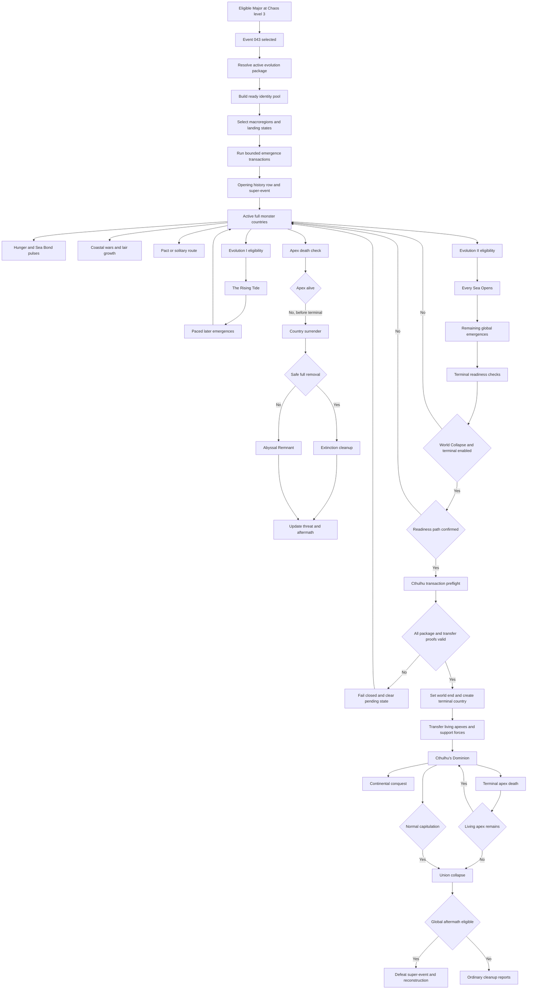

# Event 043 state machine

## State ownership

- Global Event 043 state owns roster, evolution, terminal readiness, and aftermath.
- Each full monster country owns Hunger, Sea Bond, lairs, support cap, route, and pact membership.
- Each apex identity owns permanent living, dead, and terminal-transfer receipts.
- Each threatened human country owns selected threat and active response missions.
- State records own lair, feeding, evacuation, purification, and devastation history.
