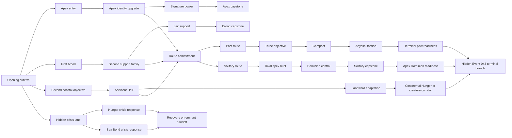

# Event 043 full-monster focus-tree lane diagram

## Layout rules

- Apex, brood, and range lanes stay visually separate.
- Pact and solitary routes split from one clear commitment.
- Crisis content occupies a compact lower lane.
- Terminal content stays hidden until Evolution II and World Collapse.
- Connector lines remain short and do not cross unrelated lanes.
- Focus Navigation targets each major lane.
