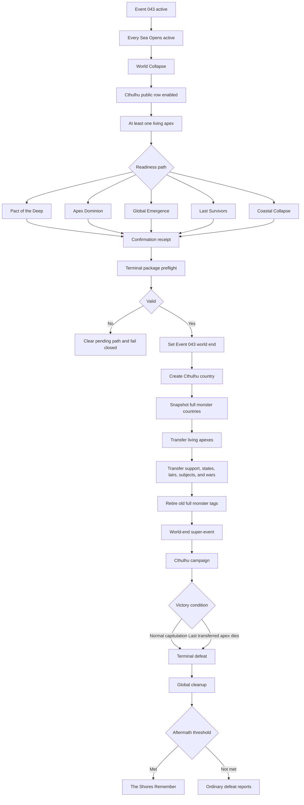

# Event 043 terminal route diagram

```mermaid
flowchart TD
    A[Event 043 active] --> B[Every Sea Opens active]
    B --> C[World Collapse]
    C --> D[Cthulhu public row enabled]
    D --> E[At least one living apex]
    E --> F{Readiness path}

    F --> P[Pact of the Deep]
    F --> Q[Apex Dominion]
    F --> R[Global Emergence]
    F --> S[Last Survivors]
    F --> T[Coastal Collapse]

    P --> U[Confirmation receipt]
    Q --> U
    R --> U
    S --> U
    T --> U

    U --> V[Terminal package preflight]
    V --> W{Valid}
    W -->|No| X[Clear pending path and fail closed]
    W -->|Yes| Y[Set Event 043 world end]
    Y --> Z[Create Cthulhu country]
    Z --> AA[Snapshot full monster countries]
    AA --> AB[Transfer living apexes]
    AB --> AC[Transfer support, states, lairs, subjects, and wars]
    AC --> AD[Retire old full monster tags]
    AD --> AE[World-end super-event]
    AE --> AF[Cthulhu campaign]

    AF --> AG{Victory condition}
    AG -->|Normal capitulation| AH[Terminal defeat]
    AG -->|Last transferred apex dies| AH
    AH --> AI[Global cleanup]
    AI --> AJ{Aftermath threshold}
    AJ -->|Met| AK[The Shores Remember]
    AJ -->|Not met| AL[Ordinary defeat reports]
```

## One terminal row

The five paths are alternate proofs for one public terminal outcome. Event Details shows one Cthulhu row and one persistent checkbox.
