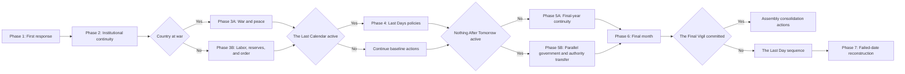

# Event 049 Decision Phase Map

## Visibility budget

- Normal phase: three to five primary decisions.
- Hard maximum: six primary decisions.
- Active mission cap: one to three.
- Later phases replace earlier actions.
- The category shows only Doomsday Conviction and Time Until the End as persistent values.

## Phase 1 action families

- Choose one government posture.
- Make one first public commitment.
- Open one immediate institution or public-order mission.

## Phase 2 action families

- Schools and universities.
- Technical institutes.
- Rail and food network.
- Military rolls and depots.
- Archives and registers.
- Hospitals and public health.

The system selects only the most relevant missions for the country.

## Phase 3A action families

- Exploratory armistice.
- Humanitarian truce.
- Conscientious service.
- Prisoner release.
- Arms-line conversion.
- Defined final offensive under Nothing Left to Lose.

## Phase 3B action families

- Reserve regulation.
- Shelter construction.
- Public evidence.
- Movement cooperation.
- Fraud exposure.
- Transport and labor continuity.

## Phase 4 action families

- Wind down long military programs.
- Cancel selected prestige projects.
- Open borders for pilgrimage or family reunion.
- Debt settlement.
- Distribute reserves.
- National observance.
- Movement representation.

Only posture-relevant actions appear.

## Phase 5B authority families

- Form a custodial administration.
- Convene a national assembly.
- Transfer local services.
- Recognize defensive-only command.
- Defend the existing government through continuity proof.
- Break the parallel government at high risk.
- Petition the Final Assembly.

## Phase 6 final-month priorities

The player chooses a limited subset among:

- Food and water.
- Hospitals and burial services.
- Archives and seed.
- Communications.
- Public vigils.
- Prisoners.
- Military standing orders.
- Family transport.
- Reopening plans.

## Phase 7 reconstruction families

- Reopen education and research.
- Recall skilled personnel.
- Restore transport and essential production.
- Settle debts and property.
- Reconstitute or reform the military.
- Convert shelters.
- Reintegrate settlements.
- Investigate suppression.
- Close the Last Calendar.
