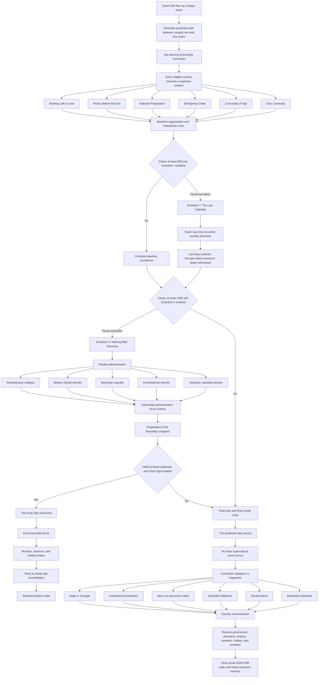

# Event 049 Route Map

The labels in this diagram are planning labels. Final localisation requires implementation review.

## Route principles

- Baseline progression remains playable when either evolution is disabled.
- The Last Calendar changes the countdown and policy layer, but it does not cause a world end.
- Nothing After Tomorrow unlocks national government replacement and terminal readiness.
- The Final Vigil requires a separate 1000 or more Chaos gate, branch toggle, and readiness proof.
- The ordinary date can fail after a severe world crisis without activating the terminal route.
- The failed-date aftermath is a full phase, not one closing popup.
