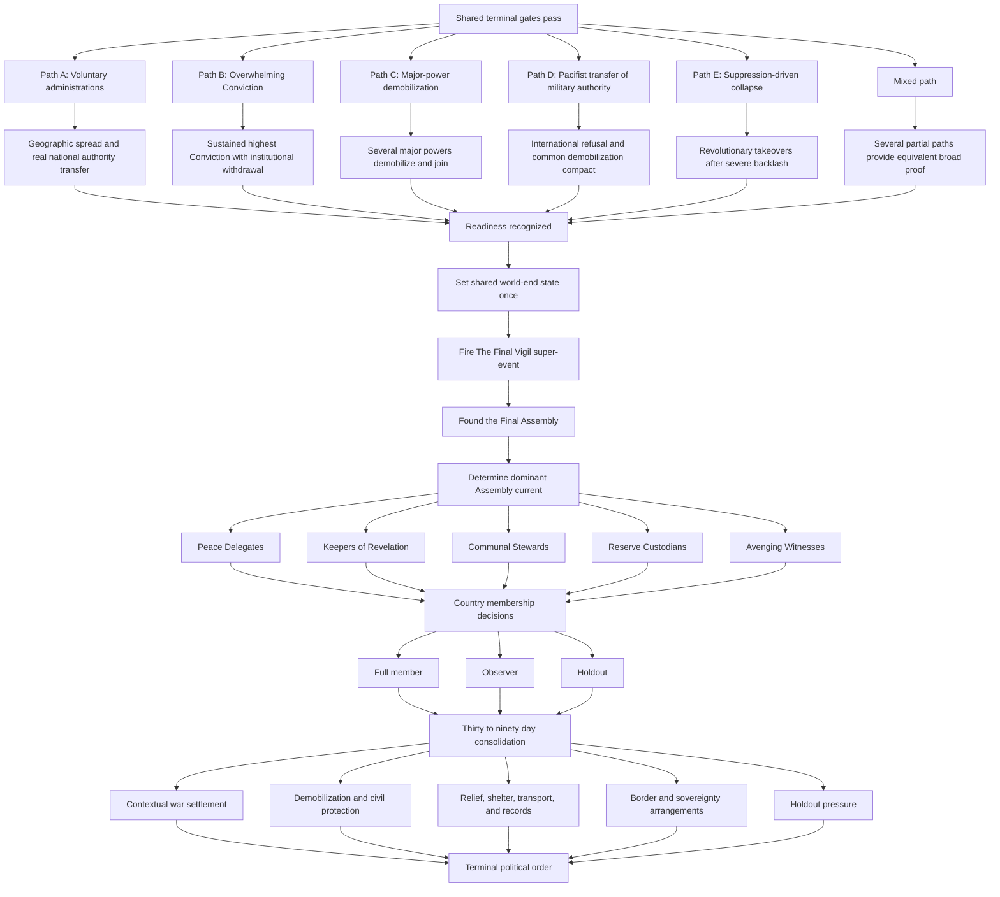

# Event 049 Terminal Path Map

## Shared gates

Every terminal path requires:

- Chaos at 1000 or more.
- Event 049 active.
- Evolution II enabled and active.
- The Final Vigil enabled in Event Details.
- No existing world end.
- Sustained political proof.

## Anti-exploit requirements

- Country weights are capped.
- Newly released microstates cannot provide full terminal weight immediately.
- One major power cannot satisfy a global path alone.
- A numeric Conviction spike without institutional withdrawal is insufficient.
- Observer states do not count as full administrations.
- Joining and leaving cannot repeat terminal milestones.
- Another world end blocks commitment.
