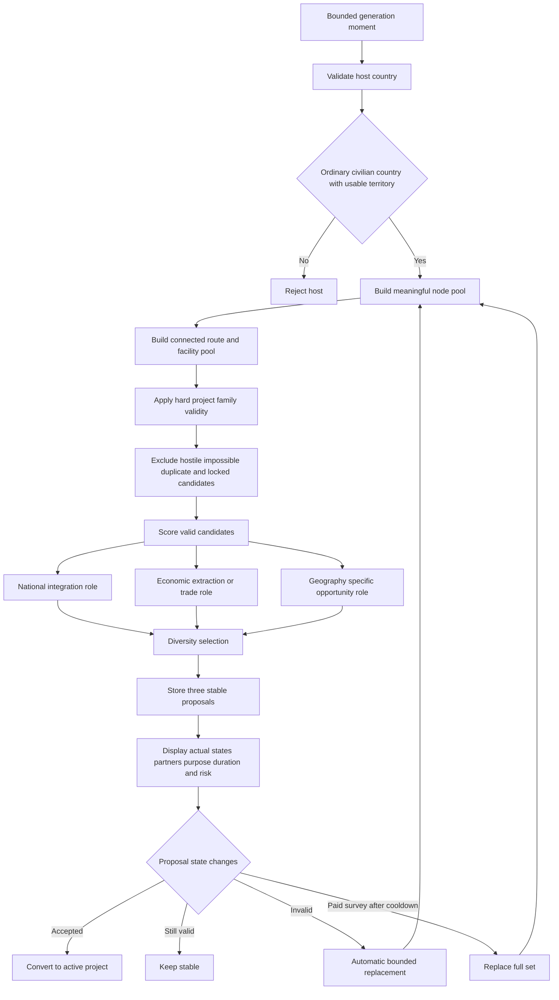

# Candidate Generation Flow

## Hard and soft gates

Hard validity determines whether a project can exist. Soft scoring determines whether a valid project is attractive. A low score can reduce selection. It can never make an invalid fixed link or foreign route appear.
