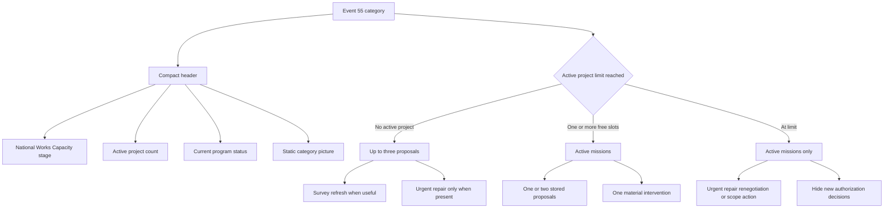

# Decision Category Visibility Map

```mermaid
flowchart TD
    A[Event 55 category] --> B[Compact header]
    B --> B1[National Works Capacity stage]
    B --> B2[Active project count]
    B --> B3[Current program status]
    B --> B4[Static category picture]
    A --> C{Active project limit reached}
    C -->|No active project| D[Up to three proposals]
    D --> D1[Survey refresh when useful]
    D --> D2[Urgent repair only when present]
    C -->|One or more free slots| E[Active missions]
    E --> E1[One or two stored proposals]
    E --> E2[One material intervention]
    C -->|At limit| F[Active missions only]
    F --> F1[Urgent repair renegotiation or scope action]
    F --> F2[Hide new authorization decisions]
```

## Budget

One category state should show three to five primary actions and never more than six. Active missions normally stay between one and three.
