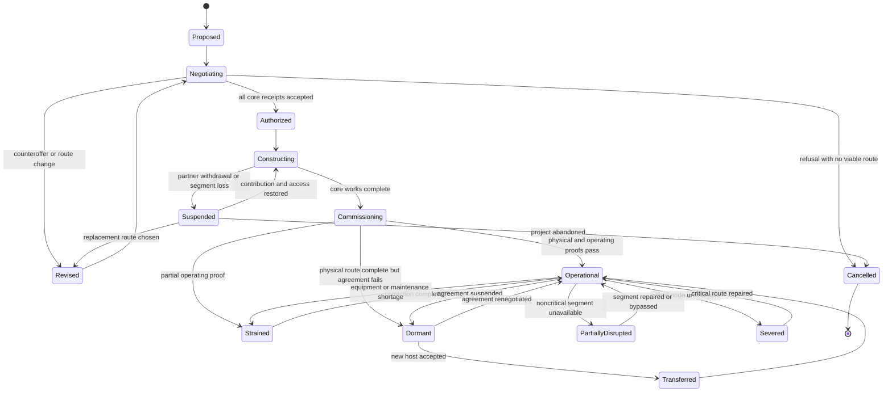

# International Corridor State Machine

## State rule

Physical infrastructure and the operating agreement are distinct. A corridor can remain physically present while its international benefits are Dormant.
