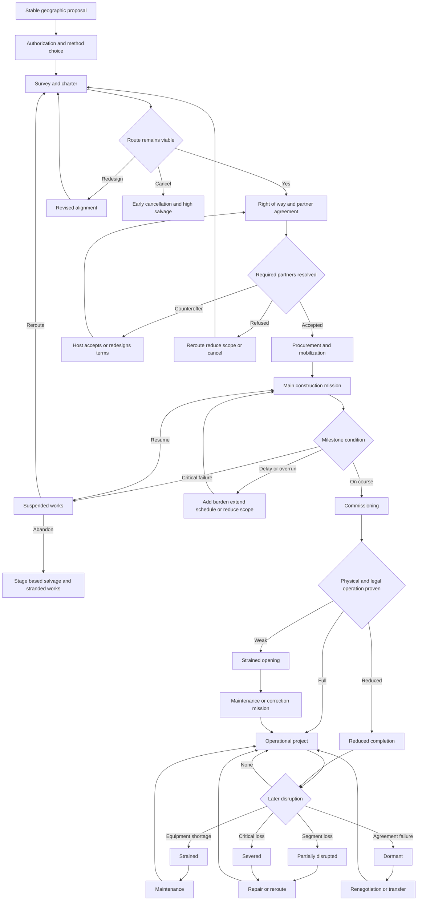

# Project Lifecycle Diagram

## Reading note

The diagram shows one project object moving through several states. Rerouting, repair, and renegotiation preserve the project identity. They do not create duplicate completed projects.
