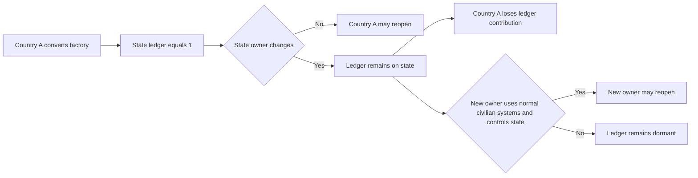
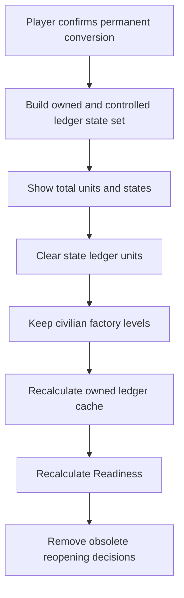

# Event 061 factory ledger

## Atomic baseline conversion

```text
Preconditions in target state
  owner is affected country
  controller is affected country
  military factory level is positive
  civilian factory can replace it

Atomic transaction
  military factory level      -1
  civilian factory level      +1
  state Event 61 ledger       +1
  country cycle converted     +1
  country owned ledger cache  +1

Failure rule
  if any required building change cannot succeed, none of the transaction is recorded
```

## Atomic restoration

```text
Preconditions in target state
  owner is acting country
  controller is acting country
  state Event 61 ledger is positive
  civilian factory level is positive
  military factory can replace it

Atomic transaction
  civilian factory level      -1
  military factory level      +1
  state Event 61 ledger       -1
  country restored total      +1
  country owned ledger cache  -1

Failure rule
  the decision cannot create a military factory unless it consumes one civilian factory and one ledger unit
```

## Ownership flow



## What changes the ledger

| Action | Ledger result |
| --- | ---: |
| Event 61 baseline converts one military factory to civilian | `+1` |
| Evolution III first transition converts one military factory to civilian | `+1` |
| Reopen State Arms Plants converts one ledgered civilian factory to military | `-1` |
| Make the Conversion Permanent accepts one ledgered civilian factory | `-1` |
| New civilian factory construction | `0` |
| New military factory construction | `0` |
| Annexation without Event 61 conversion | `0` |
| Factory damage | `0`, but capacity can become dormant |
| Factory destruction | `0` immediately, with restoration capped by actual remaining civilian levels |
| State owner change | `0`, ledger follows state |

## Country cache reconciliation

```text
Country owned ledger cache equals the sum of positive state ledger units in states that are:
  owned by the country
  controlled by the country
  valid under the ordinary civilian-system contract

The state values are authoritative.
The country total is a cache for UI, AI, decisions, and validation.
```

## Permanent civilian route



## Parallel project guard

```text
At completion, each planned restoration level is processed one at a time.
Every level rechecks current owner, controller, civilian factory, and ledger.
A project stops when any required quantity is exhausted.
Only successful atomic levels count toward Readiness or achievements.
```
