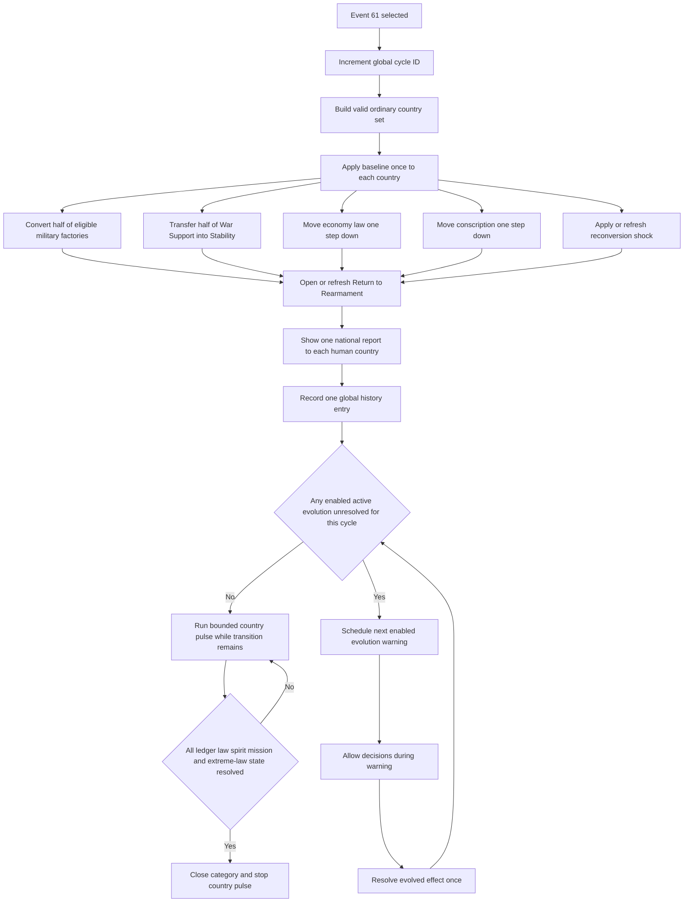
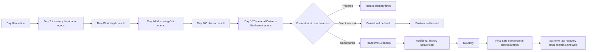
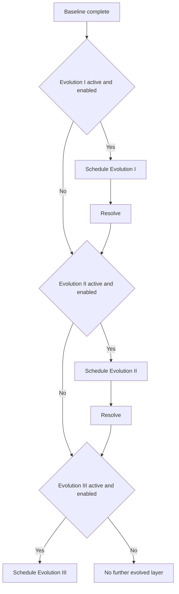
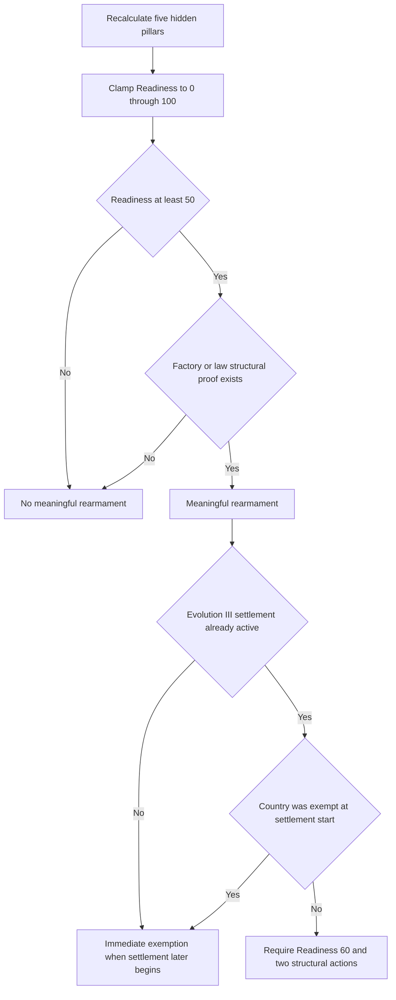
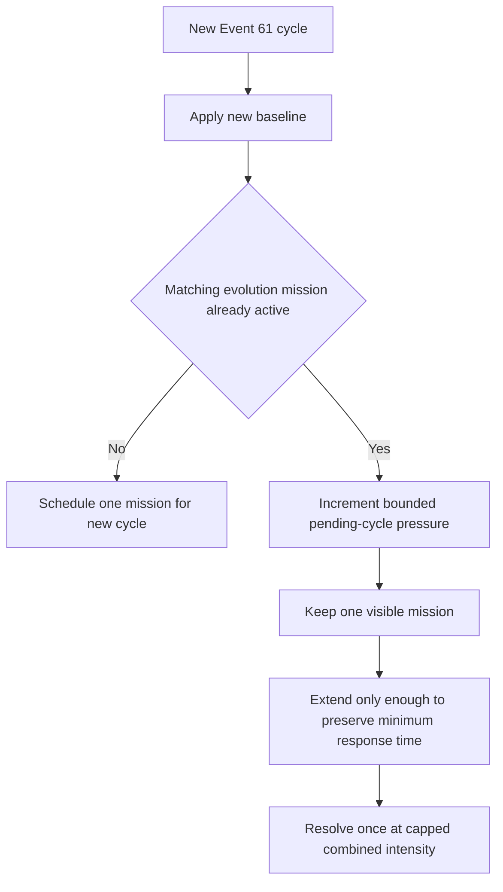

# Event 061 lifecycle

## Global firing flow

```mermaid
flowchart TD
    A[Event 61 selected] --> B[Increment global cycle ID]
    B --> C[Build valid ordinary country set]
    C --> D[Apply baseline once to each country]
    D --> E[Convert half of eligible military factories]
    D --> F[Transfer half of War Support into Stability]
    D --> G[Move economy law one step down]
    D --> H[Move conscription one step down]
    D --> I[Apply or refresh reconversion shock]
    E --> J[Open or refresh Return to Rearmament]
    F --> J
    G --> J
    H --> J
    I --> J
    J --> K[Show one national report to each human country]
    K --> L[Record one global history entry]
    L --> M{Any enabled active evolution unresolved for this cycle}
    M -->|No| N[Run bounded country pulse while transition remains]
    M -->|Yes| O[Schedule next enabled evolution warning]
    O --> P[Allow decisions during warning]
    P --> Q[Resolve evolved effect once]
    Q --> M
    N --> R{All ledger law spirit mission and extreme-law state resolved}
    R -->|No| N
    R -->|Yes| S[Close category and stop country pulse]
```

## Evolution sequence when all stages are active

```mermaid
flowchart LR
    A[Day 0 baseline] --> B[Day 7 Inventory Liquidation opens]
    B --> C[Day 45 stockpile result]
    C --> D[Day 46 Mustering Out opens]
    D --> E[Day 106 division result]
    E --> F[Day 107 National Defence Settlement opens]
    F --> G{Exempt or at direct war risk}
    G -->|Prepared| H[Retain ordinary laws]
    G -->|Direct war risk| I[Provisional deferral]
    I --> J[Postwar settlement]
    G -->|Unprepared| K[Peacetime Economy]
    K --> L[Additional factory conversion]
    L --> M[No Army]
    M --> N[Final safe conventional demobilization]
    N --> O[Extreme-law recovery route remains available]
```

## Disabled evolution rule

```mermaid
flowchart TD
    A[Baseline complete] --> B{Evolution I active and enabled}
    B -->|Yes| C[Schedule Evolution I]
    B -->|No| D{Evolution II active and enabled}
    C --> E[Resolve]
    E --> D
    D -->|Yes| F[Schedule Evolution II]
    D -->|No| G{Evolution III active and enabled}
    F --> H[Resolve]
    H --> G
    G -->|Yes| I[Schedule Evolution III]
    G -->|No| J[No further evolved layer]
```

## Readiness state flow

```mermaid
flowchart TD
    A[Recalculate five hidden pillars] --> B[Clamp Readiness to 0 through 100]
    B --> C{Readiness at least 50}
    C -->|No| D[No meaningful rearmament]
    C -->|Yes| E{Factory or law structural proof exists}
    E -->|No| D
    E -->|Yes| F[Meaningful rearmament]
    F --> G{Evolution III settlement already active}
    G -->|No| H[Immediate exemption when settlement later begins]
    G -->|Yes| I{Country was exempt at settlement start}
    I -->|Yes| H
    I -->|No| J[Require Readiness 60 and two structural actions]
```

## Repeat firing merge

```mermaid
flowchart TD
    A[New Event 61 cycle] --> B[Apply new baseline]
    B --> C{Matching evolution mission already active}
    C -->|No| D[Schedule one mission for new cycle]
    C -->|Yes| E[Increment bounded pending-cycle pressure]
    E --> F[Keep one visible mission]
    F --> G[Extend only enough to preserve minimum response time]
    G --> H[Resolve once at capped combined intensity]
```
