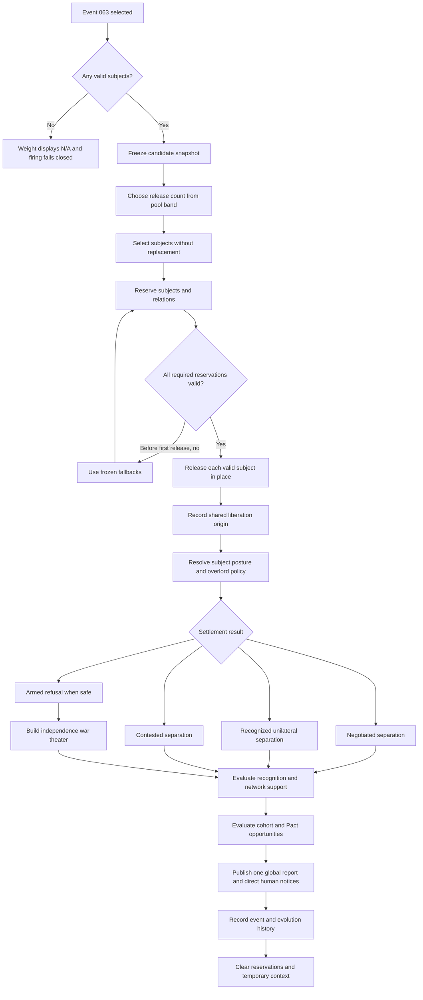
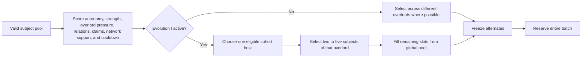
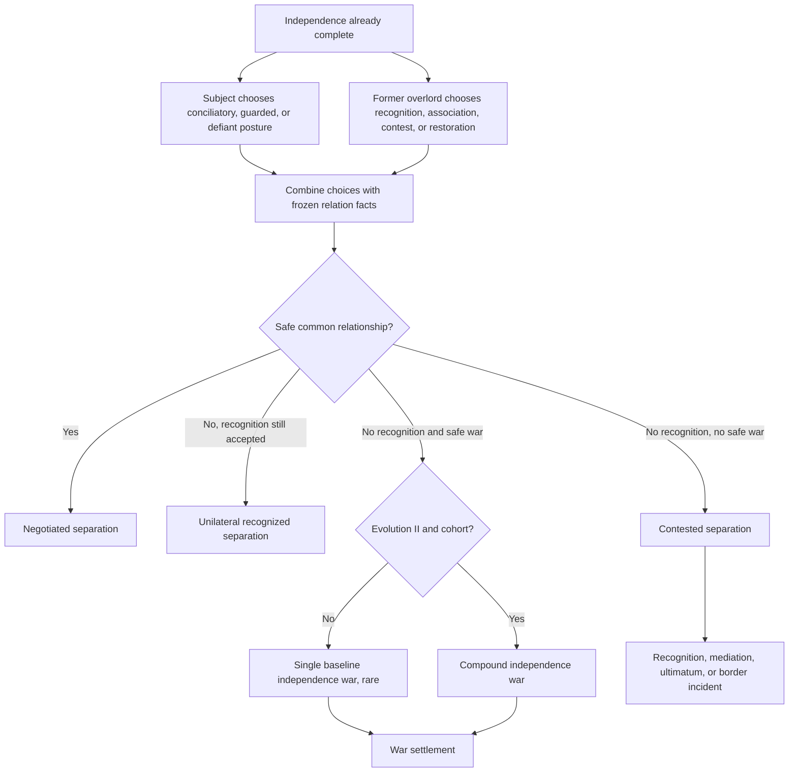
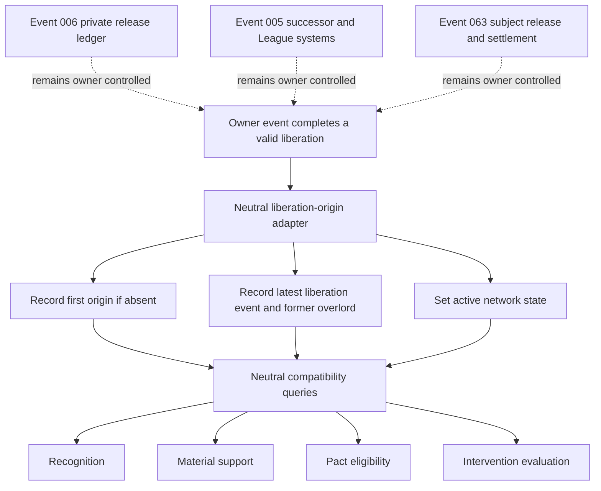
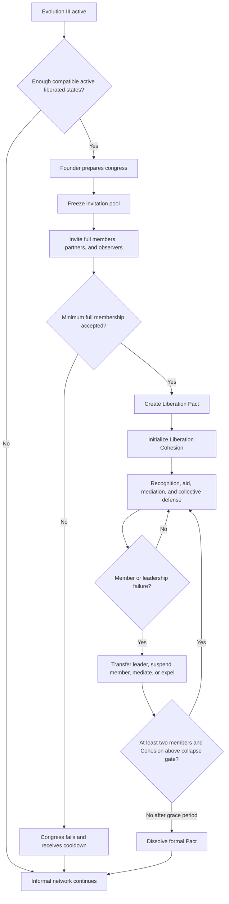
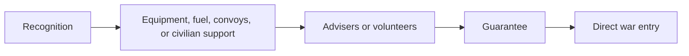

# Event 063 flow diagrams

## Firing transaction

## Candidate and cohort selection

## Settlement resolution

## Shared origin and ownership

## Liberation Pact lifecycle

## Independence-war support ladder

A supporter should choose the lowest level that can materially help. Direct war entry requires access, capacity, compatibility, and a free theater slot.
