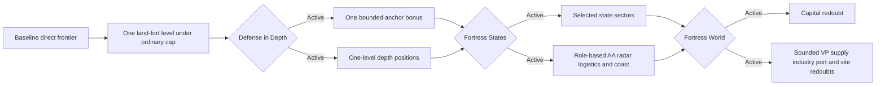
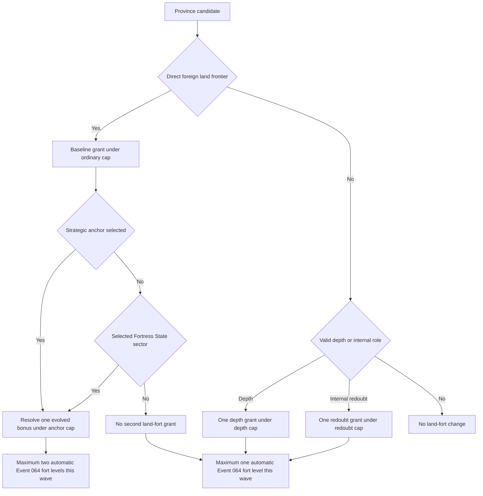
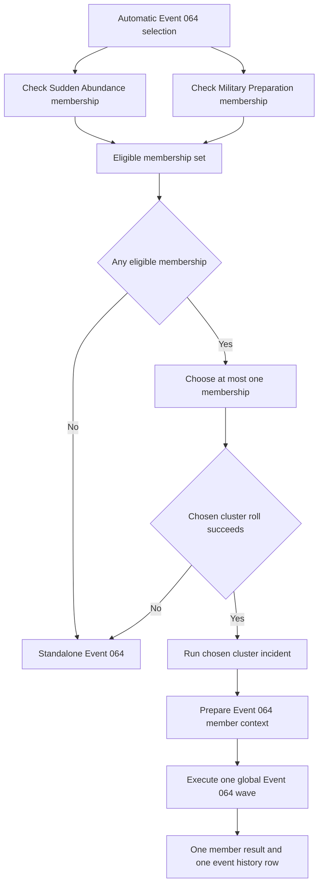

# Event 064 Flow Diagram

All labels below are design handles. The diagram shows behavior, not exact script syntax.

```mermaid
flowchart TD
    A[Event 064 selected] --> B{Automatic context}
    B -->|Yes| C[Build eligible cluster memberships]
    B -->|No| D[Use standalone manual or debug context]
    C --> E{One cluster chosen and roll succeeds}
    E -->|Yes| F[Save exact cluster incident]
    E -->|No| G[Save standalone natural context]
    D --> H[Create unique global wave token]
    F --> H
    G --> H
    H --> I[Snapshot valid countries and current map]
    I --> J[Process one country]
    J --> K[Find current foreign land frontier]
    K --> L[Deduplicate direct frontier provinces]
    L --> M[Apply baseline one-level wave under cap]
    M --> N{Defense in Depth enabled and matured}
    N -->|Yes| O[Select anchors and bounded depth positions]
    N -->|No| P{Fortress States enabled and matured}
    O --> P
    P -->|Yes| Q[Select bounded Fortress States and role packages]
    P -->|No| R{Fortress World enabled and matured}
    Q --> R
    R -->|Yes| S[Select capital and bounded internal redoubts]
    R -->|No| T[Finalize country result]
    S --> T
    T --> U{More snapshotted countries}
    U -->|Yes| J
    U -->|No| V[Finalize global footprint and materialization]
    V --> W[Apply mapped Chaos with guards]
    W --> X[Record one Event 064 history row]
    X --> Y[Record concrete evolution rows]
    Y --> Z[Send local reports to human countries]
    Z --> AA[Resolve AI postures]
    AA --> AB[Open bounded response windows]
    AB --> AC[Clear world candidates and wave context]
    AC --> AD{Country chooses or has posture}
    AD -->|Integrate| AE[Reinforce Priority Sector]
    AD -->|Logistics| AF[Connect New Line]
    AD -->|Breach| AG[Conduct Breach Exercises]
    AD -->|No valid active posture| AH[Close without category]
    AE --> AI{Evolution II or III actions valid}
    AF --> AI
    AG --> AI
    AI -->|Evolution II| AJ[Harden Air or Coastal Flank]
    AI -->|Evolution III| AK[Prepare National Redoubt]
    AI -->|No extra action| AL[Response window continues]
    AJ --> AL
    AK --> AL
    AL --> AM{Project completes or fails}
    AM --> AN[Apply result once and clean target state]
    AN --> AO{Response window or project still active}
    AO -->|Yes| AL
    AO -->|No| AP[Remove posture and hide category]
    AP --> AQ[Physical buildings remain on map]
    AQ --> AR[Later border change does not trigger a world scan]
    AR --> AS[Later Event 064 wave builds a new snapshot]
```

## Evolution package view

## Province overlap view

## Cluster arbitration view

