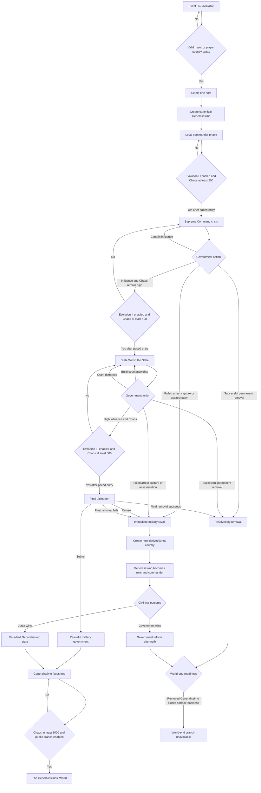

# Event 067 State Machine

## State ownership notes

- Loyal commander, Supreme Command, and State Within the State belong to the original host country.
- The manual scenario may enter Supreme Command, State Within the State, Final Ultimatum, or Immediate Military Revolt through a scenario-only setup flag.
- Generalissimo Influence exists only before peaceful submission or civil war resolution.
- Command Cohesion replaces Influence after a Generalissimo government is established.
- Successful permanent removal clears normal world-end readiness.
- The public world-end branch requires the original Generalissimo to remain active, ruling, or represented by an undefeated junta legacy state.
