# System Architecture

## Objective

Create a repeatable, inspectable pipeline that accepts one reference image and a structured brief, generates a 3D source candidate, turns it into a HOI4-ready asset package, and refuses completion until runtime evidence is present.

## Components

### 1. Job intake

The intake layer creates one immutable job record. It stores:

- job and asset identifiers
- event or system owner
- asset class
- one reference image and its checksum
- source provenance and license status
- geometry intent
- texture direction
- forbidden additions and known ambiguity
- scale reference
- topology profile
- rigging and action requirements
- credit and retry budget
- required runtime consumer

The intake record is validated against `schemas/model_job.schema.json`.

### 2. Reference preflight

The preflight layer checks whether the reference image is suitable for single-image reconstruction. A workflow-generated reference requests native transparency by default and preserves its alpha; background removal is fallback clarification for failed native transparency or an inherited, sourced, or user-provided opaque image. Preflight records occlusion, silhouette quality, background complexity or alpha quality, limb separation, lighting, visible openings, dark regions that may be misread as holes, and likely unseen-side ambiguity.

The preflight can approve one derived reference image, but the original remains immutable. A derived image requires its own checksum, processing note, and approval.

### 3. Meshy MCP client

The Meshy client uses the official MCP server in stdio mode. It is responsible for:

- balance check
- image-to-3D submission
- task status
- immediate artifact download
- optional remesh
- optional retexture
- humanoid rigging where valid
- preset animation application where valid
- task metadata and consumed-credit recording

The Meshy client does not decide that a model is acceptable. It returns candidates and evidence.

### 4. Artifact vault

Every remote result is downloaded into an event or asset-scoped job folder before the provider retention window expires. The vault stores:

- original reference
- approved derived reference
- request payloads with secrets removed
- task responses
- task IDs
- consumed credits
- source GLB and FBX
- PBR textures
- thumbnails
- checksums
- generation notes
- rejected candidates

No successful task is represented only by a remote URL.

### 5. Blender HOI4 adapter

The production Blender interface exposes a narrow set of deterministic operations. It does not give the general orchestration agent unrestricted access to arbitrary Python execution.

The adapter owns:

- scene creation from a versioned template
- import into a protected source collection
- duplication into a working collection
- scene inspection
- geometry audits
- transform and origin normalization
- vanilla reference import
- scale comparison
- triangulation
- material conversion
- skeleton creation or import
- vertex group and weight checks
- action import, authoring, renaming, and cleanup
- PDX exporter invocation
- preview rendering
- `.blend` save and evidence export

The adapter executes version-controlled scripts from an allowlist. Parameters are structured data, not free-form code.

### 6. Paradox exporter adapter

The exporter adapter verifies `io_pdx_mesh`, imports or configures PDX materials, invokes mesh and animation export, and records the extension version and export settings.

It returns:

- exported `.mesh`
- exported `.anim` files
- export log
- object, skeleton, material, and action summary
- checksum set
- any exporter warning or unsupported field

### 7. QA and evidence service

The QA layer combines automated checks and human review. It creates:

- geometry report
- material report
- rig report
- action report
- export report
- preview renders
- turntable or viewport captures
- animation previews
- requirement-to-runtime crosswalk
- runtime handoff
- in-game validation report

### 8. Runtime integration handoff

The main implementation agent owns final `.asset`, entity, technology, equipment, unit, building, focus, event, decision, or GUI wiring. The 3D asset subagent proposes stable names and ready-to-copy snippets only after inspecting a valid local precedent.

## Data flow

```mermaid
flowchart LR
    A[Reference image and brief] --> B[Job validation]
    B --> C[Reference preflight]
    C --> D{Approved input?}
    D -- No --> X[Blocked or revised reference]
    D -- Yes --> E[Meshy MCP generation]
    E --> F[Immediate artifact vault]
    F --> G[Generation review]
    G --> H{Core geometry acceptable?}
    H -- No, recoverable by retry --> E
    H -- No, reference defect --> X
    H -- Yes --> I[Blender HOI4 adapter]
    I --> J[Geometry and material QA]
    J --> K{Rig required?}
    K -- No --> N[PDX export]
    K -- Yes --> L[Rig and weight pipeline]
    L --> M[Animation pipeline]
    M --> N
    N --> O[Export QA and runtime handoff]
    O --> P[Main-agent runtime wiring]
    P --> Q[In-game validation]
    Q --> R{Acceptance passed?}
    R -- No --> S[Return to bounded repair stage]
    R -- Yes --> T[Complete]
```

## Trust boundaries

| Boundary | Risk | Required control |
| --- | --- | --- |
| Meshy API key | Secret leakage | Environment or secret store only, redaction in logs, no committed key |
| Meshy remote assets | Expiring URLs and provider retention | Immediate download, checksum, local immutable vault |
| Blender MCP | Arbitrary code and filesystem access | Localhost only, isolated job copy, allowlisted scripts, no unrestricted tool in production |
| External Blender extensions | Supply-chain change | Exact archive, version, URL, SHA256, license, and install log in dependency lock |
| Source image | Rights, identity, and design ambiguity | Provenance, license status, one-image checksum, human preflight approval |
| AI output | Hallucinated geometry and hidden defects | 360-degree review, component audit, comparison to reference, hard geometry gate |
| PDX export | Silent exporter mismatch | Version lock, export log, re-import or parser check when available, runtime test |
| Runtime wiring | Wrong sprite, entity, action, or texture consumer | Requirement-to-runtime crosswalk and exact consumer identifiers |

## State machine

A job uses the following canonical states:

1. `draft`
2. `preflight_blocked`
3. `preflight_approved`
4. `generation_queued`
5. `generation_in_progress`
6. `generation_review`
7. `generation_rejected`
8. `generation_approved`
9. `blender_imported`
10. `geometry_blocked`
11. `geometry_approved`
12. `materials_approved`
13. `rigging_not_required`
14. `rigging_in_progress`
15. `rigging_blocked`
16. `rigging_approved`
17. `animation_not_required`
18. `animation_in_progress`
19. `animation_blocked`
20. `animation_approved`
21. `pdx_exported`
22. `export_blocked`
23. `runtime_handoff_ready`
24. `runtime_wired`
25. `in_game_blocked`
26. `complete`
27. `canceled`

Transitions are append-only in the job history. A job may return to a prior work stage, but it cannot delete the record of the rejected attempt.

## Determinism and reproducibility

Each job records:

- Meshy MCP package version
- Meshy task IDs and request fields
- Blender version
- Blender MCP backend and version
- project Blender adapter commit
- `io_pdx_mesh` version and archive checksum
- source and derived reference checksums
- input model and texture checksums
- every Blender processing script checksum
- export settings
- output checksums
- local vanilla reference paths and hashes where practical

The same inputs may not reproduce identical AI geometry, so reproducibility means traceable lineage and deterministic local processing after a chosen candidate, not a promise that a remote generation model will return the same asset twice.

## Ownership

| Surface | Owner |
| --- | --- |
| Source reference and brief | Parent agent or user |
| Meshy generation and task evidence | 3D asset subagent |
| Blender source scene and local processing | 3D asset subagent |
| PDX export and export evidence | 3D asset subagent |
| `.gfx`, `.asset`, entity, gameplay, event, focus, decision, country, or GUI wiring | Main implementation agent unless explicitly delegated |
| Final in-game validation and completion claim | Main implementation agent |
| New reusable helpers or adapter changes | 3D pipeline owner, reviewed by parent |

## No central MCP router

This architecture does not create a repository-wide MCP router. Meshy and Blender guidance lives inside the 3D model pipeline, which owns that asset workflow. Other project skills keep their existing MCP ownership.
