# Chaos Redux 3D Model and Animation Workflow

This is the consolidated reading copy of the planning package. The individual files, schemas, templates, bootstrap assets, MCP configurations, proposed skill, and proposed subagent remain authoritative for implementation.

## Included planning documents

- `README.md`
- `00_source_register.md`
- `01_system_architecture.md`
- `02_mcp_installation_and_security.md`
- `03_job_lifecycle_and_orchestration.md`
- `04_meshy_generation_pipeline.md`
- `05_blender_hoi4_processing_pipeline.md`
- `06_asset_profiles.md`
- `07_rigging_and_animation_pipeline.md`
- `08_qa_acceptance_and_evidence.md`
- `09_failure_recovery_cost_and_security.md`
- `10_repo_integration_plan.md`
- `11_implementation_backlog.md`
- `12_pilot_and_test_matrix.md`
- `13_operating_runbook.md`
- `14_open_decisions_and_blockers.md`


---

<!-- BEGIN README.md -->

# Chaos Redux 3D Model and Animation Workflow Planning Package

**Package status:** implementation-ready planning package

**Prepared:** 2026-07-22

**Target platform:** Windows, Blender, Hearts of Iron IV, Chaos Redux

## What this package establishes

This package defines a reusable workflow for creating custom HOI4 3D assets from one reference image. Meshy AI performs image-to-3D generation and can provide humanoid rigging and preset animation candidates. Blender performs all HOI4 normalization, repair, rigging, animation cleanup, material conversion, Paradox export, and evidence generation.

The workflow covers:

- humanoid land units
- nonhuman and supernatural units
- animals and creatures
- land vehicles and articulated weapons
- aircraft
- naval models
- buildings and static map objects
- animated attachments, turrets, recoil parts, doors, limbs, and special mechanisms

The workflow does not treat an AI-generated model as game-ready. It uses explicit gates for geometry, topology, scale, materials, skeletons, weights, actions, export, runtime wiring, and in-game review.

## Locked architecture decisions

1. **Meshy uses the official Meshy MCP server.** The project config uses stdio transport and a wrapper that reads `MESHY_API_KEY` from the environment.
2. **Blender is controlled through a narrow HOI4 adapter.** The adapter may use the official Blender Lab MCP backend on supported Blender versions or a pinned compatibility backend, but the production tool surface does not expose unrestricted arbitrary Python execution.
3. **The Paradox `io_pdx_mesh` extension is a managed dependency.** New installations install it from a checksum-locked archive. Existing installations are verified before every job.
4. **Every model job has a state file and evidence ledger.** A job cannot skip from generation to completion.
5. **Meshy auto-rigging is restricted to suitable humanoid bipeds.** Nonhumanoid assets use a Blender-authored rig unless a future, locally verified API revision expands the supported contract.
6. **Exact HOI4 budgets come from local vanilla precedents.** Tutorial numbers and Meshy defaults are seed heuristics, not universal engine limits.
7. **No silent fallbacks are allowed.** A requested animation cannot be replaced by a static asset, and an unverified export cannot be called complete.
8. **Final completion requires runtime proof.** Source art, Meshy output, a `.blend`, textures, `.mesh`, required `.anim` files, entity handoff, preview evidence, and in-game validation must all be represented in the requirement-to-runtime crosswalk.

## Installation status

This package does not claim that Meshy MCP, Blender MCP, or `io_pdx_mesh` were installed on the user's Windows machine. This environment has no access to that machine, its Blender installation, the Meshy API key, or the live Chaos Redux repository. The package includes guarded bootstrap scripts, configuration templates, a dependency-lock contract, verification steps, and acceptance criteria so installation can be performed reproducibly in the target environment.

## Recommended implementation order

1. Run the local discovery and vanilla calibration tranche in `11_implementation_backlog.md`.
2. Lock Blender, Meshy MCP, Blender MCP, and `io_pdx_mesh` versions and checksums.
3. Add the proposed skill and subagent.
4. Implement the job schema, artifact vault, and cost ledger.
5. Implement the allowlisted Blender adapter.
6. Complete the four pilot assets in `12_pilot_and_test_matrix.md`.
7. Wire one pilot into HOI4 and record full runtime evidence.
8. Resolve every promotion blocker in `14_open_decisions_and_blockers.md`.
9. Promote the pipeline only after the pilot audit has no blocking gaps.

## Package map

| File or folder | Purpose |
| --- | --- |
| `00_source_register.md` | Complete source inventory, tutorial extraction, and research boundaries |
| `01_system_architecture.md` | Components, trust boundaries, state machine, and data flow |
| `02_mcp_installation_and_security.md` | Meshy MCP, Blender MCP, extension bootstrap, secrets, and hardening |
| `03_job_lifecycle_and_orchestration.md` | Job states, approvals, retries, naming, concurrency, and orchestration |
| `04_meshy_generation_pipeline.md` | Single-image generation, topology strategies, texturing, rigging, and download rules |
| `05_blender_hoi4_processing_pipeline.md` | Import, normalization, repair, PDX materials, rigging, actions, and export |
| `06_asset_profiles.md` | Per-class requirements for units, buildings, vehicles, aircraft, ships, and creatures |
| `07_rigging_and_animation_pipeline.md` | Rig route selection, bone policy, IK, weights, action rules, and animation QA |
| `08_qa_acceptance_and_evidence.md` | Hard blockers, evidence package, crosswalk, and completion standard |
| `09_failure_recovery_cost_and_security.md` | Failure taxonomy, retry policy, current API cost model, rollback, and security |
| `10_repo_integration_plan.md` | Proposed Chaos Redux paths, ownership, skill routing, and handoff surfaces |
| `11_implementation_backlog.md` | Phased build plan with acceptance criteria |
| `12_pilot_and_test_matrix.md` | Pilot assets and end-to-end test cases |
| `13_operating_runbook.md` | Operator workflow for daily use and recovery |
| `14_open_decisions_and_blockers.md` | Target-machine decisions, promotion blockers, and explicit non-decisions |
| `CHAOS_REDUX_3D_MODEL_WORKFLOW_PLAN.md` | Consolidated reading copy of the main planning documents |
| `VALIDATION_REPORT.md` and `VALIDATION_REPORT.json` | Package-level structural validation and environment limitations |
| `PACKAGE_MANIFEST.json` and `PACKAGE_SHA256S.txt` | File-size and SHA256 integrity inventories for the distributed folder |
| `references/` | Current external tool research snapshot and update triggers |
| `schemas/` | Machine-readable job and evidence contracts |
| `templates/` | Job, manifest, QA, animation, and runtime handoff templates |
| `config/` | Generic and Codex MCP templates, dependency locks, adapter policy, and asset-profile examples without secrets |
| `bootstrap/` | Guarded Windows setup and verification assets |
| `wrappers/` | Secret-safe MCP launch wrappers |
| `tools/` | Planning utilities, including a Meshy credit estimator |
| `proposed_skill/` | Proposed reusable Chaos Redux 3D pipeline skill |
| `proposed_subagent/` | Proposed bounded 3D asset-production subagent |
| `mcp/` | Narrow Blender tool contract and Meshy tool mapping |
| `checklists/` | Reference-image and first-pilot checklists |

## Source review statement

All project files supplied with this task were read in full, including the tutorial transcription, repository rules, mechanics guide, all supplied skills, all supplied subagent definitions, and all three catalog exports. The source register names every file.

## Core operating principle

A generated model is a candidate source. A Blender scene is a working file. A PDX export is a runtime candidate. Only an asset with complete evidence and an in-game pass is complete.

<!-- END README.md -->


---

<!-- BEGIN 00_source_register.md -->

# Source Register

## Review completion

Every project source supplied with the task was read in full before this package was written. No supplied source was skipped.

## Project sources

| Source | How it informed this package |
| --- | --- |
| `AGENTS(3).md` | Repository authority, required local references, coding and documentation rules, completion proof, no silent fallback, subagent ownership, and source-of-truth rules |
| `CHAOS_REDUX_MECHANICS(3).md` | Scale of the project, event architecture, major-event presentation, dynamic systems, and the range of unusual unit or object concepts the asset pipeline must support |
| `Pasted text(6).txt` | User request and tutorial transcription for Meshy generation, geometry inspection, remeshing, triangular topology, Blender import, scale, rigging, IK, weights, PDX materials, and animation |
| `chaos-redux-event-assets(3).md` | Asset manifests, source and processed files, runtime placement, requirement-to-runtime crosswalks, unit-visual separation, DDS handling, and asset completion rules |
| `chaos-redux-event-planning(4).md` | Asset-class planning, country and unit package depth, animation planning, dynamic identity, source modes, and implementation-ready specification standards |
| `chaos-redux-events(3).md` | Parent integration ownership, event-linked assets, docs, runtime consumers, validation, and completion expectations |
| `chaos-redux-frame-animation(3).md` | Evidence discipline for animated work, source versus preview distinction, static fallbacks, state semantics, and wiring handoffs. The 3D pipeline adapts these principles without treating a GIF or frame sheet as the runtime 3D animation format |
| `chaos-redux-improvement-loop(3).md` | Anti-bloat rule, closure conditions, playable depth, visual state design, and the need to connect assets to real mechanics |
| `chaos-redux-subagents(3).md` | `fork_context=false`, narrow role ownership, required handoffs, asset routing, patch boundaries, and parent responsibility |
| `chaos-redux-super-events(3).md` | Complete-package thinking, source verification, unique runtime assets, and no placeholder completion |
| `chaos-redux-decisions-missions(3).md` | Clear visible costs and requirements, state-driven UI, no passive reward-store design, and task-specific validation principles |
| `chaos-redux-focus-trees(10).md` | Route identity, visual coverage, asset variety, playable payoff, and local vanilla-precedent requirements |
| `chaos_redux_clusters_catalog(1).csv` | Existing event-cluster scope and the need for reusable asset routing across linked events |
| `chaos_redux_events_catalog(1).csv` | Full event catalog review. It demonstrates demand for humanoids, nonhuman hosts, creatures, machines, vehicles, structures, aircraft, naval assets, transformations, and route-specific identities |
| `chaos_redux_scenarios_catalog(1).csv` | Manual scenario breadth and the need for reproducible asset variants and scenario-safe runtime wiring |

## Subagent sources

The following supplied subagent definitions were read in full:

- `chaosx_asset_source_researcher.toml`
- `chaosx_country_package_auditor.toml`
- `chaosx_decision_mission_auditor.toml`
- `chaosx_documentation_curator.toml`
- `chaosx_event_completion_auditor.toml`
- `chaosx_focus_tree_auditor.toml`
- `chaosx_generated_event_art.toml`
- `chaosx_icon_artist.toml`
- `chaosx_improvement_loop_planner.toml`
- `chaosx_localisation_auditor.toml`
- `chaosx_repo_explorer.toml`
- `chaosx_scripted_system_architect.toml`
- `chaosx_skill_maintainer.toml`
- `chaosx_spreadsheet_doc_worker.toml`
- `chaosx_super_event_audio_researcher.toml`
- `chaosx_super_event_text_researcher.toml`

These definitions established the model for a new bounded asset-production subagent: exact inputs, narrow reads, explicit outputs, hard scope boundaries, manifest evidence, and no gameplay wiring without parent-granted scope.

## Tutorial workflow extracted from the transcription

The tutorial establishes the following manual reference process:

1. Generate a model from one source image.
2. Inspect the entire model for disconnected, floating, open, or hallucinated geometry.
3. Retry generation when the core silhouette or connectivity is wrong.
4. When low-poly generation loses necessary structure, generate a higher-detail model and remesh it down.
5. Use triangular topology for the HOI4 candidate.
6. Preserve PBR texture output.
7. Import FBX into Blender.
8. Compare the asset against a vanilla model to set direction and scale.
9. Build a root bone, body bone, limb chains, mirrored limbs, and suitable IK controls.
10. Parent bones with intentional offsets and keep IK controls disconnected where required.
11. Parent the mesh to the armature with empty groups.
12. Assign vertices deliberately to named bone groups and avoid accidental cross-limb weights.
13. Use X-ray selection when assigning rear vertices.
14. Replace imported generic materials with PDX materials.
15. Use final DDS texture inputs for the PDX material.
16. Create readable idle, movement, and attack actions.
17. Test loops and judge animations at the zoom level where HOI4 players will see them.
18. Export and wire the result through the Paradox tooling.

The planning package turns each manual step into a state gate with recorded evidence.

## Tutorial guidance that remains a heuristic

The tutorial suggests a target near 10,000 vertices and warns against roughly 25,000 to 30,000 or more. This package preserves those values as seed heuristics for the first pilot, not as universal HOI4 engine rules. The production profile must be calibrated against the closest vanilla model, material, skeleton, animation, and entity precedent on the user's installed game version.

The tutorial describes a free retry in the Meshy web interface. The API and MCP workflow does not assume that an API retry is free. API calls use the current API credit schedule unless a documented Meshy policy says otherwise. Failed API tasks are handled according to the API's current refund behavior, while user-requested or quality-driven retries remain budgeted actions.

## Current external research snapshot

External facts were verified against primary sources where available. The detailed source table is in `references/current_tool_research_2026-07-22.md`.

Key findings:

- Meshy publishes an official MCP server with image-to-3D, remesh, retexture, rig, animate, task, download, and balance tools.
- Meshy Image to 3D accepts one source image, can use smart topology or standard generation, can produce triangular topology, can generate PBR maps, and can accept a text prompt specifically for texturing.
- The current Image to 3D API does not expose a general geometry instruction prompt. The workflow therefore stores geometry instructions as orchestration and QA constraints, and optionally uses an approved derived reference image when preprocessing is necessary.
- Meshy programmatic rigging documentation currently limits reliable use to clear humanoid bipeds.
- Meshy animations are selected by `action_id` from the animation library and applied to a completed rigging task.
- Meshy API assets have a short retention window for non-Enterprise users, so the workflow downloads every successful artifact immediately and records checksums.
- Blender now has an official Blender Lab MCP path, but the official page warns that generated code may run without guards. The package therefore requires an allowlisted project adapter and isolated job workspace.
- The community Blender MCP path also supports arbitrary Python execution. It is a compatibility backend, not the production permission model.
- `io_pdx_mesh` supports Blender and Clausewitz mesh and animation workflows. Its documented Blender installation differs between Blender 4.2 or newer and older supported versions.
- Codex supports project or user MCP configuration through `[mcp_servers.<name>]` tables, including stdio commands, environment-variable forwarding, tool allowlists, timeouts, and approval controls.

## Required local references before implementation

The planning environment did not have access to the user's local Chaos Redux repository, offline Paradox wiki snapshot, installed vanilla game files, or existing `.mesh`, `.anim`, `.asset`, and entity definitions. The first implementation tranche must therefore read and retain local evidence from:

- the graphical asset, interface, character, and relevant model pages in `paradox_wiki/`
- the full vanilla documentation folder
- the closest vanilla land, air, naval, building, character, and animation examples
- existing Chaos Redux 3D model, material, asset, and entity patterns
- the user's installed `io_pdx_mesh` version and Blender version

No exact production budget, bone limit, material channel mapping, action name, or entity syntax should be locked before that calibration pass.

<!-- END 00_source_register.md -->


---

<!-- BEGIN 01_system_architecture.md -->

# System Architecture

## Objective

Create a repeatable, inspectable pipeline that accepts one reference image and a structured brief, generates a 3D source candidate, turns it into a HOI4-ready asset package, and refuses completion until runtime evidence is present.

## Components

### 1. Job intake

The intake layer creates one immutable job record. It stores:

- job and asset identifiers
- event or system owner
- asset class
- one reference image and its checksum
- source provenance and license status
- geometry intent
- texture direction
- forbidden additions and known ambiguity
- scale reference, with an imported read-only same-surface vanilla model and the exact entity scale
- topology profile
- rigging and action requirements
- credit and retry budget
- required runtime consumer

The intake record is validated against `schemas/model_job.schema.json`.

### 2. Reference preflight

The preflight layer checks whether the reference image is suitable for single-image reconstruction. It records occlusion, silhouette quality, background complexity, limb separation, lighting, visible openings, dark regions that may be misread as holes, and likely unseen-side ambiguity.

The preflight can approve one derived reference image, but the original remains immutable. A derived image requires its own checksum, processing note, and approval.

### 3. Meshy MCP client

The Meshy client uses the official MCP server in stdio mode. It is responsible for:

- balance check
- image-to-3D submission
- task status
- immediate artifact download
- optional remesh
- optional retexture
- humanoid rigging where valid
- preset animation application where valid
- task metadata and consumed-credit recording

The Meshy client does not decide that a model is acceptable. It returns candidates and evidence.

### 4. Artifact vault

Every remote result is downloaded into an event or asset-scoped job folder before the provider retention window expires. The vault stores:

- original reference
- approved derived reference
- request payloads with secrets removed
- task responses
- task IDs
- consumed credits
- source GLB and FBX
- PBR textures
- thumbnails
- checksums
- generation notes
- rejected candidates

No successful task is represented only by a remote URL.

### 5. Blender HOI4 adapter

The production Blender interface exposes a narrow set of deterministic operations. It does not give the general orchestration agent unrestricted access to arbitrary Python execution.

The adapter owns:

- scene creation from a versioned template
- import into a protected source collection
- duplication into a working collection
- scene inspection
- geometry audits
- transform and origin normalization
- vanilla reference import
- scale comparison against an imported read-only same-surface vanilla model, including source-space and effective runtime height
- triangulation
- material conversion
- skeleton creation or import
- vertex group and weight checks
- action import, authoring, renaming, and cleanup
- PDX exporter invocation
- preview rendering
- `.blend` save and evidence export

The adapter executes version-controlled scripts from an allowlist. Parameters are structured data, not free-form code.

### 6. Paradox exporter adapter

The exporter adapter verifies `io_pdx_mesh`, imports or configures PDX materials, invokes mesh and animation export, and records the extension version and export settings.

It returns:

- exported `.mesh`
- exported `.anim` files
- export log
- object, skeleton, material, and action summary
- checksum set
- any exporter warning or unsupported field

### 7. QA and evidence service

The QA layer combines automated checks and human review. It creates:

- geometry report
- material report
- rig report
- action report
- export report
- preview renders
- turntable or viewport captures
- animation previews
- requirement-to-runtime crosswalk
- runtime handoff
- in-game validation report

### 8. Runtime integration handoff

The main implementation agent owns final `.asset`, entity, technology, equipment, unit, building, focus, event, decision, or GUI wiring. The 3D asset subagent proposes stable names and ready-to-copy snippets only after inspecting a valid local precedent.

## Data flow

```mermaid
flowchart LR
    A[Reference image and brief] --> B[Job validation]
    B --> C[Reference preflight]
    C --> D{Approved input?}
    D -- No --> X[Blocked or revised reference]
    D -- Yes --> E[Meshy MCP generation]
    E --> F[Immediate artifact vault]
    F --> G[Generation review]
    G --> H{Core geometry acceptable?}
    H -- No, recoverable by retry --> E
    H -- No, reference defect --> X
    H -- Yes --> I[Blender HOI4 adapter]
    I --> J[Geometry and material QA]
    J --> K{Rig required?}
    K -- No --> N[PDX export]
    K -- Yes --> L[Rig and weight pipeline]
    L --> M[Animation pipeline]
    M --> N
    N --> O[Export QA and runtime handoff]
    O --> P[Main-agent runtime wiring]
    P --> Q[In-game validation]
    Q --> R{Acceptance passed?}
    R -- No --> S[Return to bounded repair stage]
    R -- Yes --> T[Complete]
```



## Trust boundaries

| Boundary | Risk | Required control |
| --- | --- | --- |
| Meshy API key | Secret leakage | Environment or secret store only, redaction in logs, no committed key |
| Meshy remote assets | Expiring URLs and provider retention | Immediate download, checksum, local immutable vault |
| Blender MCP | Arbitrary code and filesystem access | Localhost only, isolated job copy, allowlisted scripts, no unrestricted tool in production |
| External Blender extensions | Supply-chain change | Exact archive, version, URL, SHA256, license, and install log in dependency lock |
| Source image | Rights, identity, and design ambiguity | Provenance, license status, one-image checksum, human preflight approval |
| AI output | Hallucinated geometry and hidden defects | 360-degree review, component audit, comparison to reference, hard geometry gate |
| PDX export | Silent exporter mismatch | Version lock, export log, re-import or parser check when available, runtime test |
| Runtime wiring | Wrong sprite, entity, action, or texture consumer | Requirement-to-runtime crosswalk and exact consumer identifiers |

## State machine

A job uses the following canonical states:

1. `draft`
2. `preflight_blocked`
3. `preflight_approved`
4. `generation_queued`
5. `generation_in_progress`
6. `generation_review`
7. `generation_rejected`
8. `generation_approved`
9. `blender_imported`
10. `geometry_blocked`
11. `geometry_approved`
12. `materials_approved`
13. `rigging_not_required`
14. `rigging_in_progress`
15. `rigging_blocked`
16. `rigging_approved`
17. `animation_not_required`
18. `animation_in_progress`
19. `animation_blocked`
20. `animation_approved`
21. `pdx_exported`
22. `export_blocked`
23. `runtime_handoff_ready`
24. `runtime_wired`
25. `in_game_blocked`
26. `complete`
27. `canceled`

Transitions are append-only in the job history. A job may return to a prior work stage, but it cannot delete the record of the rejected attempt.

## Determinism and reproducibility

Each job records:

- Meshy MCP package version
- Meshy task IDs and request fields
- Blender version
- Blender MCP backend and version
- project Blender adapter commit
- `io_pdx_mesh` version and archive checksum
- source and derived reference checksums
- input model and texture checksums
- every Blender processing script checksum
- export settings
- output checksums
- local vanilla reference paths and hashes where practical

The same inputs may not reproduce identical AI geometry, so reproducibility means traceable lineage and deterministic local processing after a chosen candidate, not a promise that a remote generation model will return the same asset twice.

## Ownership

| Surface | Owner |
| --- | --- |
| Source reference and brief | Parent agent or user |
| Meshy generation and task evidence | 3D asset subagent |
| Blender source scene and local processing | 3D asset subagent |
| PDX export and export evidence | 3D asset subagent |
| `.gfx`, `.asset`, entity, gameplay, event, focus, decision, country, or GUI wiring | Main implementation agent unless explicitly delegated |
| Final in-game validation and completion claim | Main implementation agent |
| New reusable helpers or adapter changes | 3D pipeline owner, reviewed by parent |

## No central MCP router

This architecture does not create a repository-wide MCP router. Meshy and Blender guidance lives inside the 3D model pipeline, which owns that asset workflow. Other project skills keep their existing MCP ownership.

<!-- END 01_system_architecture.md -->


---

<!-- BEGIN 02_mcp_installation_and_security.md -->

# MCP Installation and Security Plan

## Installation goal

Install and verify three managed components on the Windows workstation:

1. the official Meshy MCP server
2. the official Blender Lab MCP server for isolated development and operator-assisted work
3. the Paradox `io_pdx_mesh` Blender extension

A fourth component, the Chaos Redux Blender HOI4 adapter, is built in the repository and is the only Blender-facing interface permitted for unattended production jobs.

## Version policy

Every dependency is locked by exact version or commit and SHA256 before it is used in a production job.

| Component | Initial planning pin | Promotion rule |
| --- | --- | --- |
| Node.js | 20 LTS or a newer project-approved LTS | Must satisfy Meshy MCP Node 18+ requirement and pass smoke tests |
| Meshy MCP | `@meshy-ai/meshy-mcp-server@0.4.0` | Recheck the official release before implementation and relock after tests |
| Blender | One project-approved version per workstation profile | Must pass Blender MCP and `io_pdx_mesh` compatibility tests together |
| Blender Lab MCP | Exact official release or commit | Install from the official Blender Lab source and lock the archive or commit |
| Community Blender MCP | No default production pin | May be used only as an explicitly approved compatibility backend |
| `io_pdx_mesh` | `0.91` as the initial research baseline | Download the current approved release, hash it, and test mesh and animation export |
| Python/uv | Project-approved current versions | Used for the adapter and Blender MCP server, never inferred from a global install |

The planning pins are not permanent promises. `config/dependencies.lock.example.json` shows the fields that must be resolved on the target machine.

## Meshy MCP installation

### Prerequisites

- Node.js 18 or newer
- `npx` available on `PATH`
- a Meshy API key with API access
- sufficient API credit balance
- outbound HTTPS access to the Meshy API

### Secret handling

The API key must be stored in one of these locations:

1. a user-scoped secret manager used by the MCP host
2. a Windows user environment variable named `MESHY_API_KEY`
3. a local untracked `.env` file read only by the wrapper

The key must never appear in:

- committed MCP JSON
- job YAML
- logs
- screenshots
- task request archives
- issue reports
- handoff documents

The wrapper in `wrappers/run_meshy_mcp.cmd` checks that the variable exists without printing it.

### Windows MCP configuration

Use `cmd /c npx` on Windows. The repository config should point to the wrapper rather than embedding the key.

```json
{
  "mcpServers": {
    "meshy": {
      "command": "C:\\path\\to\\chaos_redux\\.tools\\3d_pipeline\\wrappers\\run_meshy_mcp.cmd",
      "args": [],
      "env": {}
    }
  }
}
```

The wrapper should launch the exact locked package version, not an unversioned latest package.

### Codex project configuration

For Codex, copy the selected tables from `config/codex_mcp.example.toml` into either the user configuration or a trusted project configuration. The template uses stdio `command` and `args`, forwards the Meshy secret by environment-variable name, sets explicit startup and tool timeouts, and restricts Meshy to the workflow's approved tool list.

The proposed `blender_hoi4` table is disabled in the template until the repository-owned server exists and passes its allowlist, path-confinement, dependency-lock, and clean-profile tests. The unrestricted Blender Lab development profile is also disabled by default and must never be substituted silently for the production adapter.

### Meshy smoke test

The installation is accepted only when all of these pass:

1. MCP initializes over stdio.
2. The tool inventory includes image-to-3D, task status, download, remesh, rigging, animation, and balance operations.
3. Balance can be read without exposing the API key.
4. A dry metadata request succeeds.
5. A deliberately invalid request returns a structured error and does not create a paid task.
6. Logs redact authorization headers and environment values.

A paid generation is not part of the installation smoke test. The first paid request belongs to the pilot tranche and requires an approved job record.

## Blender MCP installation

### Two-mode design

#### Development mode

The official Blender Lab MCP server can be enabled in a dedicated Blender profile for exploration, scene inspection, and development of deterministic scripts. It is treated as a privileged tool because it exposes Blender's Python capabilities.

#### Production mode

Unattended jobs call the Chaos Redux `blender_hoi4` adapter. The adapter accepts only structured commands listed in `mcp/blender_allowlist_contract.md` and runs version-controlled scripts. The general Blender MCP server is not exposed to the production orchestration agent.

### Isolated Blender profile

Create a separate profile directory for the workflow. Do not use the artist's normal Blender profile for automation.

Recommended environment isolation:

```text
.tools/3d_pipeline/blender_profile/
  config/
  scripts/
  extensions/
  cache/
```

Set Blender user configuration variables or launch arguments so this profile owns its preferences, installed extensions, recent files, and automation settings.

### Network and listener rules

- Bind Blender MCP to loopback only.
- Do not expose its port through a firewall rule, VPN tunnel, reverse proxy, or LAN listener.
- Do not run it while untrusted `.blend` files are open.
- Disable optional external asset-provider integrations in the production profile.
- Disable telemetry in any compatibility backend that supports a telemetry control.
- Run the adapter against a job copy, never directly against the repository's only source `.blend`.

### Official Blender Lab MCP installation sequence

1. Resolve the current official Blender Lab MCP extension and server versions.
2. Save the source URL, version or commit, license, archive hash, and retrieval date in the dependency lock.
3. Install the extension into the isolated profile.
4. Install the MCP server into a dedicated `uv` or Python environment.
5. Start Blender with an empty scene in the isolated profile.
6. Start the MCP listener on loopback.
7. Start the MCP server and connect from the host.
8. Confirm that the server can inspect the empty scene.
9. Run a disposable cube test in a temporary directory.
10. Shut down and verify that no listener remains active.

### Community compatibility backend

A community Blender MCP backend is not a silent fallback. It may be approved when the official server cannot support the selected Blender version or required host. Approval must record:

- why the official backend cannot be used
- exact repository, release, commit, and checksum
- telemetry state
- listener address and port
- exposed tools
- arbitrary-code risks
- removal plan after official compatibility is restored

The production adapter remains mandatory even when a community backend is used underneath it.

## Paradox `io_pdx_mesh` extension installation

### Dependency lock

The lock entry must include:

- project: `ross-g/io_pdx_mesh`
- approved release or commit
- archive filename
- archive SHA256
- source URL
- GPL license note
- Blender version used for the compatibility test
- tested games and export types
- installation date

### Install sequence

For Blender 4.2 or newer, the extension can be installed from disk. The reproducible command-line route is preferred after its syntax is confirmed against the installed Blender version.

Conceptual command:

```powershell
& $BlenderExe --command extension install-file -r user_default -e $PdxExtensionZip
```

If the installed release is packaged as a legacy add-on rather than a Blender extension, use a version-controlled Blender bootstrap script and record the alternate path. Do not guess between the two packaging modes.

### Verification

The extension is accepted when:

- the expected module is importable
- the PDX Blender Tools registration is present
- a known vanilla `.mesh` can be imported when the extension supports that operation
- a disposable mesh exports without an uncaught exception
- a disposable skeleton action exports when animation export is supported
- the output files are created in the requested folder
- the log records the extension version or commit

A UI panel appearing is not sufficient verification.

## Chaos Redux Blender HOI4 adapter installation

The adapter is a repository-owned MCP server or command service with these properties:

- local-only transport
- structured JSON input
- allowlisted operation names
- path confinement to one job directory plus approved read-only reference roots
- no arbitrary source code argument
- no shell command argument
- no URL fetch from Blender
- deterministic script checksums
- append-only operation log
- explicit save points and rollback copies

The adapter may invoke Blender in foreground or headless mode depending on the operation. Human review operations may use foreground Blender. Audits, exports, and preview renders should support headless execution where the extension permits it.

## Bootstrap phases

`bootstrap/setup_windows.ps1` implements guarded preparation, not blind installation.

### Phase A: discovery

- locate Blender installations
- report Blender version
- report Node, npm, npx, Python, and uv versions
- locate an existing `io_pdx_mesh` installation
- detect Meshy and Blender MCP config entries
- confirm secret presence without displaying it

### Phase B: lock validation

- verify every archive checksum
- reject missing or placeholder checksums
- reject unapproved versions
- verify source archive filenames

### Phase C: installation

- create isolated directories
- install or update approved components
- write project-scoped MCP configuration from a template
- preserve any existing config before changing it

### Phase D: verification

- run `bootstrap/verify_environment.ps1`
- write a machine-readable environment report
- do not mark setup complete while a required check is unresolved

## Security acceptance checklist

- [ ] Meshy key exists but is absent from configuration and logs.
- [ ] Meshy MCP uses an exact package version.
- [ ] Blender MCP binds only to loopback.
- [ ] Production orchestration cannot call arbitrary Python.
- [ ] Blender uses an isolated automation profile.
- [ ] `io_pdx_mesh` archive checksum matches the dependency lock.
- [ ] Job paths are confined to approved roots.
- [ ] External model files are imported into a disposable scene copy.
- [ ] All paid Meshy calls require a job ID and budget gate.
- [ ] Every setup change has a backup or removal procedure.

<!-- END 02_mcp_installation_and_security.md -->


---

<!-- BEGIN 03_job_lifecycle_and_orchestration.md -->

# Job Lifecycle and Orchestration

## Job identity

Every request becomes one model job before any paid request or Blender write occurs.

Recommended ID:

```text
3d_<event_id_or_system>_<asset_slug>_<yyyyMMdd_HHmmss>
```

Examples:

```text
3d_003_holy_realm_temple_20260722_143000
3d_014_cannibal_raider_20260722_150500
3d_shared_chemical_tank_20260722_161500
```

The ID remains stable across retries. Attempts receive separate ordinal IDs.

## Job directory

```text
docs/assets/<event_id>_<event_slug>/models_3d/<asset_slug>/
  job.yaml
  history.jsonl
  references/
    original/
    derived/
  briefs/
  provider/
    requests/
    responses/
    downloads/
    rejected/
  blender/
    source/
    working/
    checkpoints/
    previews/
    reports/
  textures/
    source/
    processed/
    dds/
  export/
    mesh/
    anim/
    logs/
  runtime/
    handoff.md
    crosswalk.md
    validation/
  manifest.md
```

Final runtime assets move to their approved gameplay folders. The docs package retains source, evidence, and lineage.

## Intake contract

The job must define:

- asset owner and purpose
- exact asset class and profile
- one reference image
- provenance and license or user-provided status
- intended subject, silhouette, visible parts, and rear-side assumptions
- forbidden additions
- desired texture treatment
- whether generation must preserve a real design or may interpret it
- target vanilla reference model or reference family
- required scale relationship
- static or animated requirement
- required action roles
- runtime consumer
- credit ceiling
- maximum paid attempts
- review authority

Ambiguity is not hidden. It is recorded under `known_ambiguity` and resolved before generation or accepted as an intentional interpretation risk.

## Reference preflight

The reference receives one of four statuses:

- `approved_original`
- `approved_derived`
- `needs_user_review`
- `blocked`

A derived reference may perform only approved clarification work such as:

- background removal
- exposure correction
- filling an obviously accidental dark seam that the generator may interpret as a hole
- cropping to one complete subject
- removing a caption or UI border without removing subject geometry

It may not invent unseen parts, redesign the subject, or silently change identity.

## Paid-call gate

Before a paid Meshy tool is called, orchestration must verify:

1. job schema passes
2. reference preflight is approved
3. requested operation is allowed for the profile
4. current balance is known
5. estimated cost fits both job and session budgets
6. paid attempt count is below the ceiling
7. output directory exists
8. download and retention handling is ready

The gate writes an approval record before submission.

## Attempt model

Each provider operation creates an attempt record:

```text
attempt_id
operation
provider_task_id
submitted_at
completed_at
request_summary
estimated_credits
consumed_credits
status
output_checksums
review_result
rejection_reasons
parent_attempt_id
```

A remesh, retexture, rig, and animation each receive their own attempt. They are not merged into the generation attempt.

## Orchestration stages

### Stage 1: intake and preflight

- create job
- validate schema
- hash reference
- write preflight report
- choose asset profile
- estimate cost range

### Stage 2: source generation

- check balance
- submit image-to-3D
- poll or receive status updates
- download immediately
- hash all outputs
- record consumed credits
- create contact preview
- run generation review

### Stage 3: optional provider post-processing

- remesh only when profile and geometry review justify it
- retexture only when geometry is already accepted
- rig only for supported humanoid candidates
- animate only after rig approval and action inventory review

### Stage 4: Blender processing

- create job scene from template
- import candidate into protected source collection
- duplicate into working collection
- inspect and repair
- normalize scale and orientation
- create PDX materials and textures
- create or validate skeleton
- author or clean actions
- save checkpoints after every gate

### Stage 5: PDX export

- export mesh
- export required animations
- record exporter log and checksums
- package runtime handoff

### Stage 6: main-agent wiring

- register materials, assets, entities, models, or gameplay consumers
- keep exact identifiers in the crosswalk
- do not rename the asset without updating the job and manifest

### Stage 7: in-game validation

- test at normal map zoom and close inspection
- test every action transition and loop
- test material and texture loading
- test multiplayer-safe deterministic configuration where relevant
- record screenshots or video evidence

## Review authorities

| Gate | Minimum reviewer |
| --- | --- |
| Reference preflight | Parent agent or user-defined asset owner |
| Paid retry beyond normal budget | Parent agent |
| Generation geometry approval | 3D asset worker plus human review for ambiguous identity |
| Blender geometry and materials | 3D asset worker |
| Rig and animation | 3D asset worker, with manual review of deformation |
| Runtime wiring | Main implementation agent |
| In-game acceptance | Main implementation agent |
| Simplification or fallback | User discussion required |

## Retry policy

Retries are bounded by cause.

### Provider retry

Use when the candidate is globally wrong, missing important components, heavily fused, or contains unrecoverable hallucinated geometry.

### Reference revision

Use when the source image contains a misleading gap, shadow, cropped component, or overlapping silhouette.

### Blender repair

Use when the identity is correct and defects are local, such as loose pieces, small holes, normals, limited intersections, minor topology cleanup, or material conversion.

### Manual modeling review

Use when the model needs substantial authored reconstruction that exceeds the planned automated repair scope.

### Hard block

Use when identity, license, technical feasibility, budget, exporter support, or runtime precedent is unresolved.

No job may loop indefinitely. Reaching the paid retry ceiling requires a parent decision to revise the reference, change the profile, increase the budget, or stop.

## Concurrency

Meshy queue and request limits are account-scoped and can change. The orchestrator therefore uses configurable limits rather than fixed assumptions.

Recommended initial policy:

- one paid generation at a time during the pilot
- up to two status or download operations concurrently
- one Blender write job per Blender profile
- one PDX export at a time
- exponential backoff with jitter for 429 and transient provider errors
- no automatic retry for validation, billing, authentication, or unsupported-input errors

## Naming rules

Use lowercase snake_case for:

- asset slugs
- Blender collections
- objects
- armatures
- bones where the runtime convention permits it
- actions
- material names
- texture filenames
- mesh and animation filenames

Provider task IDs remain unchanged and are stored as metadata, not used as asset names.

## Checkpoints and rollback

Mandatory Blender checkpoints:

1. imported candidate
2. geometry-approved
3. materials-approved
4. rig-approved
5. each action family approved
6. pre-export
7. exported

A repair step writes to a new checkpoint. It does not overwrite the previous approved state until the next gate passes.

## Cancellation

Cancellation stops new paid work and Blender writes. It does not delete evidence. The job records:

- who canceled it
- time
- reason
- credits already consumed
- retained artifacts
- cleanup actions
- whether the asset can be resumed

<!-- END 03_job_lifecycle_and_orchestration.md -->


---

<!-- BEGIN 04_meshy_generation_pipeline.md -->

# Meshy Generation Pipeline

## Provider role

Meshy creates candidate geometry, PBR texture sources, and, for suitable humanoid characters, optional rig and preset animation sources. It is not the authority for HOI4 scale, topology budget, skeleton policy, action names, material format, or runtime readiness.

## Single-reference contract

The normal job uses exactly one reference image. It can also include structured instructions in the job brief, but the current Image-to-3D API surface must be treated honestly:

- the image is the primary geometry input
- text direction can be used for texture generation where the tool exposes `texture_prompt`
- orchestration notes can guide candidate selection and later Blender work
- a general free-form geometry prompt must not be assumed when the live MCP tool schema does not expose one

At job start, inspect the current MCP tool schema. Store the schema version and exact submitted fields.

## Reference-image quality rules

Prefer:

- one complete subject
- unobstructed silhouette
- neutral or simple background
- strong separation between limbs, turrets, wings, legs, antennae, and body
- even lighting
- minimal cast shadow
- enough resolution to see component boundaries
- a view that communicates the subject's dominant form

Flag:

- black gaps that may be interpreted as missing geometry
- cropped extremities
- heavy perspective distortion
- components hidden behind the body
- mirrored or asymmetric details that the image does not explain
- translucent parts
- thin wires or barrels near pixel width
- painted details that could be mistaken for geometry
- multiple subjects
- readable text that should not become texture noise

## Generation defaults

The initial request should prefer the current smart-topology route when it is available and appropriate.

Conceptual defaults:

- model family: current smart topology model
- topology: triangles
- target polygon count: profile value, not a universal number
- PBR maps: enabled
- lighting removal: enabled when the source contains baked lighting
- pose: `none` for static assets, suitable A or T pose for humanoids when supported
- auto-sizing: disabled for final scale because Blender owns scale normalization
- output: GLB as the canonical provider archive plus FBX when rig or animation interchange requires it
- transparent preview: enabled when available and useful

The exact MCP field names are taken from the current tool schema and stored in the request evidence.

## Topology strategy

### Strategy A: smart-topology first

Use for most jobs. It should target the asset profile's working range while preserving major components.

### Strategy B: high-detail source then controlled reduction

Use when the low-count candidate leaves gaps, breaks thin structures, fuses limbs, or loses the subject's identity.

Sequence:

1. generate the higher-detail source
2. approve its geometry before reducing it
3. remesh through Meshy or Blender according to comparative tests
4. compare component survival and silhouette
5. select the lowest acceptable candidate, not simply the lowest count

### Strategy C: reference revision

Use when the same defect repeats and corresponds to source-image ambiguity. The derived reference must be approved and documented.

### Strategy D: stop

Use when repeated generation cannot produce a viable core without redesigning the subject.

## Polygon budget policy

The tutorial's approximately 10,000-vertex target and 25,000 to 30,000 upper caution are recorded as useful historical heuristics. They are not universal HOI4 limits.

Every asset profile obtains a tested budget from local vanilla precedents:

- triangle count
- vertex count
- material slots
- texture dimensions
- bone count
- action complexity
- expected simultaneous on-map instances

The profile can define a preferred, review, and hard-block band. Exceeding the preferred band is not an automatic rejection when a vanilla precedent and runtime test justify it.

## Texture generation

Use PBR generation and retain all returned maps. The texture brief should specify:

- period and faction style
- base materials
- finish and wear
- camouflage or paint placement
- what must remain unpainted
- forbidden text, symbols, and modern details
- whether color must follow the reference strictly

The texture prompt is limited by the provider's current schema. Store the exact prompt and character count.

Texture approval occurs after geometry approval. Do not spend retexture credits on a rejected mesh.

## Candidate review

Create a review sheet with at least:

- front
- rear
- left
- right
- top or high three-quarter
- underside where relevant
- wireframe
- untextured shaded view
- textured view

Inspect:

- overall identity
- missing or duplicated components
- floating geometry
- fused limbs or weapons
- hollow openings
- disconnected parts
- thin-part survival
- symmetry errors
- rear-side invention
- wheel, track, wing, mast, barrel, and propeller shape
- surface noise
- texture seams and baked shadows

The candidate receives one of these decisions:

- `approved_for_blender`
- `approved_for_blender_with_local_repairs`
- `retry_generation`
- `revise_reference`
- `blocked`

## Download and retention

Provider URLs are temporary. Every successful task is downloaded immediately and verified before the task is considered captured.

Required downloads when available:

- GLB
- FBX
- OBJ only when needed for inspection
- base color
- normal
- roughness
- metallic
- any packed texture maps
- thumbnail
- transparent thumbnail
- rigged output
- each animated output
- task response JSON

After download:

1. calculate SHA256
2. verify file size is nonzero
3. attempt format open or import
4. record the local path
5. keep the remote URL only in redacted evidence

## Remesh decision

Remesh when:

- face count exceeds the approved working range
- topology density is badly distributed
- deformation requires cleaner topology
- source detail needs controlled simplification

Do not remesh merely because the operation exists. Compare provider remesh with Blender reduction during the pilot.

Required remesh settings:

- triangular output
- target count or adaptive quality from the profile
- preserve texture or regenerate texture deliberately
- no automatic quad route for final HOI4 export unless the mesh is subsequently triangulated and deformation tests prove the route better

## Meshy rigging route

Meshy auto-rigging is permitted only when all of these are true:

- the subject is a standard humanoid biped
- limbs and body structure are clear
- the mesh is textured or otherwise supported by the current API
- face count is within the current rigging service limit
- the model faces the provider's required direction
- the intended HOI4 skeleton can be mapped without destructive deformation

Nonhuman creatures, vehicles, aircraft, ships, buildings, and unusual humanoids use Blender-authored rigs unless a future provider revision is locally verified for that class.

## Meshy animation route

Provider animations are source candidates. The workflow must:

1. enumerate currently available actions or approved action IDs
2. choose the closest semantic action
3. request an approved frame rate
4. download both GLB and FBX when available
5. inspect the skeleton and root behavior
6. retarget or clean the action in Blender
7. rename it to the project action role
8. verify the loop and HOI4 export

Do not hard-code undocumented action IDs in the skill.

## Cost control

Every paid operation records estimated and consumed credits. A typical planning calculation is:

```text
image_to_3d + optional_remesh + optional_rig + action_count * animation_cost + optional_retexture
```

The live balance and live provider pricing page override package examples. `tools/estimate_meshy_credits.py` provides a planning estimate and labels it with the snapshot date.

## Provider error handling

| Error class | Response |
| --- | --- |
| Authentication or authorization | Stop, do not retry, repair secret or entitlement |
| Insufficient credits | Stop, report required and available balance |
| Rate limit | Backoff with jitter, preserve same job attempt |
| Unsupported input | Stop or revise input, do not retry unchanged |
| Provider processing failure | Record failure and consumed credits, then apply paid retry policy |
| Expired output URL | Attempt provider task lookup once, otherwise mark artifact capture failure |
| Corrupt download | Redownload while URL is valid, then block if checksum/open still fails |
| Content or license concern | Stop and escalate to parent |

<!-- END 04_meshy_generation_pipeline.md -->


---

<!-- BEGIN 05_blender_hoi4_processing_pipeline.md -->

# Blender HOI4 Processing Pipeline

## Blender is the normalization authority

All provider outputs enter Blender as source candidates. Blender owns the final decisions for:

- orientation
- scale
- origin and pivot
- transforms
- topology
- object separation
- UV and material conversion
- armature
- vertex groups and weights
- action names and frame ranges
- PDX export

## Scene template

A versioned job template should contain:

```text
CR_JOB_ROOT
  00_reference
  10_provider_source
  20_working_mesh
  30_rig
  40_actions
  50_export
  90_evidence
```

Rules:

- provider files import into `10_provider_source`
- provider source objects are locked and never edited
- working duplicates live in `20_working_mesh`
- vanilla scale references live in `00_reference`
- only approved export objects enter `50_export`
- cameras, lights, and evidence objects stay outside export collections

## Import

Preferred import order:

1. GLB for canonical geometry and PBR inspection
2. FBX for provider rig and animation interchange
3. OBJ only as a diagnostic fallback when approved

Record:

- source format
- importer version
- import settings
- object count
- material count
- armature count
- animation count
- original transforms

Do not silently merge all objects on import. Object boundaries can carry meaningful components.

## Orientation and facing

The workflow must inspect a local vanilla precedent for the target domain. The profile records:

- forward axis
- up axis
- object local rotation
- armature local rotation
- mesh origin
- ground plane
- expected entity facing in game

The tutorial's manual 90-degree correction becomes a measured transform in the profile. It is not applied blindly to every asset.

## Scale normalization

Scale is calibrated against one or more imported vanilla models from the same runtime surface.

Examples:

- infantry against a vanilla infantry unit
- tank against a same-class vanilla tank
- aircraft against a comparable air model
- ship against a comparable hull class
- building against the same map-building family

Procedure:

1. import the approved vanilla reference read-only
2. align ground planes and forward axes
3. measure bounding boxes
4. apply the profile's intended relative size
5. apply object scale
6. verify armature and mesh transforms
7. save the scale ratio in the report

Entity-level scale may remain available for small tuning, but it is not a substitute for a normalized source asset.

## Geometry audit

Automated report fields:

- object count
- triangle and vertex counts per object and total
- loose parts
- connected components
- non-manifold edges
- boundary edges
- zero-area faces
- zero-length edges
- duplicate vertices within tolerance
- intersecting components where detectable
- inverted normals
- UV layer count
- UV overlap ratio where appropriate
- material slot count
- unapplied transforms
- negative scale
- bounding box and ground penetration

Profile-specific checks add wheel count, wing symmetry, turret separation, bone influence, and other semantic requirements.

## Repair scope

The adapter may perform only selected local repairs automatically:

- recalculate normals
- merge duplicate vertices within a small recorded tolerance
- triangulate
- remove isolated zero-area geometry
- fill explicitly approved small holes
- separate loose components
- join approved components
- apply transforms
- move origin or pivot to an approved location
- limited decimation or remesh with before-and-after comparison

It may not automatically:

- sculpt missing anatomy
- invent a hidden side
- replace a vehicle suspension
- redesign a weapon
- fuse major components to pass a connectedness check
- remove a component because it is difficult to rig

Substantial modeling work becomes manual review or a new generated candidate.

## Triangulation

The final export mesh must be triangular unless a locally verified exporter or engine path proves otherwise. Triangulation happens before final weight and export validation so face changes cannot invalidate later evidence.

Record:

- triangulation method
- triangle count before and after
- changed normals or UV issues
- whether the provider already supplied triangles

## Object separation policy

Keep a part separate when it requires:

- independent animation
- distinct pivot
- distinct material treatment
- damage or state switching
- reuse across variants
- visibility control

Typical separate parts:

- turret
- gun barrel
- recoil slide
- propeller
- rotor
- wheels or tracks when animated
- doors
- wings or control surfaces when animated
- creature jaw or special appendage

Object count must still match a tested local precedent and exporter behavior.

## UV and textures

### Source preservation

Retain provider source textures unchanged in the docs asset package.

### Processing

- verify UVs are nonempty
- inspect seams at normal map-view scale and close range
- remove baked lighting when practical or retexture
- fix color-space assignments
- convert or pack channels according to the exact PDX material precedent
- resize only to profile-approved dimensions
- generate mipmaps or DDS through the repository's approved texture workflow
- keep alpha behavior explicit

### Texture names

Use stable asset-scoped names such as:

```text
<asset_slug>_diffuse.dds
<asset_slug>_normal.dds
<asset_slug>_specular.dds
```

The actual channel set follows the local vanilla material and `io_pdx_mesh` conventions. Do not assume a modern metallic-roughness set maps directly to HOI4.

## PDX materials

The adapter should create or configure PDX materials using a locally verified vanilla material from the same domain.

The material report records:

- PDX shader or material type
- source PBR inputs
- channel conversion
- texture paths
- alpha mode
- double-sided state if relevant
- unsupported provider maps
- visual differences after conversion

No asset passes materials QA while it displays magenta, black, unlit, overly glossy, transparent by accident, or with missing paths.

## Rig processing

Rig work follows `07_rigging_and_animation_pipeline.md`. The Blender stage may:

- import and preserve a provider rig
- map or rebuild bones
- create a custom armature
- create control bones not exported to runtime when supported
- create vertex groups
- assign and normalize weights
- bake constraints into export actions

## Action processing

Each action is isolated and named by semantic role. The scene must not rely on an arbitrary active action at export time.

Action report fields:

- source action
- final action name
- frame range
- FPS
- loop state
- root translation and rotation summary
- keyed bones
- constraint bake state
- start/end pose delta
- foot or contact drift
- exported filename

## Export preparation

Before export:

- only approved objects are visible in the export collection
- no reference or evidence object is selected
- transforms are approved
- mesh is triangulated
- texture paths are relative and valid
- armature is approved when required
- action frame range is explicit
- exporter version and settings are recorded
- output folder is empty or versioned

## PDX export

Export separately:

- one or more `.mesh` files as required by the precedent
- one `.anim` per approved action or the exact local pattern
- exporter logs

The adapter must surface every exporter warning. A file existing does not mean export passed.

## Post-export checks

Where supported:

- re-import the mesh into a fresh scene
- re-import each animation against the approved skeleton
- compare bounding boxes
- compare material slots
- compare bone names and count
- compare action frame count
- verify all referenced texture paths exist

If re-import is not supported or reliable, document the limitation and rely on parser checks plus the in-game test.

## Runtime handoff

The 3D worker proposes:

- final mesh path
- final animation paths
- texture paths
- entity and asset identifiers
- animation role mapping
- scale recommendation
- variant relationships
- required consumer files
- ready-to-copy snippets only when a local precedent has been inspected

The main agent owns the final source edits and completion claim.

<!-- END 05_blender_hoi4_processing_pipeline.md -->


---

<!-- BEGIN 06_asset_profiles.md -->

# Asset Profiles

## Profile purpose

One universal model pipeline would create bad results. Each asset class receives a profile with semantic checks, Blender operations, animation expectations, and runtime evidence.

All numeric budgets are configuration values derived from local vanilla examples. The examples below describe policy, not fixed engine limits.

## Shared profile fields

Every profile defines:

```text
profile_id
runtime_domain
vanilla_reference_paths
forward_axis
up_axis
ground_rule
preferred_triangle_band
review_triangle_band
hard_block_triangle_band
material_slot_limit
texture_set
texture_dimensions
rig_route
action_roles
root_motion_policy
instance_density
semantic_checks
export_preset
runtime_consumers
```

## Profile matrix

| Profile | Meshy role | Default rig route | Typical animation roles | Most important QA |
| --- | --- | --- | --- | --- |
| `static_prop` | Generate geometry and PBR | None | Optional state animation | silhouette, pivot, scale, materials |
| `building` | Generate massing and facade candidate | None or limited mechanical rig | smoke, door, machinery only when required | ground contact, camera readability, material economy |
| `humanoid_unit` | Generate posed character, optional rig and motion | Meshy candidate then Blender mapping, or Blender rig | idle, move, attack, death or special roles as required | limbs, weights, feet, weapon, loop, scale |
| `nonhumanoid_creature` | Generate geometry and texture | Blender custom armature | idle, move, attack, special | anatomy, limb chains, IK, deformation, silhouette |
| `vehicle_land` | Generate body and components | Blender mechanical rig | idle, move, attack, recoil, turret | wheel/track alignment, turret pivots, barrel, ground contact |
| `aircraft` | Generate airframe candidate | Blender mechanical rig | idle, move, attack, propeller or rotor | wing symmetry, landing alignment, propeller pivot, scale |
| `naval` | Generate hull and superstructure | Blender mechanical rig when needed | idle, move, attack, turret or radar | waterline, hull integrity, mast thin parts, turret pivots |
| `articulated_attachment` | Generate or source one modular part | Blender mechanical rig | recoil, rotate, open, pulse | pivot, attachment transform, action isolation |

## Static prop

Use for equipment on the map, monuments, wrecks, stationary devices, and non-building objects.

Requirements:

- one clear origin and ground point
- no rig unless an actual runtime action is required
- low material count
- silhouette readable at expected zoom
- optional collision or locator data only when the target surface uses it
- no hidden high-detail interior unless the camera can see it

Generation notes:

- smart topology is normally preferred
- use a higher-detail source only when thin parts fail
- separate meaningful moving parts before export

## Building

Use for map buildings, special structures, towers, facilities, temples, bunkers, factories, and event-specific structures.

Requirements:

- test against a vanilla building from the same surface
- align the base to the ground plane
- confirm expected camera and isometric readability
- preserve large facade features and roofline
- reduce micro-detail that creates shimmer
- define damage, construction, or state variants only when the runtime system consumes them

Meshy limits:

- a single perspective image can hallucinate the unseen side
- generated windows and doors may become geometry noise
- repetitive architecture may need Blender cleanup or manual correction

Animation:

- no ambient motion by default
- machinery, doors, emitters, or occult mechanisms require explicit actions and runtime support

## Humanoid unit

Use for infantry, monsters with human structure, special soldiers, leaders used as map units, and humanoid robots.

Reference preflight:

- full body visible
- arms separated from torso where possible
- legs separated
- weapon or held object visible and not fused across limbs
- neutral A or T pose preferred for rigging

Rig route:

1. Meshy rig is allowed for a clear biped.
2. Import rigged output into Blender.
3. Compare provider skeleton with the target HOI4 precedent.
4. Retarget or rebuild as needed.
5. Bake approved actions to the export skeleton.

Minimum semantic bones or controls depend on the target skeleton, but usually cover:

- root
- pelvis/body
- spine or body chain
- head
- left and right upper and lower limbs
- feet and hands when deformation needs them
- weapon or attachment bone when the asset requires it

Animation roles are profile and consumer driven. Do not assume every unit needs all roles.

## Nonhumanoid creature

Use for quadrupeds, insects, crustaceans, tentacled creatures, supernatural forms, and event monsters.

Default route:

- Meshy generates geometry and texture only
- Blender creates a custom armature
- bone hierarchy follows body mass, limb chains, jaws, tails, wings, and special appendages
- IK is added where planted limbs need stable contact
- control bones are separated from deform bones when the exporter pattern supports it

Semantic QA:

- all major legs and appendages exist
- mirrored anatomy is intentional
- joints contain enough topology to bend
- no body part is assigned to a distant opposite-side bone
- planted limbs do not skate excessively
- idle pose does not collapse the body

The tutorial's root, body, mirrored limb, disconnected IK target, and chain-length approach is a starting pattern. Each creature receives a documented rig map.

## Land vehicle

Use for tanks, trucks, artillery carriers, walkers, armored trains, and other land machines.

Object plan should identify:

- hull
- turret
- gun barrel
- recoil part
- wheels
- tracks
- antennas
- mounted equipment
- optional damage parts

Default rig:

- root at a tested vehicle pivot
- hull bone or object
- turret yaw bone
- barrel pitch bone
- recoil bone when visible
- wheel or track animation only when runtime precedent supports it and it is visible

Hard semantic blockers:

- asymmetric wheel count without design basis
- floating tracks
- fused turret that must rotate
- bent or sealed gun barrel
- underside far above or below ground
- obvious modern or incorrect component introduced by the generator

## Aircraft

Use for fixed-wing aircraft, helicopters, strange aircraft, drones, and airborne creatures that use model assets.

Requirements:

- wing and tail symmetry unless intentionally asymmetric
- control surfaces coherent
- propeller or rotor separated when animated
- landing alignment or airborne origin based on the local precedent
- no baked ground shadow
- thin antennae and landing gear reviewed after reduction

Animation roles may include:

- propeller or rotor loop
- idle
- move
- attack
- gear or door state only when the consumer supports it

## Naval

Use for ships, submarines, sea creatures used as naval units, and floating structures.

Requirements:

- approved waterline
- hull closed where visible
- no accidental keel or deck holes
- mast and gun thin parts survive
- turrets have correct pivots
- scale against a same-class vanilla ship
- material gloss remains readable without mirror-like artifacts

Animation roles may include:

- idle or bob only if runtime precedent exists
- move
- attack
- turret rotation or gun recoil
- radar, propeller, or special mechanism

Avoid generating extensive unseen underwater detail unless it affects the runtime view.

## Articulated attachment

Use for modular weapons, turrets, launchers, doors, tentacles, equipment packs, and replaceable mechanisms.

Requirements:

- attachment origin and parent locator documented
- local axis documented
- action affects only the intended hierarchy
- no duplicate root movement
- static fallback available when the action is not used
- variant compatibility proven against each parent model

## Instance-density factor

A model seen once can tolerate more cost than an infantry asset rendered many times. Profiles record expected instance density:

- `rare_unique`
- `low`
- `medium`
- `high`
- `very_high`

Triangle and material budgets must become stricter as instance density rises, subject to local runtime testing.

## Profile calibration record

Before a profile is promoted, inspect at least three local precedents when available. Record:

| Reference | Runtime use | Triangles | Vertices | Bones | Actions | Materials | Textures | Notes |
| --- | --- | ---: | ---: | ---: | ---: | ---: | --- | --- |

The profile's preferred band should reflect the reference family and intended simultaneous count, not a generic web guideline.

<!-- END 06_asset_profiles.md -->


---

<!-- BEGIN 07_rigging_and_animation_pipeline.md -->

# Rigging and Animation Pipeline

## Rig route decision

```text
Need animation?
  no -> no armature unless runtime precedent requires one
  yes -> standard humanoid biped?
           yes -> evaluate Meshy rig candidate
                    compatible with HOI4 export skeleton?
                      yes -> map, clean, bake, validate
                      no -> retarget or rebuild in Blender
           no -> build custom Blender armature
```

The route decision is recorded before rig work.

## Skeleton principles

- one clear root for runtime movement
- parent hierarchy follows physical motion
- deform bones are distinguished from controls
- bone names remain stable after animation production begins
- mirror naming uses the project's tested convention
- exporter limits and local vanilla skeletons take priority over generic Blender practice
- every exported bone has a purpose
- unused provider bones are removed or explicitly retained with justification

## Humanoid rig path

### Provider-rig intake

Audit:

- root count
- bone count
- bone orientations
- forward direction
- scale
- hierarchy
- mesh binding
- unexpected facial or finger bones
- source actions

The provider rig may be used as:

- the final export skeleton if a local precedent proves compatibility
- a source skeleton for retargeting
- a temporary deformation rig while an export skeleton is built

### Retargeting

Retarget by semantic mapping, not bone-name similarity alone.

Required mapping record:

```text
source_bone
semantic_role
target_bone
rotation_correction
translation_policy
scale_policy
notes
```

Bake constraints before export. Verify the baked action with constraints disabled.

## Custom nonhumanoid rig path

### Rig map

Before adding bones, write a rig diagram that identifies:

- root
- primary body mass
- secondary body segments
- each limb chain
- planted contact points
- jaws, claws, tails, wings, turrets, barrels, and appendages
- IK targets and poles
- export and non-export controls

### Parenting

The tutorial pattern is retained as a useful default:

1. root controls the whole asset
2. body bones parent to root with offset where appropriate
3. limb chains parent to the body segment that carries them
4. IK target bones are not connected to the deform chain
5. mirrored limbs are inspected after mirroring rather than assumed correct

### IK

Use IK when it improves contact or posing. Record:

- target bone
- constrained bone
- chain length
- pole target
- stretch state
- whether constraints are baked for export

The tutorial's chain length of two is appropriate for a two-bone limb, not a universal value.

## Mechanical rigs

Vehicles and mechanisms use rigid or near-rigid weighting.

Typical hierarchy:

```text
root
  hull_or_body
    turret_yaw
      barrel_pitch
        recoil
    left_wheel_group
    right_wheel_group
```

Aircraft and ships follow the same principle with domain-specific parts.

Rigid components should not bend because of blended weights. Assign them to one deform bone or keep them as correctly parented objects according to the exporter precedent.

## Binding and weights

### Empty-group route

For custom rigs, parent the mesh with empty groups when automatic weights would create unsafe cross-body influences. Then assign groups deliberately.

### Weight rules

- every deforming vertex has a valid total weight
- weights are normalized
- zero-weight vertices are reported
- excessive influence count is reported against the local exporter and runtime precedent
- no opposite-side influence without a physical reason
- rigid parts use rigid weights
- joints have enough transition area to bend
- hidden source groups and provider groups are removed or documented

### Isolation workflow

The tutorial's hide-after-assignment technique is preserved as a manual review method. In automation, equivalent checks should track unassigned and multiply assigned regions without relying only on visibility state.

### X-ray selection warning

Manual edits must select through the full mesh when assigning cross-sections. Front-only selection is a known source of unweighted rear vertices.

## Deformation test poses

Before animation, create profile-specific test poses.

Humanoid:

- arm raise
- elbow bend
- leg lift
- knee bend
- torso twist
- weapon pose

Creature:

- each limb chain at minimum and maximum useful bend
- body lift
- jaw or claw motion
- tail or wing extremes

Mechanical:

- full turret yaw
- barrel pitch extremes
- maximum recoil
- door or hatch limits
- propeller or rotor full rotation sample

A rig cannot pass solely because the rest pose looks correct.

## Action inventory

Each job defines required semantic actions. Example roles:

- `idle`
- `move`
- `attack`
- `attack_alt`
- `death`
- `deploy`
- `recoil`
- `turn`
- `special`

The final runtime names come from local vanilla and Chaos Redux entity precedents. The role remains stable even if the actual action token differs.

## Animation source routes

### Meshy preset source

Use when a suitable provider action exists. Clean and retarget in Blender.

### Blender-authored action

Use for:

- nonhumanoid creatures
- mechanical motion
- special attacks
- route-specific idle behavior
- actions unavailable from the provider
- replacement of an unacceptable provider action

### Sourced animation

Permitted only when provenance, license, skeleton compatibility, and transformation rights are documented.

No route may silently replace a requested animation with a static pose.

## Animation authoring rules

- set explicit FPS and frame range
- keep one action per semantic role
- key only necessary controls or baked deform bones
- avoid sub-frame or unsupported interpolation assumptions
- keep contacts readable at map scale
- exaggerate small motion only when needed for HOI4 zoom readability and after review
- preserve the asset identity and physical limits
- remove accidental scale keys
- constrain root motion according to profile

## Root motion policy

Each action is classified:

- `in_place`
- `runtime_translation`
- `limited_recoil`
- `mechanical_rotation`

Most unit locomotion sources are converted to in-place movement unless the local runtime entity explicitly consumes root translation.

Checks:

- root starts at approved origin
- root does not drift vertically
- loop does not jump
- attack does not translate the whole unit unless intended
- recoil returns to the rest transform

## Loop QA

For looped actions:

- compare first and last evaluated pose
- inspect position and rotation deltas per exported bone
- inspect contact drift
- play at native FPS for at least five loops
- inspect at normal HOI4 map zoom
- inspect transitions from idle to action and back

A technically closed loop can still look bad. Human review remains required.

## Required preview package

For each action:

- viewport or rendered MP4/GIF for review
- frame range and FPS overlay in the evidence report, not inside runtime textures
- side and three-quarter views where deformation matters
- skeleton overlay preview when diagnosing weights
- static contact sheet of key poses

The preview is evidence only. The final HOI4 asset is the exported `.anim` package.

## Action acceptance

An action passes when:

- semantic role is clear
- required body parts move
- unintended parts stay stable
- no severe mesh collapse or stretch occurs
- loop or one-shot ending is correct
- root policy passes
- exporter accepts it
- runtime mapping exists
- in-game behavior passes

## Change control

Changing the skeleton after action approval invalidates:

- weight approval
- all baked actions
- export evidence
- runtime animation checks

The job state must return to rigging and regenerate downstream evidence.

<!-- END 07_rigging_and_animation_pipeline.md -->


---

<!-- BEGIN 08_qa_acceptance_and_evidence.md -->

# QA, Acceptance, and Evidence

## Quality model

QA is a sequence of blocking gates. A later gate cannot compensate for a failed earlier gate.

1. source and rights
2. generation geometry
3. Blender geometry
4. materials
5. rig
6. actions
7. PDX export
8. runtime wiring
9. in-game presentation

## Finding severity

| Severity | Meaning | Completion effect |
| --- | --- | --- |
| `blocker` | Invalid identity, missing required artifact, broken geometry, unsafe dependency, failed export, or failed runtime | Cannot proceed or complete |
| `major` | Visible defect, bad deformation, wrong scale, missing action, material error, or unreliable loop | Must be fixed before handoff |
| `minor` | Small visual or documentation defect that does not alter identity or runtime behavior | May proceed only with recorded disposition |
| `note` | Observation or future improvement | Does not block |

A known simplification is not automatically minor. It must be discussed under the project's no-fallback rule.

## Source gate

Required evidence:

- original reference file
- checksum
- provenance
- license or user-provided status
- preflight report
- derived-reference diff and approval when used
- one-subject confirmation

Blockers:

- unknown rights for an asset that needs documented reuse
- real design changed without approval
- unusable silhouette
- missing or corrupt reference

## Generation gate

Required evidence:

- redacted request
- provider version and task ID
- consumed credits
- downloaded outputs and checksums
- multi-view contact preview
- candidate review report

Blockers:

- missing major component
- floating or disconnected critical component
- identity mismatch
- large open geometry caused by hallucination
- unrecoverable fused limbs or mechanisms
- missing local download

## Geometry gate

Automated checks:

- triangle and vertex counts
- transforms
- loose parts
- non-manifold and boundary edges
- degenerate geometry
- normals
- UV layers
- material slots
- bounds and ground contact

Semantic checks depend on the profile.

Blockers:

- invalid topology for the exporter
- geometry outside the hard-block profile band without an approved precedent
- required animated component cannot move
- source and working model lineage is unclear
- unapproved destructive repair

## Material gate

Required evidence:

- source texture set
- channel-conversion note
- processed PNG or lossless intermediates
- final DDS files
- PDX material configuration
- Blender render using the PDX-equivalent setup
- file-path audit

Blockers:

- missing runtime texture
- wrong alpha behavior
- baked lighting that makes the model unusable and was not approved
- material displays incorrectly in Blender or game
- unsupported PBR map silently discarded without documentation

## Rig gate

Required evidence:

- rig map
- skeleton hierarchy listing
- semantic bone mapping for provider rigs
- weight report
- deformation pose contact sheet
- zero-weight and influence audit

Blockers:

- missing required bone or pivot
- invalid hierarchy
- severe deformation
- unweighted vertices
- opposite-side stretch
- rigid mechanism bends
- exporter-incompatible skeleton

## Animation gate

Required evidence:

- action manifest
- source action lineage
- frame range and FPS
- root-motion report
- loop delta report
- preview and key-pose contact sheet
- export mapping

Blockers:

- required action missing
- unapproved static substitution
- broken loop
- severe foot or contact sliding
- whole-model drift
- wrong semantic action
- deformation failure

## Export gate

Required evidence:

- exporter version and checksum
- export settings
- `.mesh` and `.anim` checksums
- full exporter log
- optional re-import report
- texture-path report

Blockers:

- exporter exception
- missing output
- warning that affects geometry, skeleton, action, or material integrity
- path points outside the mod or uses a missing file
- export cannot be associated with an approved Blender checkpoint

## Runtime wiring gate

The requirement-to-runtime crosswalk must contain one row per accepted requirement.

Required columns:

| Requirement ID | Design source | Purpose | Source artifact | Working artifact | Final runtime file | Registration | Consumer | State/action binding | Evidence | Status |
| --- | --- | --- | --- | --- | --- | --- | --- | --- | --- | --- |

Examples of exact rows:

- base mesh
- each material and texture map
- skeleton
- idle action
- movement action
- attack action
- turret action
- building state variant
- entity definition
- equipment or unit model consumer

Counts do not prove coverage. An extra action cannot replace a missing required action without an accepted design amendment.

## In-game gate

### Visual checks

- correct scale relative to vanilla
- correct ground or water contact
- correct facing
- textures load at all expected zooms
- no magenta, black, invisible, or transparent failure
- no severe shimmer from excessive detail
- no visible holes during motion
- silhouette remains readable

### Animation checks

- correct action plays for the correct state
- idle loops
- movement loops and speed reads correctly
- attack timing is readable
- turret, recoil, propeller, limb, jaw, or special motion uses the correct pivot
- transitions do not snap unexpectedly
- no exported reference object appears

### Performance checks

- expected number of simultaneous instances does not cause an unacceptable frame-time increase
- material and texture count match the profile
- animation does not trigger excessive update cost

The pilot defines a repeatable capture scene and comparison method rather than relying on memory.

## Evidence package

A complete model package includes:

```text
reference and provenance
preflight
provider request and response
provider task and credit ledger
provider source files
chosen and rejected candidate notes
blend source and checkpoints
geometry report
material report
texture sources and DDS
rig report
weight report
action manifests
animation previews
mesh and animation exports
export log
runtime handoff
requirement-to-runtime crosswalk
in-game validation report
final manifest
```

## Completion states

### `complete`

Every accepted row has a source, runtime registration, live consumer, evidence, and in-game pass.

### `needs_user_review`

A visual, identity, license, or design decision requires the user. The asset is not complete.

### `blocked`

A technical, rights, cost, dependency, or runtime issue prevents completion.

### `canceled`

Work stopped intentionally, with artifacts and credits recorded.

There is no `complete_with_fallback` state.

## Audit after late changes

Any change to the accepted design, reference, skeleton, profile, action list, material set, or runtime consumer requires a fresh coverage diff:

- added rows
- removed rows
- replaced rows
- changed rows
- still-uncovered rows

Do not reuse a prior total or contact sheet as completion evidence after a material change.

<!-- END 08_qa_acceptance_and_evidence.md -->


---

<!-- BEGIN 09_failure_recovery_cost_and_security.md -->

# Failure Recovery, Cost, and Security

## Failure taxonomy

| Code | Failure | Normal response |
| --- | --- | --- |
| `REF_AMBIGUOUS` | Reference hides or confuses geometry | Revise reference or ask for review |
| `REF_RIGHTS` | Provenance or use rights unresolved | Block |
| `GEN_IDENTITY` | Candidate does not match the subject | Regenerate within budget |
| `GEN_FLOATING` | Critical floating or disconnected geometry | Regenerate unless local repair is clearly bounded |
| `GEN_FUSED` | Limbs, weapons, turrets, or wings fused | Regenerate or revise reference |
| `GEN_THIN_LOSS` | Barrel, mast, antenna, leg, or edge lost | Higher-detail route or local reconstruction review |
| `GEN_REAR_HALLUCINATION` | Unseen side is unacceptable | Regenerate, revise reference, or manual review |
| `TEX_FAILURE` | Texture style, seams, or baked light unacceptable | Retexture after geometry approval or repair in Blender |
| `RIG_UNSUPPORTED` | Provider cannot rig the asset class | Blender custom rig |
| `RIG_DEFORM` | Weights or hierarchy deform badly | Reweight, retarget, or rebuild rig |
| `ANIM_MISSING` | Required action unavailable | Author in Blender, do not substitute static |
| `ANIM_LOOP` | Loop or root motion fails | Clean and rebake |
| `EXPORT_EXTENSION` | `io_pdx_mesh` missing or incompatible | Repair managed dependency, block export |
| `EXPORT_FAILURE` | Exporter error or invalid output | Return to Blender checkpoint and diagnose |
| `RUNTIME_MATERIAL` | Texture or shader fails in game | Return to material stage |
| `RUNTIME_ACTION` | Wrong or broken action in game | Return to action or entity mapping |
| `RUNTIME_SCALE` | Wrong map scale or pivot | Return to normalization and re-export |
| `SECURITY` | Secret, path, listener, or arbitrary-code violation | Stop all automation and remediate |
| `BUDGET` | Job or account credit ceiling reached | Parent decision required |

## Recovery ladder

Use the least destructive valid response:

1. retry status or download without creating a paid task
2. retry transient provider call with backoff
3. perform bounded Blender repair
4. submit another paid generation within the approved attempt budget
5. create an approved derived reference
6. perform substantial manual modeling after scope approval
7. stop and block

The ladder is not mandatory order when the cause is already known. For example, a rights failure blocks immediately.

## Free-retry claims

The tutorial describes a free retry in the Meshy web interface. The API workflow must not assume that an API retry is free. Record actual `consumed_credits` for every task and use the live billing rules.

## Current API credit snapshot

Snapshot date: 2026-07-22. Recheck before implementation.

| Operation | Planning cost |
| --- | ---: |
| Image-to-3D, smart topology, no texture | 5 |
| Image-to-3D, smart topology, textured | 15 |
| Image-to-3D, Meshy 7, no texture | 20 |
| Image-to-3D, Meshy 7, textured | 30 |
| Retexture | 10 |
| Remesh | 5 |
| Convert | 1 |
| Resize | 1 |
| Auto-rig | 5 |
| Animation per action | 3 |
| UV unwrap | Not listed in the reviewed pricing table. Require a live unit cost or actual `consumed_credits` |

Example planning totals:

```text
smart-topology textured humanoid + rig + 3 actions = 29 credits
Meshy 7 textured humanoid + rig + 3 actions = 44 credits
smart-topology textured static prop + remesh = 20 credits
```

These examples exclude retries and optional retexture.

## Budget policy

Each job defines:

- `credit_soft_limit`
- `credit_hard_limit`
- `paid_generation_attempt_limit`
- `paid_postprocess_attempt_limit`
- `animation_action_limit`

Behavior:

- estimated cost above soft limit requires warning and reviewer acknowledgement
- no call may exceed the remaining hard limit
- actual consumed credits update the ledger immediately
- failed tasks record zero or charged credits from the provider response, not an assumption
- parent approval is required to raise the hard limit

## Cost estimator

`tools/estimate_meshy_credits.py` supports:

- model family
- texture state
- remesh count
- retexture count
- rig count
- action count
- retry scenarios

Its output is an estimate and includes the pricing snapshot date.

## Rate limits and queue handling

Provider rate and queue limits are account-specific. The orchestrator stores the current discovered limits when available.

On 429:

- honor `Retry-After` when present
- apply exponential backoff with jitter
- do not create a new attempt record for a request the provider did not accept
- stop after the configured transient retry ceiling

Do not parallelize paid work simply because the MCP can submit it.

## Asset retention risk

The current provider documentation states that API assets for non-Enterprise accounts have a limited retention period. The package therefore requires immediate local capture and does not rely on provider storage as an archive.

A task is not `generation_approved` until local files open successfully and have checksums.

## Blender security incidents

Stop and invalidate the active job when:

- Blender MCP listens beyond loopback
- free-form Python reaches the production backend
- a script accesses a path outside the job and approved read-only roots
- a downloaded `.blend` runs unreviewed embedded code
- an extension checksum differs from the lock
- the adapter invokes an unapproved shell command
- credentials appear in a log

Response:

1. stop servers
2. preserve logs without redistributing secrets
3. rotate exposed credentials
4. compare changed files against the job boundary
5. restore the last trusted checkpoint
6. update the incident and dependency records
7. rerun environment verification before resuming

## Supply-chain recovery

When an extension or MCP update is needed:

- install into a new isolated profile
- run the complete smoke and pilot tests
- compare output checksums and reports where deterministic
- keep the old profile until the new one passes
- promote by changing the dependency lock
- document removal or rollback commands

Never update a production Blender profile in place during an active asset job.

## No silent fallback examples

Forbidden:

- use a static model because attack animation failed
- keep a provider mesh far above the tested budget because remesh was difficult
- remove a required turret to simplify rigging
- omit normal/specular textures because PDX mapping was unclear
- use a different Blender MCP backend without documenting it
- call a web-app retry free in the API budget
- mark export complete without an in-game check

Required response is to fix, revise scope with the user, or block.

<!-- END 09_failure_recovery_cost_and_security.md -->


---

<!-- BEGIN 10_repo_integration_plan.md -->

# Repository Integration Plan

## New workflow owner

Create one reusable skill:

```text
.agents/skills/chaos-redux-3d-model-pipeline/SKILL.md
```

Create one bounded asset-production subagent alongside the existing custom subagent definitions:

```text
chaosx_3d_model_pipeline.toml
```

The proposed files are included under `proposed_skill/` and `proposed_subagent/`.

## Ownership boundaries

### 3D pipeline skill owns

- single-reference 3D job intake
- Meshy generation, remesh, texture, humanoid rig, and animation candidate workflow
- Blender geometry cleanup and normalization
- armatures, weights, and actions
- PDX material preparation
- `io_pdx_mesh` verification and export
- 3D manifests, previews, QA, and runtime handoff
- 3D dependency locks and adapter contracts

### `chaos-redux-event-assets` continues to own

- broad asset requirement inventory
- 2D unit concept references and equipment art
- source-mode rules for real or fictional visual references
- DDS and manifest conventions that also apply to model textures
- requirement-to-runtime coverage across all asset types

It should route a final 3D model request to the new 3D skill and subagent rather than treating a concept image as a finished model.

### `chaos-redux-frame-animation` continues to own

- 2D frame-sheet animation
- animated icons, portraits, and UI sprites

It does not own skeletal 3D `.anim` production. Cross-reference the new skill so agents do not apply the 2D per-frame rule to a skeletal model action.

### Main implementation agent owns

- final `.asset`, entity, equipment, unit, building, GUI, event, focus, decision, country, and localisation source changes
- final runtime identifiers
- final in-game validation
- completion claims

### 3D subagent must not edit

- gameplay files
- localisation
- `.gfx`, `.gui`, `.asset`, or entity files unless the parent explicitly expands scope
- spreadsheets
- unrelated assets

It produces final model files and a handoff that lets the parent wire them without guessing.

## Proposed repository paths

```text
.agents/skills/chaos-redux-3d-model-pipeline/
  SKILL.md
  references/
  templates/

.tools/3d_pipeline/
  adapter/
  blender_scripts/
  schemas/
  config/
  wrappers/
  bootstrap/
  tests/

config or MCP-host project file
  project-scoped Meshy and Blender entries

docs/assets/<event_id>_<event_slug>/models_3d/<asset_slug>/
  source and evidence package

gfx/models/<domain>/<event_id>_<event_slug>/
  final runtime files when the local engine precedent permits this layout
```

The final `gfx/models` path must be confirmed against local vanilla and existing Chaos Redux model paths. Engine-required root placement overrides the event-scoped preference and must be documented.

## Documentation changes

### `AGENTS.md`

Add concise routing rules:

- use `chaos-redux-3d-model-pipeline` for custom units, buildings, vehicles, aircraft, ships, creatures, skeletal animations, and PDX export
- use `chaosx_3d_model_pipeline` for bounded production
- Meshy and Blender MCP guidance remains in the owner skill, not a central MCP router
- all exact budgets and exporter rules require local vanilla and documentation review
- final completion requires in-game evidence

### `chaos-redux-event-assets`

Add:

- route 3D model requirements to the new skill
- distinguish 2D equipment/model reference art from final 3D geometry
- add 3D manifest fields for mesh, armature, action, material, entity handoff, and runtime consumer
- preserve source, processed texture, final DDS, and coverage rules

### `chaos-redux-subagents`

Add:

- the new subagent's scope
- required context-free prompt fields
- patch and handoff boundaries
- no gameplay wiring by default
- no fallback or completion authority

### `chaosx_skill_maintainer`

Use this existing agent to review and apply the new skill plus routing updates. It should not add event-specific content.

## Parent prompt contract for the 3D subagent

A complete prompt includes:

- event or system ID and slug
- asset slug and purpose
- exact reference image path
- provenance and license status
- asset profile
- final source package path
- proposed runtime folder
- target vanilla reference paths
- expected scale relationship
- material and texture direction
- required action roles
- source-mode permissions
- credit budget and attempt ceiling
- Meshy and Blender dependency locks
- required handoff path
- explicit forbidden simplifications
- `fork_context=false`

If these inputs are missing, the subagent reports the missing fields rather than exploring the whole repository.

## 3D manifest extensions

Every model entry should include:

- asset ID and slug
- profile
- source reference and checksum
- provider task IDs and versions
- source GLB and FBX
- selected candidate
- `.blend` checkpoint
- triangle and vertex counts
- object and material counts
- armature and bone counts
- action list and frame data
- source and final textures
- final `.mesh` and `.anim` files
- exporter version and settings
- proposed runtime identifiers
- actual runtime registration after parent wiring
- live consumer
- in-game evidence
- status

## Handoff location

When the event ID and slug are known:

```text
docs/plans/<event_id>_<event_slug>_plans/subagent_handoffs/
  <asset_slug>_3d_model_handoff.md
```

The source asset package remains under `docs/assets/.../models_3d/`.

## Runtime registration workflow

1. The 3D worker inspects a named local precedent.
2. It proposes stable file and action names.
3. It exports and creates `runtime/handoff.md`.
4. The main agent adds runtime source definitions.
5. The main agent writes exact registration and consumer IDs into the crosswalk.
6. The main agent validates in game.
7. The manifest status changes from `handed_off` to `wired`, then `complete` only after evidence.

## Catalog and documentation impact

The event catalog workbook remains owned by the spreadsheet worker. A 3D asset should appear in event docs, manifests, or spreadsheet text only when it is relevant to the player-facing event description or asset coverage. The 3D subagent does not edit the workbook.

## Existing catalog relevance

The supplied event catalog includes ordinary, military, supernatural, nonhuman, technological, environmental, and world-end content. The workflow therefore cannot be optimized only for human infantry. Profile support for buildings, creatures, vehicles, aircraft, naval models, and strange articulated assets is part of the first design, even if implementation is promoted in stages.

## Proposed AGENTS routing snippet

```text
- Use `chaos-redux-3d-model-pipeline` when a task creates, rigs, animates, converts, exports, audits, or documents a custom HOI4 3D model for a unit, building, vehicle, aircraft, ship, creature, or articulated asset.
- Use `chaosx_3d_model_pipeline` for bounded 3D asset production. The subagent may create source models, Blender files, PDX materials, textures, `.mesh`, `.anim`, previews, manifests, and handoffs. The main agent owns final runtime source wiring and in-game completion.
- Meshy and Blender MCP servers are privileged dependencies. Use the versions, allowlisted adapter, secret handling, cost gates, and evidence rules in the 3D pipeline skill. Do not expose unrestricted Blender Python to unattended production work.
```

<!-- END 10_repo_integration_plan.md -->


---

<!-- BEGIN 11_implementation_backlog.md -->

# Implementation Backlog

## Tranche 0: Local evidence and calibration

### Work

- locate all Chaos Redux and vanilla 3D model, material, entity, and animation definitions relevant to each domain
- read local game documentation for meshes, entities, assets, materials, and animation where present
- inspect `io_pdx_mesh` usage and any repository scripts
- measure at least three vanilla examples for the first four profiles
- identify action names, skeleton patterns, axes, scale, material channels, and final paths
- write profile calibration records

### Acceptance

- no pilot profile relies on tutorial numbers alone
- exact local paths and identifiers are recorded
- unsupported or unclear engine surfaces are listed as blockers
- no provider credits are spent before this tranche passes

## Tranche 1: Dependency lock and workstation bootstrap

### Work

- select the Blender version
- lock Meshy MCP
- lock official Blender Lab MCP
- lock `io_pdx_mesh`
- create an isolated Blender profile
- implement guarded setup and verification scripts
- create project-scoped MCP configuration
- verify secret handling

### Acceptance

- every external dependency has source, version or commit, checksum, and license
- both MCP servers connect in an isolated test
- PDX mesh and animation smoke exports succeed
- production Blender adapter still rejects free-form Python

## Tranche 2: Job schema and artifact vault

### Work

- implement `model_job.schema.json`
- implement evidence schema
- implement JSONL history
- create job initialization command
- create SHA256 and download verification
- create cost and attempt ledger
- add append-only state transitions

### Acceptance

- invalid jobs fail before paid work
- a successful mock job retains complete lineage
- secrets are absent from all archived records
- cancellation and resume preserve history

## Tranche 3: Meshy MCP orchestration

### Work

- discover current tool schemas at startup
- implement balance gate
- implement image-to-3D submission
- implement status polling and transient retry
- implement immediate downloads
- implement remesh and retexture branches
- implement humanoid rig and animation source branches
- record consumed credits

### Acceptance

- no paid call runs without a job and budget approval
- expired remote URLs are not the only copy of an accepted artifact
- provider errors map to the failure taxonomy
- request evidence matches the actual MCP tool schema

## Tranche 4: Blender HOI4 adapter foundation

### Work

- implement path confinement
- implement allowlisted operations
- create versioned scene template
- import GLB and FBX
- implement scene and geometry reports
- import read-only vanilla reference
- normalize orientation, scale, origin, and transforms
- save checkpoints

### Acceptance

- arbitrary code and shell arguments are rejected
- adapter cannot write outside the job and approved output roots
- mock geometry audit produces stable machine-readable output
- source collection remains unchanged after processing

## Tranche 5: Materials and PDX export

### Work

- implement PBR-to-PDX material conversion from local precedents
- implement texture processing and DDS handoff
- implement exporter invocation
- capture exporter logs
- implement optional re-import or parser checks
- package runtime handoff

### Acceptance

- one static pilot loads in game with correct material, scale, orientation, and pivot
- all texture paths are relative and valid
- exporter version and settings appear in evidence

## Tranche 6: Rigging and animation

### Work

- implement provider-rig audit and mapping
- implement custom rig recipes for humanoid, creature, and mechanical profiles
- implement weight reports
- implement action cleanup, bake, root policy, and loop report
- implement preview rendering
- export `.anim` files

### Acceptance

- one humanoid and one nonhumanoid pilot pass Blender and in-game deformation checks
- one mechanical pivot animation passes
- skeleton changes correctly invalidate downstream approvals

## Tranche 7: Pilot promotion

Complete the pilot matrix in `12_pilot_and_test_matrix.md`.

### Acceptance

- four primary pilot assets pass end to end
- failure-injection tests pass
- cost estimates and actual credits are compared
- runtime crosswalk has no uncovered accepted row
- no requested action was replaced with a static fallback

## Tranche 8: Repository skill and subagent rollout

### Work

- use `chaosx_skill_maintainer` to review the proposed skill
- add routing to `AGENTS.md`, event-assets, and subagents skills
- install the subagent definition
- add templates and examples to the skill
- document parent prompt contract

### Acceptance

- the new workflow does not duplicate or conflict with 2D asset skills
- subagent ownership is narrow and context-free
- parent remains responsible for runtime wiring and completion

## Tranche 9: Hardening and scale

### Work

- add queue and concurrency controls
- add webhook support only after secure HTTPS infrastructure exists
- add regression test assets
- add performance capture in a repeatable HOI4 scene
- add profile-specific semantic checks
- add dependency update test harness
- add archival and cleanup policy

### Acceptance

- dependency updates can be tested without changing production
- a failed task cannot corrupt an approved job
- high-instance assets have measured performance evidence

## Recommended issue breakdown

| Issue | Deliverable | Dependency |
| --- | --- | --- |
| 3D-001 | Local vanilla and exporter reference map | None |
| 3D-002 | Dependency lock and Windows discovery | 3D-001 |
| 3D-003 | Isolated Blender profile and MCP smoke tests | 3D-002 |
| 3D-004 | Job and evidence schemas | 3D-001 |
| 3D-005 | Meshy client and artifact vault | 3D-002, 3D-004 |
| 3D-006 | Blender adapter security boundary | 3D-003, 3D-004 |
| 3D-007 | Geometry and scale operations | 3D-006 |
| 3D-008 | PDX material conversion | 3D-001, 3D-006 |
| 3D-009 | PDX mesh export | 3D-003, 3D-008 |
| 3D-010 | Provider rig mapping | 3D-006 |
| 3D-011 | Custom rig recipes | 3D-006 |
| 3D-012 | Action processing and export | 3D-009, 3D-010, 3D-011 |
| 3D-013 | Static building pilot | 3D-005, 3D-009 |
| 3D-014 | Humanoid unit pilot | 3D-005, 3D-012 |
| 3D-015 | Nonhumanoid creature pilot | 3D-005, 3D-011, 3D-012 |
| 3D-016 | Vehicle pilot | 3D-005, 3D-012 |
| 3D-017 | Runtime crosswalk and audit | 3D-013 through 3D-016 |
| 3D-018 | Skill and subagent rollout | 3D-017 |

## Stop conditions

Implementation must stop for user or parent review when:

- a fallback or simplification would be required
- the selected Blender version cannot run both the approved MCP and exporter
- a required HOI4 model surface lacks a local precedent
- source rights are unclear
- provider cost exceeds the approved hard limit
- a profile cannot meet performance or visual requirements
- the requested animation cannot be produced or exported

<!-- END 11_implementation_backlog.md -->


---

<!-- BEGIN 12_pilot_and_test_matrix.md -->

# Pilot and Test Matrix

## Pilot purpose

The first release is not promoted after one easy static prop. It must prove the four most important failure classes:

1. single-image architectural reconstruction
2. provider humanoid rig and animation interchange
3. custom nonhumanoid rigging and IK
4. mechanical pivots and multiple actions

The actual reference images must be supplied or approved before paid generation.

## Primary pilot A: static building

### Suggested subject

A distinctive event building with a clear silhouette and limited repeated facade detail.

### Profile

`building`

### Required outputs

- textured source model
- normalized `.blend`
- PDX materials and DDS textures
- final `.mesh`
- runtime handoff
- in-game scale and material proof

### Tests

- unseen rear-side invention review
- base and ground alignment
- isometric readability
- material-slot economy
- no animation path

### Pass

The building reads correctly at expected map zoom, uses a calibrated budget, sits on the ground, and has no missing runtime texture.

## Primary pilot B: humanoid unit

### Suggested subject

A clear full-body soldier or humanoid special unit with a visible weapon and separated limbs.

### Profile

`humanoid_unit`

### Required actions

- idle
- move
- attack

### Required routes

- smart-topology generation
- Meshy auto-rig candidate
- at least one Meshy animation candidate
- Blender retarget or cleanup
- PDX mesh and animation export

### Tests

- provider rig suitability
- target skeleton mapping
- weapon and hand deformation
- foot contact
- in-place movement
- idle and movement loops
- attack recovery

### Pass

All three actions are wired and play correctly in game. No static substitution is permitted.

## Primary pilot C: nonhumanoid creature

### Suggested subject

A crab-like, quadrupedal, insectoid, or other multi-limbed creature similar to the tutorial's rigging problem.

### Profile

`nonhumanoid_creature`

### Required actions

- idle
- move
- attack or claw strike

### Required routes

- Meshy geometry and texture only
- custom Blender rig map
- mirrored limb chains
- disconnected IK targets where needed
- explicit vertex-group assignment and weight audit

### Tests

- dark-gap reference failure risk
- leg and body connectedness
- correct chain lengths
- all planted limbs remain stable enough
- no opposite-side weight stretch
- body lift and attack extremes

### Pass

The creature retains its identity, all required limbs deform correctly, and every action passes in game.

## Primary pilot D: land vehicle

### Suggested subject

A tank, walking vehicle, artillery vehicle, or unusual armored machine with a turret and recoil-capable weapon.

### Profile

`vehicle_land`

### Required actions

- idle
- move where the runtime surface uses it
- attack or recoil
- turret or barrel movement when supported

### Tests

- hull and turret separation
- pivot placement
- barrel integrity
- wheel or track alignment
- rigid weights
- recoil return
- correct origin and ground contact

### Pass

The turret, barrel, and recoil hierarchy behaves correctly and the unit loads with the approved scale and materials.

## Secondary promotion pilots

After the primary pilots pass:

| Pilot | Profile | Critical proof |
| --- | --- | --- |
| Fighter or bomber | `aircraft` | wing symmetry, propeller or rotor, air model scale |
| Ship or submarine | `naval` | waterline, mast detail, turret pivots |
| Static special device | `static_prop` | low-cost source and high-instance performance |
| Modular weapon | `articulated_attachment` | parent transform and reusable action |

## Failure-injection tests

### Reference tests

| Test | Expected result |
| --- | --- |
| dark joint looks like a hole | Preflight warning or derived-reference approval required |
| cropped barrel or limb | Block before generation |
| multiple subjects | Block or crop to one approved subject |
| opaque background with strong shadow | Warn and remove background or approve risk |
| source rights omitted | Block |

### Provider tests

| Test | Expected result |
| --- | --- |
| authentication failure | Stop without retry |
| insufficient credits | Stop with cost report |
| 429 | Backoff and preserve attempt |
| succeeded task with corrupt file | Redownload then block if still corrupt |
| task URL near expiry | Immediate capture and warning |
| repeated fused limbs | Switch strategy or revise reference, do not loop indefinitely |

### Blender security tests

| Test | Expected result |
| --- | --- |
| free-form Python argument | Rejected |
| output path outside job root | Rejected |
| listener bound to non-loopback | Environment verification fails |
| unapproved extension checksum | Installation and job fail |
| source collection edit attempt | Rejected or detected by checksum |

### Geometry tests

| Test | Expected result |
| --- | --- |
| negative scale | Block until normalized |
| non-triangular final mesh | Block |
| zero-weight vertices | Block rig approval |
| floating critical component | Block or bounded repair review |
| hard-budget exceedance | Block unless approved precedent and runtime test exist |

### Animation tests

| Test | Expected result |
| --- | --- |
| first and last loop poses diverge | Block action |
| unexpected root drift | Block action |
| rigid turret bends | Block rig |
| attack action missing | Block runtime handoff |
| skeleton changed after action approval | Invalidate all downstream actions and exports |

### Runtime tests

| Test | Expected result |
| --- | --- |
| texture path missing | Block in-game gate |
| wrong facing | Return to orientation stage |
| model floats or sinks | Return to origin and scale stage |
| action mapping wrong | Return to runtime mapping or action stage |
| unacceptable high-instance cost | Optimize and retest |

## Metrics

Record per pilot:

- number of paid generation attempts
- credits estimated and consumed
- time spent in each stage
- original and final triangle count
- original and final object count
- texture count and dimensions
- bone count
- action count
- number of blocking findings
- number of manual modeling interventions
- in-game performance delta in the repeatable test scene

## Promotion criteria

The workflow can be promoted from pilot to production only when:

- all four primary pilots pass
- all security injection tests pass
- no pilot used an undisclosed fallback
- actual costs are within documented expectations or the model is updated
- every pilot has complete requirement-to-runtime coverage
- the main agent confirms the handoff was sufficient to wire without guessing
- the dependency lock can reproduce the environment on a clean profile

<!-- END 12_pilot_and_test_matrix.md -->


---

<!-- BEGIN 13_operating_runbook.md -->

# Operating Runbook

## Before opening a job

1. Run environment verification.
2. Confirm Meshy balance.
3. Confirm no stale Blender MCP listener is running.
4. Confirm dependency-lock hashes.
5. Confirm the job root is on a backed-up local drive.
6. Confirm reference provenance and approval.
7. Confirm profile calibration exists.
8. Confirm credit and retry limits.

Do not start from an untracked Blender scene.

## Create the job

1. Copy `templates/model_job.example.yaml`.
2. Assign the stable job and asset IDs.
3. add the single reference image.
4. calculate its SHA256.
5. fill source provenance and license state.
6. choose the profile.
7. list required actions.
8. name the vanilla reference family.
9. set credit and attempt ceilings.
10. validate against the schema.

## Run reference preflight

Use `checklists/reference_image_preflight.md`.

Output:

```text
references/preflight_report.md
```

When a derived reference is approved, keep both original and derived files and write a diff note.

## Estimate cost

Example:

```powershell
python .tools/3d_pipeline/tools/estimate_meshy_credits.py `
  --model smart_topology `
  --textured `
  --rig `
  --animations 3
```

Copy the estimate into the job and verify the live balance.

## Generate the candidate

1. start Meshy MCP through the wrapper
2. confirm tool inventory
3. call the balance tool
4. submit the approved image-to-3D request
5. record task ID immediately
6. monitor status using the same attempt
7. download every returned artifact immediately
8. hash and open files
9. record consumed credits
10. create the multi-view review package

Stop the Meshy server when the paid work session ends if it is not needed by other approved jobs.

## Review the candidate

Use the generation gate.

- inspect wireframe and shaded geometry
- inspect all sides
- mark every missing, floating, fused, invented, or deformed component
- choose approve, local repair, retry, revise reference, or block

Do not start texture or rig work on a rejected candidate.

## Optional Meshy post-processing

### Remesh

Use when the approved core needs lower or better-distributed topology. Compare with the original.

### Retexture

Use only after geometry approval. Preserve the original texture set.

### Rig and animate

Use only for a suitable humanoid. Download each rigged or animated result separately and treat it as a source candidate.

## Open the Blender job

1. start Blender in the isolated profile
2. create the job scene from the versioned template
3. import the provider source into the protected collection
4. duplicate into the working collection
5. save the first checkpoint
6. import the approved vanilla reference read-only
7. run scene and geometry inspection

## Normalize and repair

1. set forward and up axes from the profile
2. align ground plane
3. match approved relative scale
4. apply transforms
5. inspect origin and pivots
6. perform only bounded repairs
7. triangulate before final rig and export QA
8. rerun geometry report
9. save geometry-approved checkpoint

## Materials

1. inspect source PBR maps
2. map them to the local PDX precedent
3. convert textures through the approved repository workflow
4. assign relative runtime paths
5. render the material preview
6. save materials-approved checkpoint

## Rig

1. select provider-map or custom-rig route
2. write or confirm rig map
3. create hierarchy
4. add IK and controls when needed
5. parent with the approved method
6. assign weights
7. run weight and influence audit
8. run deformation test poses
9. save rig-approved checkpoint

## Actions

For each required role:

1. import, retarget, or author the action
2. set FPS and frame range
3. enforce root policy
4. clean scale and accidental keys
5. bake constraints
6. inspect loop or one-shot ending
7. render preview
8. write action manifest
9. approve the action

Do not change the skeleton after this point without invalidating all actions.

## Export

1. create pre-export checkpoint
2. verify `io_pdx_mesh` version
3. isolate the export collection
4. run the export operation
5. capture all logs
6. hash `.mesh` and `.anim` outputs
7. run re-import or parser checks when available
8. create runtime handoff

## Runtime wiring

The main agent:

1. inspects the same local precedent
2. copies final files into approved runtime paths
3. adds model, asset, entity, material, and action registrations
4. adds the exact consumer
5. updates the crosswalk
6. validates file references

## In-game test

Use the repeatable pilot scene or scenario.

Capture:

- model at standard zoom
- model at close zoom
- front and side orientation
- idle
- movement
- every attack or special action
- material and texture behavior
- scale against a vanilla peer
- performance evidence for the expected instance count

Write the result to `runtime/validation/`.

## Close the job

A job closes only when:

- state is `complete`, `blocked`, or `canceled`
- manifest matches actual files
- consumed credits are final
- crosswalk has no unexplained row
- rejected candidates are documented
- remote-only dependencies are gone
- all secrets are absent
- parent has reviewed the handoff and runtime evidence

## Recover from common problems

### Meshy task succeeded but no local model

- query the task immediately
- download all URLs
- if the URL has expired and cannot be renewed, mark artifact capture failure
- do not pay for a new task until the cause is documented

### Blender scene corrupted

- close without saving
- restore the last checkpoint
- rerun the last operation from the append-only history
- compare source collection checksum

### Exporter disappeared after Blender update

- stop production
- restore the locked Blender profile or install the approved extension into a new profile
- rerun smoke exports
- do not edit jobs until compatibility passes

### Wrong scale in game

- capture the exact observed comparison
- return to the normalization checkpoint
- update profile evidence if the vanilla reference was wrong
- re-export and rewire paths only if names changed

### Animation plays the wrong role

- inspect entity action mapping first
- then inspect exported action name and frame range
- return to Blender only when the source action is wrong

## Maintenance cadence

### Before each job

- environment verification
- balance check
- lock check

### Monthly or before a large batch

- review Meshy pricing, retention, and tool schema
- review MCP releases and security notes
- review `io_pdx_mesh` issues affecting the selected Blender version
- rerun one static and one animated regression asset

### Before dependency promotion

- clean-profile install
- all smoke tests
- four primary pilot regression tests when the change affects Blender, exporter, materials, or actions
- rollback instructions verified

<!-- END 13_operating_runbook.md -->


---

<!-- BEGIN 14_open_decisions_and_blockers.md -->

# Open Decisions and Promotion Blockers

This package defines the workflow, contracts, setup assets, and acceptance gates. The following items require evidence from the target Windows workstation and the live Chaos Redux repository before the pipeline can be promoted.

## Promotion blockers

| ID | Decision or evidence needed | Owner | Resolution evidence | Blocked surface |
| --- | --- | --- | --- | --- |
| `3D-BLK-001` | Select one Blender version that passes both Blender MCP and `io_pdx_mesh` compatibility tests | Pipeline implementer | Dependency lock plus clean-profile test report | All Blender work |
| `3D-BLK-002` | Pin the Blender Lab MCP release or commit and archive checksum | Pipeline implementer | Approved dependency-lock row | Development Blender MCP |
| `3D-BLK-003` | Pin the `io_pdx_mesh` archive and SHA256, then prove mesh and animation export | Pipeline implementer | Export and reimport evidence | PDX export |
| `3D-BLK-004` | Implement and package `chaosx_blender_hoi4_mcp` | Scripted-system or tooling owner | Installed package, tool-schema snapshot, allowlist tests | Production Blender MCP |
| `3D-BLK-005` | Calibrate each asset profile from local vanilla models, materials, actions, entities, and camera-scale tests | 3D pipeline owner | Signed calibration records | Geometry, scale, materials, animation |
| `3D-BLK-006` | Confirm the project MCP host and destination config path | Parent agent | Selected Codex or other host config with secret-safe launch | Workstation setup |
| `3D-BLK-007` | Confirm `MESHY_API_KEY` entitlement and an approved credit budget | User or account owner | Balance check and per-job budget approval | Paid generation |
| `3D-BLK-008` | Supply and approve one reference image for each pilot | Parent and reviewer | Preflight checklist plus image hash | Pilot generation |
| `3D-BLK-009` | Identify the exact runtime consumer, entity, animation roles, material pattern, and target folders for each pilot | Parent implementer | Requirement-to-runtime rows | Runtime wiring |
| `3D-BLK-010` | Run one clean-machine or clean-profile bootstrap reproduction | Independent reviewer | Setup transcript and environment report | Environment promotion |
| `3D-BLK-011` | Complete the four-pilot matrix without an undisclosed fallback or unresolved hard blocker | Parent implementer | Pilot reports and audit | Pipeline promotion |
| `3D-BLK-012` | Obtain in-game evidence at relevant zoom, speed, terrain, lighting, and action states | Parent implementer | Screenshots or video plus runtime report | Completion claim |

## Decisions that may be made per job

These are not global blockers. They belong in the job file and require an explicit reviewer decision.

- whether the reference needs an approved derived image to clarify hidden or dark geometry
- smart-topology generation versus detailed generation followed by remesh
- provider texturing versus Blender-authored texture repair or retexture
- provider humanoid rig versus Blender rig
- provider action candidate versus Blender-authored action
- rigid component weighting versus deforming weights
- whether root motion is stripped, retained, or split into a dedicated semantic action
- whether disconnected geometry is intentional articulation or a generation defect
- whether an asset can share a material, skeleton, action, or entity family with an existing asset
- whether a model is rejected and regenerated or repaired locally

Every decision must record its evidence, cost impact, affected artifacts, and reviewer.

## Explicit non-decisions

The following are already locked by this package:

- one reference image is the default Meshy input
- AI output is source material, not a completion artifact
- final HOI4 scale and orientation are normalized in Blender against approved references
- export topology is triangulated
- paid retries require a new attempt record and budget check
- the web tutorial's free-retry behavior is not assumed to exist in the API
- nonhumanoid, vehicle, aircraft, naval, and articulated rigs are Blender-owned unless a later verified provider contract is explicitly approved
- the production Blender tool surface cannot expose arbitrary code execution
- requested animation cannot be silently replaced with a static model
- missing runtime wiring or in-game evidence prevents completion

## User choices that improve first implementation

The first implementation becomes more concrete once these values are supplied:

1. The Windows path to the Chaos Redux repository.
2. The Blender executable that should be the initial compatibility candidate.
3. The MCP host in daily use. The included Codex template is ready for a Codex project config.
4. The first four reference images, or approval to reduce the pilot set to a smaller staged set while keeping promotion blocked.
5. The first real target asset, including its runtime consumer and required actions.
6. The maximum Meshy credits allowed per candidate and per accepted asset.
7. Whether the isolated Blender Lab development profile may be installed alongside the production adapter.

## Stop condition

Do not resolve a blocker by inventing a budget, a Blender version, a vanilla reference, a Paradox material mapping, an action name, a runtime consumer, or a fallback. Mark the affected row blocked and carry it into the parent handoff.

<!-- END 14_open_decisions_and_blockers.md -->
